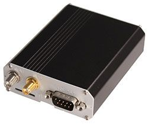

# Riti - SLS-012SF

El Riti SLS-012SF es un rastreador GPS para vehículos pensado para la gestión de flotas, servicios de localización, monitoreo remoto y aplicaciones de control industrial. Integra un módulo GPS de alta sensibilidad con un módulo de comunicación móvil para ofrecer reportes de ubicación continuos y transmisión de datos al backend. El equipo está diseñado para conectarse con diversos dispositivos externos como unidades PND, i-Button, escáneres de códigos de barras, lectores RFID, sensores de presión de neumáticos y sensores de temperatura, lo que lo hace útil tanto para seguimiento de vehículos como para tareas de telemetría más amplias.

Como dispositivo compatible con Plaspy, el SLS-012SF puede enviar datos de ubicación y sensores en tiempo real a la plataforma para visualización, generación de informes y supervisión operativa. Su uso consolidado en sistemas de gestión de flotas a gran escala demuestra su confiabilidad y lo convierte en una opción práctica para organizaciones que desean centralizar datos de vehículos y sensores en Plaspy para análisis, alertas y toma de decisiones a nivel de flota.

## Características principales

- Módulo GPS de alta sensibilidad para un seguimiento de ubicación constante y preciso
- Soporte de comunicación móvil para transmisión de datos en tiempo real a servidores backend
- Integración flexible con dispositivos externos como PND, i-Button, escáneres de códigos de barras, RFID, sensores de presión de neumáticos y de temperatura
- Entrega de datos en tiempo real a sistemas backend para almacenamiento y procesamiento instantáneos
- Acceso sencillo a los datos recolectados vía internet o descarga directa a computadoras de cliente
- Historial de funcionamiento comprobado y fiabilidad en plataformas de gestión de flotas a gran escala

## Cómo funciona con Plaspy

Al integrarlo con Plaspy, el SLS-012SF envía datos de posición y de dispositivos auxiliares a la plataforma para que los administradores de flota puedan supervisar activos y personas casi en tiempo real. Plaspy ingiere esos flujos de datos y los pone a disposición mediante tableros, reportes y herramientas de alerta.

- Consolidar la posición GPS y las entradas de sensores externos en Plaspy para una visibilidad unificada
- Supervisar ubicaciones de vehículos e historial de movimientos mediante mapas y líneas de tiempo en Plaspy
- Configurar alertas y notificaciones en Plaspy en función de patrones de datos entrantes
- Utilizar los reportes de Plaspy para analizar el desempeño de la flota y las tendencias de los sensores a lo largo del tiempo
- Habilitar escenarios de transmisión bidireccional donde comandos del backend y acuses de recibo se gestionen a través de Plaspy

## Casos de uso típicos

- Seguimiento de vehículos de flota y supervisión de rutas para operaciones de logística y transporte
- Monitoreo remoto de condiciones del vehículo y datos de sensores adjuntos para planificación de mantenimiento
- Aplicaciones de control industrial donde se requiere la agregación centralizada de ubicación y entradas de sensores
- Rastreo de activos y equipos combinado con RFID o escáneres de códigos de barras
- Supervisión de carga sensible a la temperatura o información de presión de neumáticos junto con la posición

## Por qué elegir este rastreador con Plaspy

El Riti SLS-012SF es una opción práctica para organizaciones que necesitan un rastreador vehicular fiable capaz de integrar múltiples entradas externas. Su diseño, enfocado en una recepción GPS precisa y comunicación continua con el backend, lo hace adecuado para entornos operativos donde la recolección y el procesamiento oportuno de datos son clave. Para equipos que usan Plaspy, el SLS-012SF aporta los datos necesarios para alimentar tableros de flotas, alertas e informes sin requerir soluciones alternativas complejas en la plataforma.

Dado que el dispositivo cuenta con un historial comprobado en sistemas de flotas de gran escala, puede ser una opción sensata al planificar despliegues que combinen ubicación de vehículos con datos de sensores adicionales. Plaspy puede recibir los datos del SLS-012SF y convertirlos en información accionable para despacho, mantenimiento, cumplimiento y supervisión operativa.

Para obtener más información sobre el uso de Plaspy con dispositivos compatibles y explorar las capacidades de la plataforma visite https://www.plaspy.com. Las especificaciones y la disponibilidad del producto pueden cambiar con el tiempo, por lo que le recomendamos verificar los detalles actuales del dispositivo y la documentación del fabricante en el sitio oficial de Riti https://www.riti.com.tw/.
