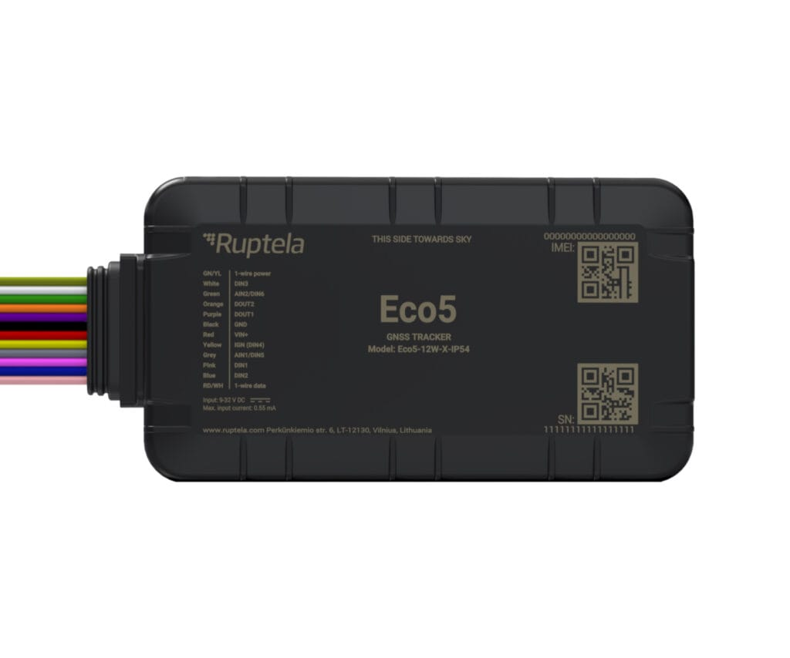

# Ruptela - Eco5

El Eco5 de Ruptela es un rastreador GPS compatible con Plaspy diseñado para la gestión profesional de flotas, el monitoreo de carga y la identificación de conductores. Se basa en un módulo GNSS u‑blox de alta gama y se ofrece en carcasas robustas IP54 e IP68, ofreciendo posicionamiento fiable, funcionamiento de bajo consumo y soporte ampliado de accesorios para vehículos ligeros y pesados.

Como dispositivo compatible con Plaspy, el Eco5 resulta ideal para operadores que requieren una integración rápida de ubicación y telemetría en una plataforma central. Su combinación de opciones de conectividad celular, Bluetooth Low Energy 5.0 y múltiples entradas y salidas permite al Eco5 enviar datos de posición, estado y accesorios a los paneles, alertas y reportes de Plaspy para mejorar la visibilidad operativa y el control.

## Aspectos destacados

- Rastreador GPS compatible con Plaspy basado en un módulo GNSS u‑blox de alta gama para posicionamiento en tiempo real confiable
- Opciones de conectividad celular que soportan cobertura amplia y despliegues a largo plazo
- Carcasas robustas con clasificación IP54 e IP68 para entornos vehiculares exigentes
- Amplio soporte de E/S y accesorios, incluyendo múltiples entradas digitales y combinadas analógicas, además de una interfaz 1‑wire para identificación de conductor
- Soporte Bluetooth Low Energy 5.0 para conectar accesorios inalámbricos como sensores de carga o ambientales
- Batería de respaldo integrada y detección de interferencias (jamming) para mantener continuidad y mejorar la detección de robos
- Corriente de sueño profundo ultrabaja para reducir el consumo en activos estacionados y en despliegues prolongados

## Cómo funciona con Plaspy

Al conectarse a Plaspy, el Eco5 transmite ubicación y telemetría del dispositivo para que usted, como gestor de flota, pueda monitorear activos en tiempo real y aprovechar esos datos en reportes y reglas operativas. Plaspy mapea la información entrante en paneles y sistemas de alertas para que los equipos actúen sobre el estado del vehículo y las lecturas de sensores sin cambiar entre herramientas.

- Actualizaciones de ubicación en tiempo real y reproducción de rutas visibles en los mapas de Plaspy con soporte para alertas de geocerca y movimiento
- Identificación de conductor y registro de eventos desde la interfaz 1‑wire y las E/S disponibles en los reportes y flujos de atribución de conductor de Plaspy
- Telemetría analógica y digital, como entradas de nivel de combustible, incorporada en los informes de Plaspy para análisis de consumo y operativos
- Alertas de estado del dispositivo, incluida la detección de interferencias y notificaciones de batería de respaldo, enviadas a Plaspy para concientizar sobre continuidad y anti robo
- Datos de accesorios Bluetooth provenientes de sensores BLE reenviados a Plaspy cuando están configurados, de modo que las condiciones de la carga y las mediciones ambientales aparezcan junto con la ubicación
- Eventos de E/S usados para activar reglas automatizadas o acciones de control remoto dentro de Plaspy para supervisión operativa

## Casos de uso típicos

- Gestión de flotas mixtas y monitoreo de rutas para operaciones urbanas y regionales
- Monitoreo anti robo y recuperación de vehículos robados facilitados por alertas de jamming y continuidad por batería de respaldo
- Monitoreo de combustible y telemetría para apoyar análisis de consumo y detección de repostajes no autorizados
- Identificación de conductor y registro de comportamiento para procesos de entrenamiento y cumplimiento en Plaspy
- Monitoreo de carga para transporte sensible a temperatura o condiciones usando sensores BLE

## Por qué elegir este rastreador con Plaspy

El Eco5 es una opción práctica para organizaciones que usan Plaspy y necesitan un equilibrio entre posicionamiento fiable, flexibilidad de accesorios y hardware resistente. Sus características de bajo consumo, batería de respaldo y detección de interferencias ayudan a mantener la continuidad operativa, mientras que las entradas disponibles y el soporte Bluetooth lo hacen adaptable a sondas de combustible, dispositivos de identificación de conductor y sensores de carga. Para despliegues que escalan desde vehículos individuales hasta flotas grandes, el Eco5 es manejable mediante las herramientas de Ruptela y está pensado para integrarse en plataformas de seguimiento central como Plaspy.

Si desea conocer más sobre cómo el Eco5 puede trabajar con Plaspy visite el sitio web de Plaspy en https://www.plaspy.com. Las especificaciones del producto y la disponibilidad pueden cambiar con el tiempo, por lo que le recomendamos verificar los detalles técnicos actuales y las variantes regionales en el sitio del fabricante en https://ruptela.com/ antes de planificar un despliegue.
