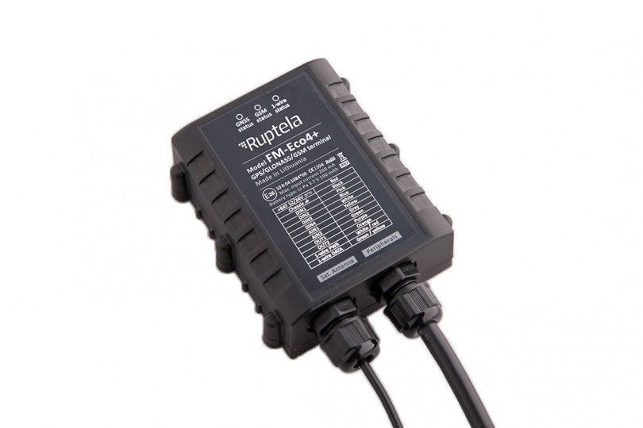

# Ruptela - FM-Eco4

El Ruptela FM-Eco4 es un rastreador GPS confiable diseñado para tareas estándar de seguimiento y monitoreo de vehículos. Registra información esencial como ubicación, velocidad, recorridos, nivel de combustible y kilometraje, e incorpora funciones para identificación de conductores, control de temperatura, análisis de comportamiento al volante y acciones de seguridad como bloqueo remoto de ignición. La unidad presenta una carcasa robusta resistente al polvo y al agua y existe una versión con batería integrada que mantiene la transmisión de datos tras la pérdida de energía.

Como dispositivo compatible con Plaspy, el FM-Eco4 puede enviar su telemetría y eventos a Plaspy para ofrecer visibilidad centralizada de la flota y facilitar las operaciones. Al integrarse con Plaspy, las capacidades principales del rastreador apoyan la optimización de rutas y órdenes, el control de combustible, la supervisión del comportamiento del conductor para una conducción eficiente, y la supervisión operativa en flotas mixtas. Esta combinación ayuda a las organizaciones a supervisar vehículos en entornos exigentes aprovechando los informes y herramientas de gestión de Plaspy.

## Aspectos destacados

- Telemetría básica del vehículo: ubicación, velocidad, recorridos, nivel de combustible y kilometraje
- Monitoreo del comportamiento del conductor y funciones de conducción eficiente para apoyar un manejo más seguro y económico
- Carcasa IP67 resistente al polvo y al agua para uso en entornos severos
- Versión FM-Eco4 plus con batería integrada que permite reportes continuos tras pérdida de alimentación
- Funciones incorporadas para identificación de conductores, registro y geocercas internas
- Funciones orientadas a la seguridad como bloqueo remoto de ignición, antijamming y controles por SMS

## Cómo funciona con Plaspy

Plaspy recibe la telemetría y los eventos del FM-Eco4 para que los gestores de flota puedan ver el estado en tiempo real y el desempeño histórico en una interfaz unificada. La integración permite supervisión operativa e informes sin necesidad de exponer la configuración del dispositivo a nivel técnico.

- Seguimiento de ubicación en tiempo real e histórico mostrado en mapas y líneas de tiempo de Plaspy
- Dashboards de monitoreo de flota con tendencias de kilometraje, consumo de combustible y eficiencia de rutas
- Alertas y notificaciones para eventos como cruces de geocerca, umbrales de temperatura y cambios de ignición
- Informes de actividad y comportamiento del conductor para apoyar programas de formación y cumplimiento
- Registro de eventos para incidentes de seguridad y señales reportadas por el dispositivo como antijamming o manipulación
- Inclusión de datos del FM-Eco4 en informes operativos y registros exportables para análisis

## Casos de uso típicos

- Supervisión de flotas mixtas para control de ubicación, rutas y kilometraje
- Monitoreo del consumo de combustible y optimización de rutas para reducir costos operativos
- Programas de comportamiento del conductor y conducción eficiente para mejorar seguridad y rendimiento
- Operaciones en entornos exigentes donde se requiere robustez IP67
- Monitoreo de cargas sensibles a la temperatura y alertas cuando sea necesario

## Por qué elegir este rastreador con Plaspy

El FM-Eco4 combina un conjunto enfocado de funciones de seguimiento con un diseño de hardware duradero, lo que lo convierte en una opción práctica para flotas que necesitan telemetría fiable sin complejidad innecesaria. Su conjunto de características está alineado con objetivos comunes de gestión de flotas como control de combustible, optimización de rutas y supervisión del desempeño del conductor, que Plaspy está diseñado para mostrar y sobre los cuales actuar.

Seleccionar el FM-Eco4 para usar con Plaspy ofrece un camino directo hacia la visibilidad y el control operativo. Plaspy puede exponer los datos del rastreador en paneles, alertas e informes para que los equipos tomen decisiones informadas sobre rutas, combustible y programas de conductores, mientras confían en un dispositivo pensado para un uso intensivo en campo.

To learn more about Plaspy and how it works with compatible trackers visit https://www.plaspy.com. Product specifications availability and manufacturer details can change over time so please verify current FM-Eco4 specifications and features on the official Ruptela website https://ruptela.com/ before making procurement or deployment decisions.
