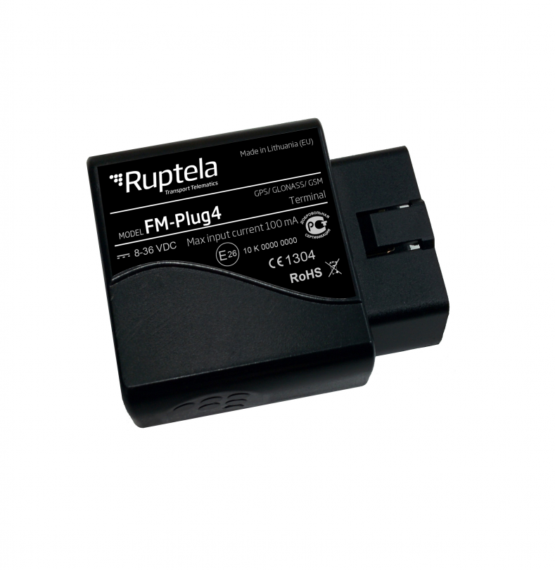

# Ruptela - FM-Plug4

El Ruptela FM-Plug4 es un rastreador OBD personal, fácil de instalar, pensado para el seguimiento y monitoreo de vehículos comerciales ligeros. Disponible en dos versiones —FM-Plug4+ con batería interna y FM-Plug4 sin batería interna— el equipo destaca por su instalación Plug and Play, su portabilidad entre vehículos y un conjunto de funciones orientadas a la protección contra robos y diagnósticos básicos del vehículo. La variante FM-Plug4+ puede leer códigos de error del motor, mientras que ambas versiones generan alertas por extracción del dispositivo y otros eventos configurables.

Como dispositivo compatible con Plaspy, el FM-Plug4 puede integrarse en los flujos de monitoreo de flota para aportar visibilidad de ubicación y notificaciones de eventos junto con el resto de activos. Su instalación rápida y su portabilidad lo convierten en una opción práctica para flotas que requieren reasignaciones frecuentes de hardware, quieren reducir el tiempo y coste de instalación, o necesitan una supervisión sencilla sin configuraciones complejas. Integrado con Plaspy, el FM-Plug4 ayuda a centralizar el rastreo, las alertas y la supervisión operativa en una sola plataforma.

## Puntos clave

- Instalación Plug and Play para despliegues rápidos y mínimo tiempo de inactividad del vehículo
- Dos variantes de hardware, incluyendo FM-Plug4+ con batería interna y lectura de códigos de motor
- Diseño portátil que permite mover el dispositivo entre vehículos según cambien las necesidades operativas
- Alertas por robo y extracción del dispositivo para apoyar procesos de recuperación y seguridad
- Micrófono incorporado para capacidades adicionales de supervisión dentro del vehículo
- Funciones que facilitan el monitoreo del comportamiento del conductor y programas de conducción ecológica

## Cómo funciona con Plaspy

Al conectarse a Plaspy, el FM-Plug4 transmite datos de ubicación y eventos a la plataforma para que los administradores de flota puedan visualizar los vehículos, recibir alertas e incluir la información del dispositivo en informes y paneles operativos. La integración permite que Plaspy muestre los eventos del FM-Plug4 junto con la telemetría del resto de la flota para una supervisión consolidada.

- Visualice la ubicación y el movimiento de los vehículos en los mapas y paneles de Plaspy
- Reciba alertas en Plaspy por robo, extracción del dispositivo y notificaciones de remolque
- Incorpore la información de códigos de error del motor del FM-Plug4+ en los informes de Plaspy para facilitar la planificación de mantenimiento
- Monitoree tendencias de comportamiento del conductor e indicadores de conducción ecológica mediante los reportes de Plaspy
- Asigne y controle dispositivos portátiles como activos cuando los vehículos se intercambian o ingresan a taller
- Use eventos y alertas de geocercas internas para el control de perímetros operativos

## Casos de uso típicos

- Flotas de vehículos comerciales ligeros que buscan una instalación rápida y económica y la posibilidad de redistribuir dispositivos
- Operaciones que mueven dispositivos entre vehículos con frecuencia por reparaciones o rotación de conductores
- Prevención y recuperación ante robos, con monitoreo y alertas por extracción o remolque
- Priorización básica de mantenimiento usando códigos de error del FM-Plug4+ para orientar diagnósticos
- Programas de formación a conductores y mejora de la eficiencia de conducción
- Seguimiento temporal para alquileres o flotas compartidas

## Por qué elegir este rastreador con Plaspy

El FM-Plug4 es ideal para organizaciones que priorizan la rapidez de despliegue y la flexibilidad. Su naturaleza Plug and Play reduce el tiempo y el coste de instalación, lo que resulta práctico para flotas que no pueden sacrificar tiempo de uso del vehículo para montar equipos. La portabilidad entre vehículos encaja de forma natural con la gestión de activos de Plaspy, facilitando el control en flotas mixtas o rotativas.

Para operaciones que se benefician de diagnósticos básicos, el FM-Plug4+ añade lectura de errores del motor que puede integrarse en los informes de Plaspy para apoyar decisiones de mantenimiento. Las alertas por robo y el micrófono dentro del vehículo ofrecen capas adicionales de conciencia situacional que amplían las capacidades de monitoreo y notificaciones de Plaspy sin necesidad de configuraciones complejas.

Para más información sobre cómo Plaspy puede funcionar con dispositivos como el Ruptela FM-Plug4 visite https://www.plaspy.com. Las especificaciones y la disponibilidad del producto pueden cambiar con el tiempo, por lo que le recomendamos verificar los detalles y características actuales en el sitio del fabricante https://ruptela.com/ antes de tomar decisiones de compra.
