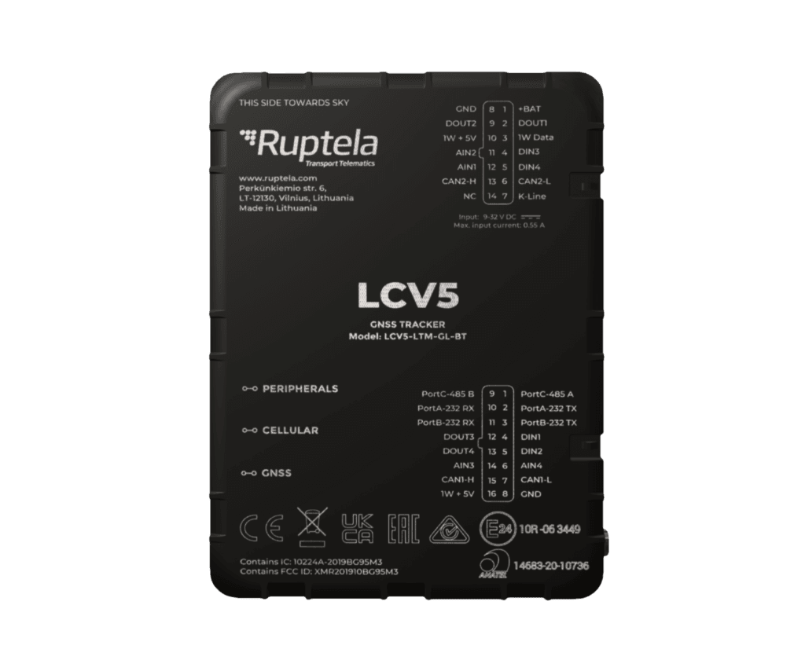

# Ruptela - LCV5

El LCV5 es un rastreador GPS diseñado específicamente para autos y vehículos comerciales ligeros que ofrece seguimiento en tiempo real confiable y telemetría avanzada para la gestión de flotas. Pensado para capturar la ubicación del vehículo junto con parámetros de telemetría como datos CAN y OBD, identificación de conductor y nivel de combustible, el LCV5 está orientado a flotas y operadores que requieren posicionamiento preciso e información útil sobre sus vehículos.

Como dispositivo compatible con Plaspy desde el primer momento, el LCV5 puede transmitir su ubicación y telemetría a Plaspy para supervisión centralizada, alertas e informes. Sus variantes de hardware flexibles y las múltiples opciones de E/S lo convierten en una alternativa práctica para organizaciones que desean integrar datos a nivel de vehículo con los paneles y flujos de trabajo de Plaspy para supervisión operativa.

## Aspectos clave

- Rastreador GPS diseñado para autos y vehículos comerciales ligeros con seguimiento en tiempo real
- Lectura de parámetros CAN y OBD para telemetría más profunda e insights sobre el comportamiento del conductor
- Soporte para monitoreo de combustible mediante integración con sensores de nivel y reportes de consumo
- Variantes de hardware múltiples, incluyendo opciones de conectividad celular y soporte para sensores BLE
- Amplias interfaces de E/S y comunicación para integrar con sistemas del vehículo y sensores externos
- Batería de respaldo integrada, detección de movimiento y funciones anti-manipulación para mejorar la protección contra robos

## Cómo funciona con Plaspy

Al integrarse con Plaspy, el LCV5 transmite posiciones y telemetría del vehículo a una instancia de Plaspy, donde esos datos se procesan para monitoreo en vivo, reproducción histórica y generación de alertas. Plaspy ingiere la información del rastreador y la presenta junto con reportes de flota y herramientas operativas para que los administradores puedan actuar sobre eventos y tendencias.

- Ubicación en vivo y telemetría del vehículo disponibles en Plaspy para visibilidad en tiempo real
- Alertas basadas en eventos como estado de ignición, apertura de puertas o cambios en entradas y eventos de identificación de conductor
- Datos de nivel y consumo de combustible integrados en los informes de Plaspy para la gestión y análisis del combustible
- Gestión remota del dispositivo y opciones de configuración para simplificar despliegues con Plaspy
- Datos de sensores BLE en variantes compatibles que amplían la telemetría de Plaspy a la supervisión de carga y condiciones ambientales

## Casos de uso típicos

- Flujos de trabajo antirobo e inmovilización de flotas para proteger vehículos y detectar manipulación
- Programas de gestión de combustible mediante integración con sensores de nivel y monitoreo de consumo
- Programas de comportamiento y seguridad del conductor aprovechando eventos derivados de CAN y del acelerómetro
- Soluciones de car sharing y control de accesos mediante identificación de conductor y registro de eventos
- Monitoreo de carga sensorizada cuando se usan variantes BLE para añadir sensores de temperatura o proximidad

## Por qué elegir este rastreador con Plaspy

El LCV5 combina un hardware enfocado en vehículos con amplias opciones de telemetría y E/S que se adaptan a diversas necesidades de flotas y vehículos comerciales. Para organizaciones que usan Plaspy, el dispositivo ofrece una forma práctica de centralizar la ubicación del vehículo, eventos del conductor y datos de combustible en una sola plataforma para monitoreo e informes.

Si desea explorar cómo encaja el LCV5 en sus flujos de trabajo con Plaspy, conozca más sobre Plaspy en el sitio principal https://www.plaspy.com. Las especificaciones del producto, la disponibilidad y los detalles del fabricante pueden cambiar con el tiempo, por lo que le recomendamos verificar las especificaciones actuales en el sitio del fabricante https://ruptela.com/.
