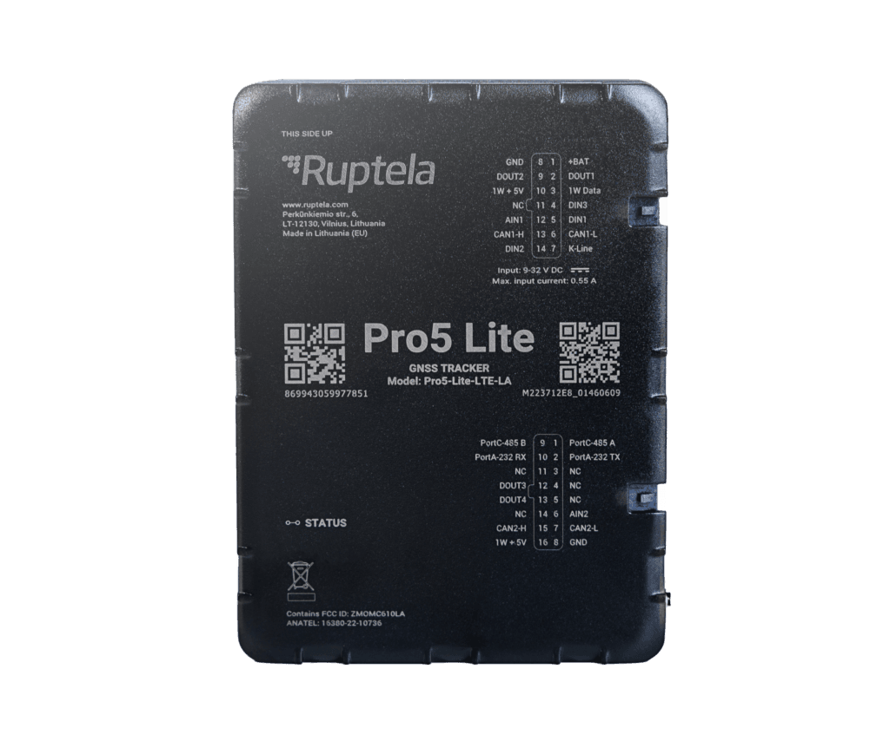

# Ruptela - Pro5 Lite

Pro5 Lite es un rastreador GPS compacto de Ruptela diseñado para flotas comerciales y gestores de activos que requieren seguimiento en tiempo real y confiable. Basado en un módulo GNSS U‑blox con antena interna y conectividad LTE con fallback a 2G, el equipo ofrece posicionamiento preciso y telemetría en una carcasa pequeña sin tornillos, adecuada para instalaciones discretas o ubicaciones OBD. El Pro5 Lite está pensado para proporcionar posicionamiento consistente e integración vehicular flexible para gestión de flotas, cargas y conductores.

Como rastreador compatible con Plaspy, Pro5 Lite se integra con Plaspy para entregar actualizaciones de posición en vivo, flujos de telemetría y transmisión segura de datos para monitoreo e informes. Plaspy puede ingerir los datos del Pro5 Lite para mostrar ubicaciones, estados y eventos de los vehículos en paneles y alertas, lo que convierte al dispositivo en una opción práctica para operadores que necesitan un rastreador compacto que funcione con una plataforma moderna de gestión de flotas.

## Aspectos destacados

- Compatibilidad nativa con Plaspy para seguimiento en vivo e integración telemática.
- Posicionamiento GNSS de alta precisión con antena interna para cobertura consistente.
- Conectividad LTE con fallback a 2G y variantes por región para amplia cobertura.
- Amplias capacidades de integración vehicular y múltiples opciones de entradas y salidas (I/O) para soportar ignición, sensores y flujos de inmovilizador.
- Funciones de seguridad integradas, incluyendo detección de manipulación y jamming, y transmisión segura de datos.
- Carcasa compacta sin tornillos y batería interna de respaldo para mantener la operación y permitir una instalación discreta.

## Cómo funciona con Plaspy

Cuando lo conecta a Plaspy, Pro5 Lite proporciona un flujo continuo de ubicación y telemetría que alimenta el monitoreo, las alertas y los informes en toda la flota. Plaspy presenta los datos del dispositivo en tiempo real y conserva registros históricos para reproducción y análisis, facilitando la supervisión operativa y la toma de decisiones.

- Reporte de posiciones en vivo para seguimiento en tiempo real y vistas en mapa dentro de Plaspy.
- Telemetría y datos vehiculares que alimentan paneles e informes sobre salud y utilización de la flota.
- Entrega de eventos y alertas por manipulación, movimiento y otras condiciones configuradas para soportar flujos de trabajo de antirrobo y seguridad.
- Actualizaciones de estado basadas en entradas y salidas para reflejar condiciones como ignición, puertas o alarmas dentro de Plaspy.
- Soporte para accesorios Bluetooth y telemetría a bordo para extender el monitoreo en casos de uso relacionados con carga o conductor.

## Casos de uso típicos

- Seguimiento de flotas comerciales y supervisión de rutas para mejorar la utilización y la asignación de unidades.
- Monitoreo antirrobo y flujos de recuperación usando seguimiento en vivo y alertas de manipulación.
- Supervisión de combustible y parámetros del motor como parte de diagnósticos de flota y control de costos.
- Monitoreo del comportamiento del conductor y seguridad mediante alertas basadas en eventos y movimiento.
- Monitoreo de carga y accesorios con integración de sensores Bluetooth para registro de estados.

## Por qué elegir este rastreador con Plaspy

Pro5 Lite es una opción sensata para organizaciones que necesitan un rastreador compacto y con muchas capacidades que se integre con una plataforma de gestión de flotas completa. Su énfasis en posicionamiento GNSS preciso, conectividad celular resistente y E/S flexible lo hace útil para operadores que buscan datos de ubicación fiables junto con telemetría a nivel de vehículo presentados a través de Plaspy. El factor de forma reducido del dispositivo y sus funciones de gestión facilitan despliegues a gran escala donde la instalación discreta y la provisión remota son importantes.

Para obtener más información sobre Plaspy y cómo dispositivos compatibles como el Ruptela Pro5 Lite funcionan dentro de la plataforma visite https://www.plaspy.com. Las especificaciones del producto y la disponibilidad pueden cambiar con el tiempo, por lo que le recomendamos verificar los detalles técnicos y las variantes más recientes en el sitio del fabricante https://ruptela.com/.
