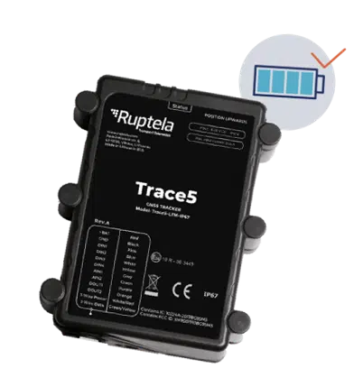

# Ruptela - Trace5 Trailer Tracker

El Ruptela Trace5 Trailer Tracker es más que un simple dispositivo de seguimiento. Cuenta con la última edición de batería recargable de larga duración, lo que garantiza que puedas rastrear tus remolques durante períodos prolongados sin preocuparte por la vida útil de la batería. Este compacto rastreador de ubicación de vehículos automático \(AVL\) basado en GNSS está diseñado para proporcionar datos precisos de ubicación para el seguimiento de vehículos y remolques, así como para la gestión de flotas.

Equipado con tecnología GNSS premium de U-blox y componentes de alta calidad, el Trace5 Trailer Tracker ofrece un excelente rendimiento y precisión. Su destacada resistencia a entornos difíciles está garantizada por su carcasa con clasificación IP67, lo que le permite sobrevivir en condiciones adversas.

Una de las características destacadas del Trace5 Trailer Tracker es su batería interna de larga duración. Con un período de informe de 5 horas, el rastreador puede durar hasta 36 días con una sola carga. Esto significa que puedes rastrear tus remolques durante un período prolongado sin necesidad de recargar con frecuencia.

La seguridad es una prioridad con el Trace5 Trailer Tracker. Cuenta con detección de interferencias, una batería de respaldo y cifrado TLS v1.2 para garantizar la seguridad y la integridad de tus datos de seguimiento.

Con Ruptela, obtienes una solución completa de un proveedor. El Trace5 Trailer Tracker es un dispositivo de seguimiento GPS que se puede combinar con accesorios adecuados para satisfacer tus necesidades específicas de seguimiento.

### Características destacadas:

- Excelente rendimiento con tecnología GNSS premium
- Destacada resistencia a entornos difíciles con carcasa con clasificación IP67
- Batería interna de larga duración con hasta 36 días de vida útil de la batería
- Seguridad con detección de interferencias y cifrado TLS v1.2
- Solución completa de un proveedor con accesorios compatibles

