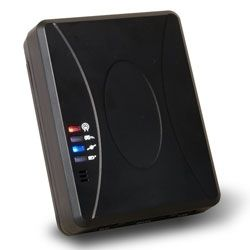

# Sanav - CT-58

El Sanav CT-58 es un mini rastreador GPS compacto diseñado para necesidades de seguimiento flexibles, como vehículos, contenedores y activos móviles. Integra un sensor de vibración de alta sensibilidad para detectar movimiento y enviar informes cuando se registra actividad. Su recepción GPS y GSM mejorada, junto con una carcasa robusta y de tamaño reducido, lo hacen adecuado para monitoreo discreto en diversos entornos operativos.

Como dispositivo compatible con Plaspy, el CT-58 puede enviar informes de ubicación y movimiento a la plataforma de seguimiento y gestión de flotas de Plaspy. Esa compatibilidad permite que las organizaciones visualicen ubicaciones en tiempo real, supervisen eventos de movimiento activados por el sensor de vibración e incluyan el CT-58 en flujos de trabajo más amplios de visibilidad, reportes y alertas que ofrece Plaspy.

## Características principales

- Factor de forma miniatura que facilita su colocación y ocultamiento para monitoreo de activos y vehículos
- Sensor de vibración integrado de alta sensibilidad para detección de movimiento e informe de eventos
- Botón de pánico externo opcional para reportes SOS cuando se requiere atención inmediata
- Mejora en la recepción GPS y GSM para mantener actualizaciones de ubicación más consistentes
- Carcasa compacta y resistente para uso en distintos ambientes
- Diseño liviano adecuado para rastreo de activos y contenedores

## Cómo funciona con Plaspy

Cuando el CT-58 se utiliza con Plaspy, sus informes de ubicación y movimiento pueden integrarse en la interfaz de monitoreo de Plaspy para que los operadores obtengan contexto histórico y conciencia situacional. Plaspy procesa los informes del rastreador y los presenta junto con otros datos de la flota o activos para apoyar las decisiones operativas.

- Visualización en tiempo real de la ubicación de activos equipados con CT-58 en los mapas de Plaspy
- Alertas de movimiento basadas en el sensor de vibración integrado para notificar a los operadores sobre actividad
- Eventos de SOS o botón de pánico canalizados hacia los flujos de alertas de Plaspy para respuesta rápida
- Registros históricos de posiciones y visibilidad básica de rutas para revisión de incidentes y generación de informes
- Inclusión de dispositivos CT-58 en grupos y paneles de monitoreo de Plaspy para supervisión centralizada

## Casos de uso típicos

- Rastreo de vehículos oculto o compacto donde el tamaño reducido es importante
- Monitoreo de contenedores para detectar movimiento y seguir la ubicación durante el transporte
- Protección de activos portátiles de alto valor o que se reubican con frecuencia
- Supervisión de flotas de alquiler donde las alertas de movimiento y la visibilidad de ubicación son útiles
- Situaciones que requieren instalación discreta y actualizaciones de seguimiento periódicas

## Por qué elegir este rastreador junto a Plaspy

El CT-58 es una opción práctica para organizaciones que buscan un rastreador pequeño y con detección de movimiento para integrar con una plataforma de seguimiento completa como Plaspy. Su detección por vibración y el reporte opcional de pánico ofrecen desencadenantes de evento sencillos que pueden convertirse en alertas operativas dentro de Plaspy, ayudando a los equipos a reaccionar ante movimientos inesperados o señales de emergencia.

Mientras el CT-58 se enfoca en un diseño físico compacto y en reportes de ubicación confiables, combinarlo con Plaspy aporta los beneficios de visibilidad centralizada, generación de alertas y reportes. Esta combinación es adecuada para flotas, operadores logísticos y gestores de activos que requieren seguimiento directo y conciencia de eventos sin hardware voluminoso.

Para obtener más información sobre cómo Plaspy soporta dispositivos como el Sanav CT-58, visite la página principal de Plaspy https://www.plaspy.com. Las especificaciones del producto, disponibilidad y detalles del fabricante pueden cambiar con el tiempo, por favor verifique las especificaciones y opciones vigentes con el fabricante en http://es.sanav.com/.
