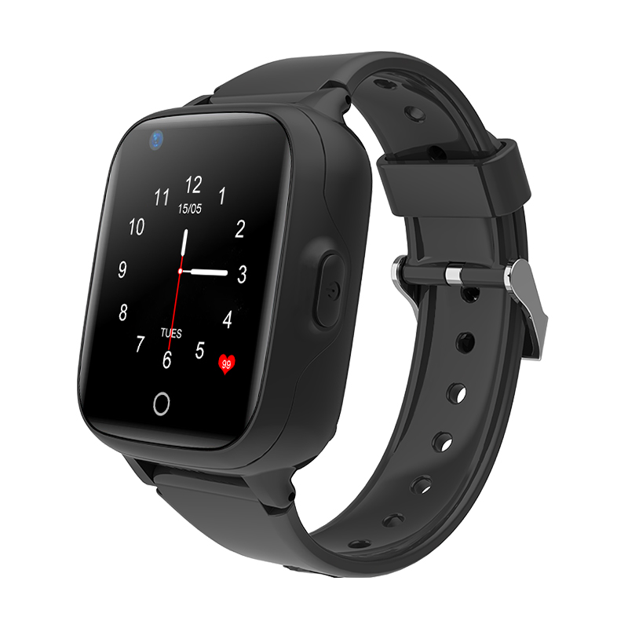

# Sentar - D31

El D31 es un reloj inteligente GPS compacto 4G pensado para niños y diseñado para cuidadores que requieren localización fiable en tiempo real y monitoreo de seguridad. Combina posicionamiento multimodal con un formato ponible amigable para menores, una pantalla táctil IPS de 1.4 pulgadas y un botón SOS integrado en el costado para llamadas de emergencia sencillas. El equipo funciona con el chipset SL8521E, corre Android 4.4 y usa una Nano SIM para conectividad celular en redes móviles comunes.

Como dispositivo compatible con Plaspy, el D31 transmite arreglos de ubicación y el estado del dispositivo a Plaspy para monitoreo centralizado y alertas. Plaspy puede procesar los datos de posicionamiento híbrido del reloj y mostrarlos en mapas, resaltar eventos de emergencia y presentar indicadores básicos de salud del equipo —como nivel de batería y estado de conectividad— para que cuidadores y administradores tengan visibilidad consolidada sin complejidad adicional.

## Aspectos destacados

- Diseño ponible y compacto pensado para niños que ofrece actualizaciones continuas de ubicación para mayor tranquilidad de los cuidadores
- Posicionamiento híbrido con GPS, A‑GPS, LBS y WiFi para mejorar la fiabilidad en distintos entornos
- Conectividad 4G con retroceso a 3G y 2G para amplia cobertura y reporte en tiempo real confiable
- Botón SOS integrado para llamadas rápidas de emergencia y alertas de alta prioridad
- Construcción resistente para el uso diario, con pantalla táctil IPS de 1.4 pulgadas y resistencia al agua IPX7
- Informes de estado del dispositivo incorporados, incluyendo nivel de batería y conectividad, para supervisión proactiva
- Factor de forma ligero con memoria limitada en el dispositivo para un funcionamiento ágil en el uso diario

## Cómo funciona con Plaspy

Al emparejarse con Plaspy, el D31 actúa como un rastreador ponible dedicado que envía datos de posicionamiento y estado a su cuenta de Plaspy. Plaspy muestra la ubicación en vivo en mapas, registra movimientos históricos y enruta notificaciones de emergencia entrantes a los cuidadores o administradores configurados.

- Transmisión de ubicación en vivo a Plaspy para seguimiento en tiempo real y visualización en mapas
- Alertas SOS enviadas a Plaspy con sello de tiempo y última posición conocida para atención inmediata
- Fuentes de posicionamiento híbrido utilizadas por Plaspy para mejorar la precisión en entornos urbanos o interiores
- Telemetría de salud del dispositivo, como nivel de batería y estado de conectividad, disponible en Plaspy para monitoreo
- Registros de eventos y comunicaciones accesibles en Plaspy para auditoría, revisión y tranquilidad de los cuidadores

## Casos de uso típicos

- Seguridad infantil y monitoreo por parte de cuidadores con ubicación en vivo y alertas SOS
- Supervisión de la ruta escolar para verificar puntos de entrega y recogida y revisar recorridos
- Vigilancia durante juegos al aire libre donde la resistencia al agua y el posicionamiento continuo son importantes
- Rastreo temporal de objetos personales como mochilas o equipo durante salidas
- Escenarios de monitoreo grupal gestionados por escuelas o proveedores de cuidado infantil que requieren visibilidad centralizada

## Por qué elegir este rastreador con Plaspy

El D31 es una solución enfocada para organizaciones y familias que necesitan un dispositivo ponible diseñado específicamente para la seguridad infantil y la tranquilidad de los cuidadores. Su formato ponible, posicionamiento híbrido y capacidad SOS integrada lo hacen adecuado para tareas de supervisión diaria donde importa una visibilidad sencilla y fiable. Dado que el reloj transmite tanto ubicación como telemetría básica del dispositivo, encaja de forma natural en Plaspy, donde los administradores pueden consolidar la supervisión entre equipos y recibir alertas oportunas.

La compatibilidad con Plaspy aporta valor operativo al centralizar información de ubicación, alertas y estado del dispositivo en una sola plataforma, reduciendo la necesidad de gestionar múltiples portales de proveedores. Si su prioridad es un rastreo infantil confiable y notificaciones de emergencia claras, el Sentar D31 emparejado con Plaspy es una opción práctica a considerar.

Para obtener más información sobre Plaspy y cómo facilita la visibilidad de dispositivos y las alertas, visite https://www.plaspy.com. Las especificaciones y la disponibilidad del producto pueden cambiar con el tiempo, por lo que le recomendamos verificar los detalles técnicos actuales y la información del fabricante en el sitio oficial de Sentar http://www.sentarsmart.com/.
