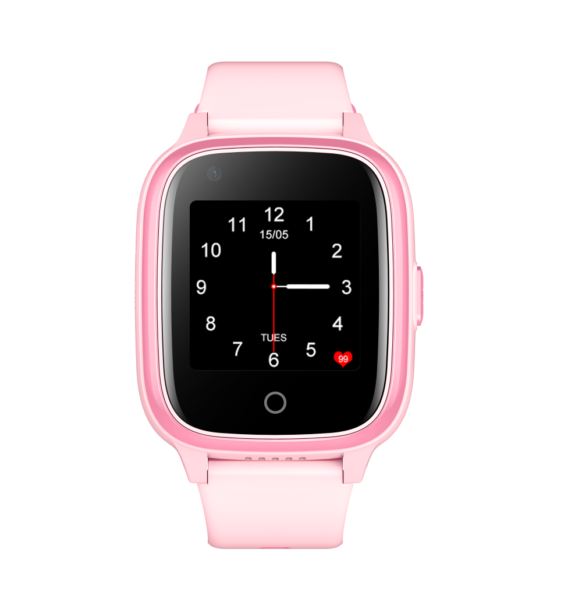

# Sentar - D32

El Sentar D32 es un reloj inteligente GPS 4G con Android para llevar en la muñeca, diseñado para el monitoreo continuo de ubicación, comunicación bidireccional y seguridad personal. Como dispositivo wearable compacto, integra posicionamiento multimodal con voz y datos celulares, un botón de encendido configurable como SOS, una pantalla táctil IPS de 1.4 pulgadas y una cámara que facilitan la conciencia situacional en tiempo real y la captura básica de imágenes.

Al transmitir ubicación y eventos en vivo a través de redes celulares y admitir alertas de emergencia y contacto por voz o video, el D32 resulta una opción práctica y compatible con Plaspy para organizaciones que requieren visibilidad sobre su personal. Plaspy puede procesar las señales de ubicación y eventos del D32 para mostrar posiciones en directo, alertas y contexto de incidentes junto con otros activos en una vista unificada de gestión.

## Características principales

- Reloj GPS wearable 4G con Android apto para el seguimiento continuo de personal desde la muñeca.
- Posicionamiento multimodal que incluye GPS, ubicación asistida, localización por celular y Wi Fi para mejorar la cobertura en entornos urbanos o interiores.
- Cámara integrada y capacidad de voz para aportar contexto visual y auditivo en incidentes y asistencia remota.
- Botón SOS configurable para alertas inmediatas y comunicación bidireccional vinculada a flujos de trabajo en Plaspy.
- Resistencia al agua IPX7 y una pantalla táctil compacta pensadas para uso diario y comprobaciones rápidas de estado.
- Batería y diseño de carga orientados a la operación diaria habitual y a mantener continuidad en la telemetría.

## Cómo funciona con Plaspy

Cuando usted lo utiliza con Plaspy, el D32 se convierte en un wearable conectado a la nube que ofrece ubicación en vivo, actualizaciones de estado y alertas por eventos a los operadores. Plaspy recopila datos de posición y eventos del dispositivo, traza movimientos y enlaza alertas y medios a las líneas de tiempo de incidentes para agilizar la respuesta y los informes.

- Ubicación y actualizaciones de posicionamiento en tiempo real mostradas en los mapas de Plaspy para visibilidad inmediata
- Alertas SOS enviadas a los flujos de incidentes de Plaspy para notificación rápida
- Interacciones bidireccionales de voz y video asociadas a eventos del dispositivo para verificación y asistencia remota
- Estado de batería y del dispositivo compartido con Plaspy para monitorización de salud del equipo y conocimiento de disponibilidad
- Imágenes de la cámara y referencias de video corto adjuntas a eventos de ubicación dentro de los informes de Plaspy

## Casos de uso típicos

- Supervisión de niños y programas de transporte escolar donde tutores y administradores necesitan ubicación y alertas de emergencia
- Cuidado de personas mayores y atención a vulnerables con opciones de alerta rápida y comunicación bidireccional
- Monitoreo de trabajadores solitarios o personal de campo que se desplaza a pie y requiere visibilidad continua y verificación de incidentes
- Gestión de personal a pie para complementar los rastreadores vehiculares, controlando mensajeros, inspectores y conductores cuando están fuera del vehículo
- Supervisión de eventos y grupos para mantener conciencia de posiciones y coordinar respuestas en actividades al aire libre o urbanas

## Por qué elegir este rastreador con Plaspy

El D32 es una opción lógica para equipos y familias que necesitan un formato wearable con comunicación integrada y funciones de emergencia. Su posicionamiento multimodal y conectividad celular proporcionan a Plaspy flujos de ubicación y señales de evento consistentes que mejoran la conciencia operativa en el seguimiento de personal y la supervisión de seguridad.

Si bien la telemetría específica de vehículos se gestiona mejor con rastreadores dedicados, el D32 cumple un papel complementario al extender la monitorización y la comunicación rápida a las personas en movimiento. Combinado con Plaspy, el dispositivo ayuda a unificar la conciencia situacional entre personal y activos en una sola vista operativa.

Para obtener más información sobre Plaspy y cómo la plataforma puede incorporar rastreadores wearables como el Sentar D32 visite https://www.plaspy.com. Product specifications and availability can change over time, so please verify the latest details with the manufacturer at http://www.sentarsmart.com/ .
