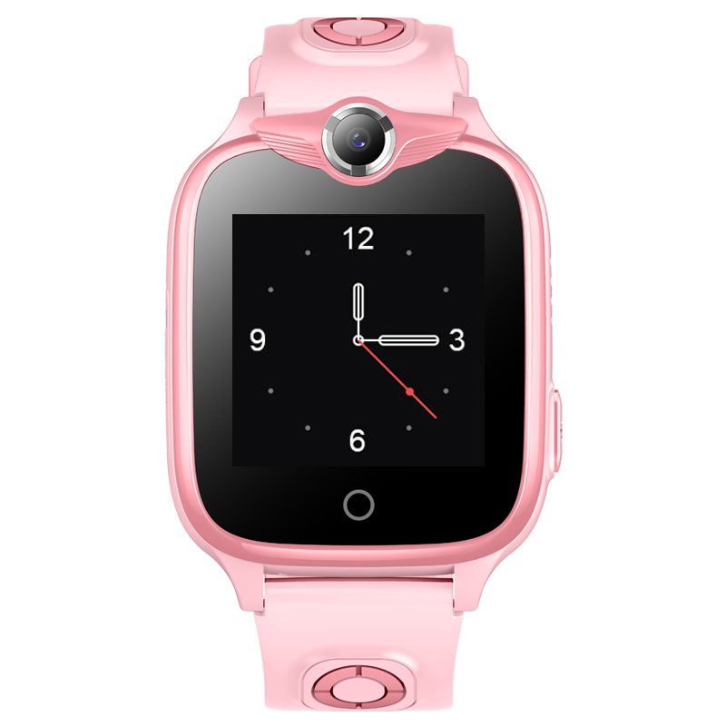

# Sentar - D33-2G

El Sentar D33-2G es un rastreador GPS compacto orientado a niños, presentado como un reloj inteligente portátil. Combina posicionamiento por satélite con localización asistida por torres celulares (GPS + LBS), llamadas bidireccionales, un botón de emergencia SOS, cámara frontal y una construcción resistente al agua con pantalla TFT de protección ocular. El dispositivo está pensado para uso diario por parte de niños y ofrece a los responsables información de ubicación y estado a través de una aplicación complementaria.

Al ser compatible con Plaspy, el D33-2G puede integrar sus reportes de ubicación, alertas y eventos de actividad en la plataforma, de modo que familias y administradores puedan monitorear rutas, recibir notificaciones sensibles al tiempo y gestionar dispositivos desde una sola interfaz. Su formato wearable y las funciones orientadas a la seguridad infantil lo hacen una opción práctica cuando se añade a Plaspy para casos de supervisión básica y visibilidad.

## Puntos clave

- Diseño tipo reloj inteligente pensado para niños y monitoreo familiar.
- Rastreo en tiempo real con GPS y asistencia LBS para mejorar cobertura en interiores y zonas urbanas.
- Llamadas bidireccionales y gestión de la agenda telefónica para mantener contactos aprobados accesibles.
- Botón de emergencia SOS dedicado para alertas rápidas a los responsables.
- Cámara frontal integrada con capacidad de captura remota desde la app complementaria.
- Alertas de geocerca y reproducción histórica de rutas para revisar movimientos.

## Cómo funciona con Plaspy

Cuando se conecta a Plaspy, el D33-2G actúa como fuente de ubicación y eventos dentro de la plataforma, enviando fijaciones de posición y eventos de alerta para que los responsables puedan ver ubicaciones en vivo, recibir notificaciones y revisar el historial del dispositivo junto con otros rastreadores compatibles.

- Visualización de la ubicación en vivo sobre los mapas de Plaspy usando los reportes de posición del dispositivo.
- Notificaciones SOS y de emergencia reenviadas a los canales de alerta configurados en Plaspy para una rápida toma de conciencia.
- Historial de rutas y reproducción en línea de tiempo disponibles en Plaspy para revisar movimientos pasados.
- Capturas remotas de la cámara y eventos del dispositivo asociados al registro cuando la funcionalidad es soportada.
- Registros de llamadas y eventos de voz que pueden vincularse a la actividad del dispositivo y a las líneas de tiempo en Plaspy.

## Casos de uso típicos

- Monitoreo parental y respuesta rápida cuando un niño activa el SOS o necesita ayuda.
- Confirmar trayectos escolares y recogidas mediante alertas de geocerca y reproducción de rutas.
- Supervisión de juegos al aire libre con llamadas bidireccionales accesibles y comprobaciones periódicas de ubicación.
- Cuidado diario o supervisión grupal donde los administradores requieren conciencia básica de ubicación y alertas.
- Verificación remota de entornos o momentos con captura de cámara y mensajes de voz.

## Por qué elegir este rastreador con Plaspy

El D33-2G ofrece un conjunto enfocado de funciones para la seguridad familiar y una independencia supervisada, y su compatibilidad con Plaspy centraliza esos eventos del dispositivo en un entorno de seguimiento. Para responsables y pequeñas organizaciones que buscan visibilidad sencilla, la combinación de posicionamiento GPS más LBS, alertas SOS, llamadas y control de cámara proporciona una conciencia situacional práctica sin complicar la experiencia para los niños.

Para saber más sobre cómo Plaspy puede trabajar con dispositivos compatibles como el Sentar D33-2G, visite https://www.plaspy.com. Las especificaciones del producto, la disponibilidad y los datos del fabricante pueden cambiar con el tiempo, por lo que por favor verifique la información técnica y los detalles de soporte actuales en el sitio del fabricante http://www.sentarsmart.com/.
