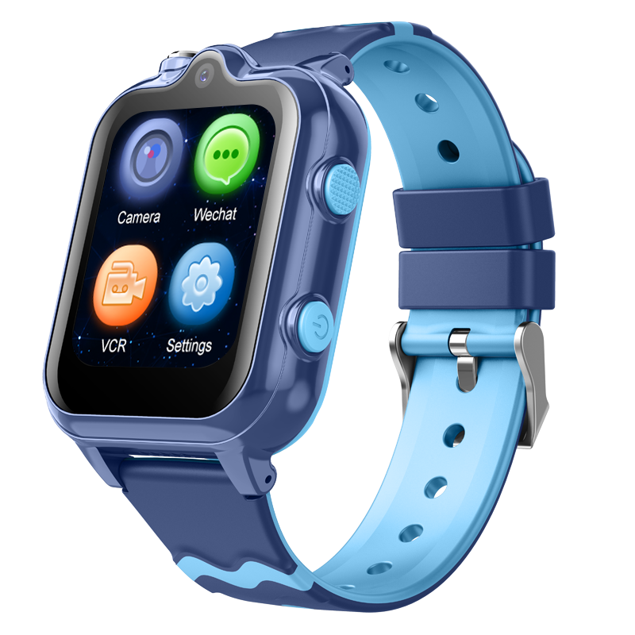

# Sentar - D35

El Sentar D35 es un reloj inteligente compacto para niños pensado para posicionamiento en tiempo real y comunicación con cuidadores. Basado en una plataforma Android con conectividad 4G, el D35 integra tecnologías de localización multimodal como GPS, AGPS, LBS y WiFi para ofrecer visibilidad continua de la ubicación. Su diseño orientado a los niños incluye una pantalla táctil IPS de 1.69 pulgadas, cámaras duales, un botón físico SOS dedicado y clasificación de resistencia al agua IPX7, cubriendo las necesidades habituales de vigilancia infantil diaria.

Como dispositivo compatible con Plaspy, el D35 puede transmitir información de ubicación y estado a la plataforma Plaspy para monitoreo centralizado y alertas. Al conectarlo a Plaspy, usted y los administradores obtendrán acceso a actualizaciones cartográficas de posición, manejo de alertas de emergencia, indicadores de comunicación bidireccional y contexto situacional como fotografías capturadas. Esto convierte al D35 en una opción práctica para familias, escuelas y prestadores de cuidado que buscan flujos de trabajo de seguimiento y seguridad gestionados de forma simple a través de Plaspy.

## Aspectos destacados

- Reloj infantil 4G compatible con Plaspy para seguimiento y comunicación en tiempo real.
- Posicionamiento multimodal con GPS, AGPS, LBS y WiFi para mejorar la cobertura de ubicación.
- Cámaras duales para capturar fotos y videos que aportan contexto situacional.
- Botón físico SOS dedicado para alertas de emergencia inmediatas.
- Pantalla táctil IPS de 1.69 pulgadas para una interacción intuitiva y manejo sencillo.
- Resistencia al agua IPX7 y factor de forma wearable pensado para el uso diario infantil.
- Disponible en varios colores para adaptarse a preferencias personales manteniendo las funciones de rastreo.

## Cómo funciona con Plaspy

Al integrarse con Plaspy, el D35 envía señales de ubicación y eventos de estado a los paneles y sistemas de notificaciones de Plaspy, de modo que usted puede supervisar movimientos, recibir alertas y revisar contexto casi en tiempo real.

- Actualizaciones de ubicación en vivo y trazas históricas accesibles mediante los mapas de Plaspy para mayor visibilidad situacional.
- Alertas SOS prioritarias generadas por el dispositivo que aparecen en las notificaciones y flujos de trabajo de alerta de Plaspy.
- Canales de voz y mensajería bidireccional indicados dentro de Plaspy para que los operadores vean eventos de conectividad y comunicación.
- Indicadores de estado del dispositivo y conectividad enviados a Plaspy para monitorear la salud de la señal y disponibilidad.
- Evidencia multimedia, como fotos y clips cortos de video, que pueden vincularse a eventos para respaldar la revisión de incidentes cuando esté permitido.

## Casos de uso típicos

- Supervisión parental para verificaciones diarias de ubicación, control de rutas y alertas de emergencia.
- Vigilancia del trayecto escolar para confirmar llegada y salida en zonas escolares.
- Coordinación de actividades extraescolares usando voz y mensajería para contacto rápido.
- Seguimiento de juegos al aire libre y viajes donde la resistencia al agua y la durabilidad son preferibles.
- Recolección de contexto de incidentes mediante imágenes capturadas para validar y documentar sucesos.

## Por qué elegir este rastreador con Plaspy

El D35 está diseñado para la seguridad infantil y la tranquilidad de los cuidadores. Su combinación de posicionamiento multimodal, una interfaz táctil visible, capacidad SOS y conectividad 4G lo hace ideal para usarse con Plaspy en entornos familiares e institucionales. Plaspy integra esos datos de dispositivo en una plataforma unificada que prioriza la visibilidad de ubicación, las notificaciones y la gestión sencilla de dispositivos sin añadir complejidad.

Si su necesidad principal es el rastreo infantil mediante un wearable con alertas rápidas y comunicación bidireccional, el Sentar D35 emparejado con Plaspy es una opción directa a considerar. Para obtener más información sobre Plaspy y cómo la plataforma puede ayudar a gestionar dispositivos compatibles como el D35, visite https://www.plaspy.com. Las especificaciones y la disponibilidad de productos pueden cambiar con el tiempo, por lo que le recomendamos verificar los detalles actuales en el sitio del fabricante http://www.sentarsmart.com/ antes de tomar decisiones de compra.
