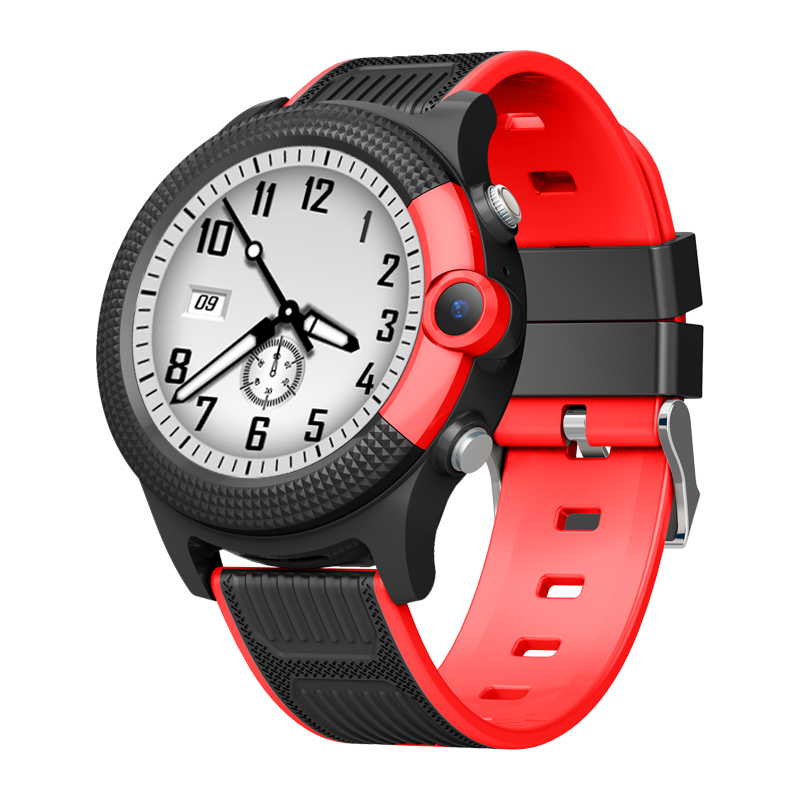

# Sentar - D36

El Sentar D36 es un reloj inteligente infantil 4G diseñado para padres que requieren una supervisión de ubicación fiable y una comunicación bidireccional sencilla. El dispositivo combina posicionamiento por GPS, LBS y WiFi con conectividad celular multibanda y ranura para Nano SIM, entregando actualizaciones de ubicación frecuentes y conectividad de voz en un formato compacto de smartwatch. Su pantalla táctil IPS de 1.28 pulgadas, carcasa de ABS más PC y correa de silicona suave lo hacen cómodo para el uso diario de los niños, mientras que su arquitectura basada en RTOS busca una operación estable.

Como dispositivo compatible con Plaspy, el D36 puede enviar sus datos de ubicación y estado a la plataforma Plaspy, de modo que cuidadores y administradores obtienen visibilidad continua y controles prácticos. Plaspy incorpora las correcciones asistidas por GPS, LBS y WiFi del D36 para mostrar mapas en vivo, rastros históricos, alertas configurables e información de estado del dispositivo, facilitando la supervisión y la comunicación sin configuraciones complejas.

## Características principales

- Rastreador compatible con Plaspy que combina posicionamiento GPS, LBS y WiFi para mejorar la precisión de la ubicación.
- Rastreo en tiempo real y comunicación de voz bidireccional por redes celulares usando una Nano SIM.
- Diseño de reloj cómodo y resistente con carcasa de ABS más PC y correa de silicona suave para uso diario.
- Pantalla táctil IPS de 1.28 pulgadas para consultas rápidas de estado e interacción sencilla.
- Batería polimérica integrada de 500 mAh y firmware basado en RTOS para una operación estable en el día a día.
- Compatibilidad celular multibanda para uso regional más amplio cuando las bandas listadas estén disponibles.

## Cómo funciona con Plaspy

Cuando está conectado a datos celulares, el D36 reporta ubicación y estado del dispositivo a Plaspy, donde esa información se presenta en mapas en vivo y vistas de historial. Plaspy consolida los datos de posicionamiento mixto y las actualizaciones de estado del D36 para soportar monitoreo, alertas y flujos de comunicación sencillos para cuidadores y administradores.

- Actualizaciones de ubicación en vivo y rutas históricas disponibles en Plaspy para visibilidad continua.
- Capacidad de voz bidireccional que se enruta vía el enlace celular del dispositivo, permitiendo llamadas padre-hijo registradas como actividad del dispositivo.
- Posicionamiento asistido por WiFi y LBS para mejorar ubicaciones en interiores y en entornos urbanos en las vistas de Plaspy.
- Estado del dispositivo y nivel de batería visibles en Plaspy para que niveles bajos o problemas de conectividad puedan generar notificaciones.
- Gestión de geocercas y alertas configurables en Plaspy para notificar cuando un dispositivo entra o sale de zonas predefinidas.

## Casos de uso típicos

- Seguridad infantil y supervisión cotidiana durante trayectos a la escuela, horas de juego y desplazamientos.
- Comunicación directa entre padres e hijos sin necesidad de un teléfono adicional.
- Viajes y uso regional donde se requiere soporte celular multibanda.
- Controles rutinarios del estado del dispositivo e historial de actividad sencillo para la tranquilidad de los cuidadores.
- Uso por proveedores de cuidado infantil o pequeños grupos que necesitan monitoreo básico y alertas.

## Por qué elegir este rastreador con Plaspy

El D36 es un dispositivo centrado en el niño que combina funcionalidades prácticas de posicionamiento y voz en un formato wearable. Las opciones de posicionamiento integradas y la voz por celular permiten a las familias mantener un único dispositivo compacto en el niño, mientras que Plaspy convierte esos flujos de datos en mapas en vivo, alertas e historial fáciles de gestionar.

Si está evaluando rastreadores para uso familiar o por parte de cuidadores, el D36 ofrece una solución directa para necesidades básicas de rastreo y comunicación dentro del ecosistema Plaspy. Conozca más sobre Plaspy en el sitio principal https://www.plaspy.com. Las especificaciones del producto, disponibilidad y detalles del fabricante pueden cambiar con el tiempo, por lo que le recomendamos verificar las especificaciones y la compatibilidad actuales con la documentación oficial de Sentar en http://www.sentarsmart.com/.
