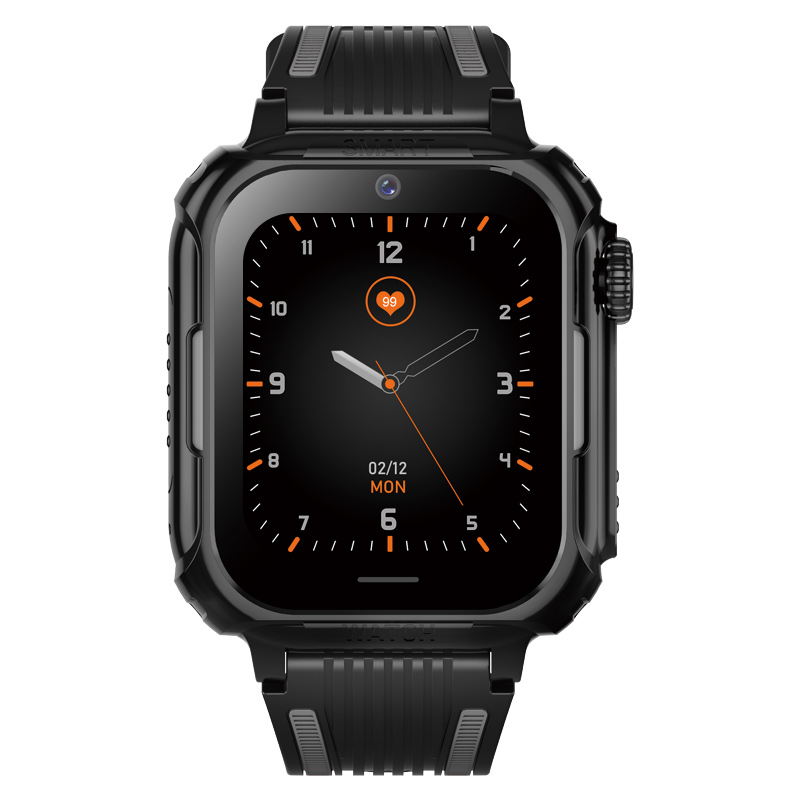

# Sentar - D38-X2

El D38-X2 es un rastreador GPS orientado a niños en forma de reloj inteligente, diseñado con énfasis en la seguridad, la comunicación y la comodidad diaria. Funciona sobre Android 8.1 con memoria y almacenamiento modestos, admite aplicaciones de mensajería populares como WhatsApp, permite llamadas de voz bidireccionales y ofrece posicionamiento mediante GPS, A-GPS, LBS y Wi‑Fi. Su carcasa removible y diseño pensado para niños lo hacen cómodo y adaptable para la escuela, la vida familiar y el juego al aire libre.

Como dispositivo compatible con Plaspy, el D38-X2 actúa como un endpoint sencillo para la ubicación en tiempo real y el estado del dispositivo dentro de una plataforma centralizada de monitoreo. Al integrarlo con Plaspy, los cuidadores y administradores pueden ver ubicaciones en vivo, supervisar la conectividad y el estado básico del dispositivo, y recibir alertas configurables para que el reloj encaje en flujos de supervisión más amplios sin añadir complejidad.

## Aspectos clave

- Compatible con Plaspy para monitoreo centralizado y generación de alertas entre dispositivos
- Ubicación en tiempo real mediante GPS y A-GPS con asistencia por LBS y Wi‑Fi
- Llamadas de voz bidireccionales y soporte para aplicaciones de mensajería como WhatsApp
- Reloj inteligente independiente con Android 8.1 y almacenamiento local para apps y datos
- Diseño físico amigable para niños con carcasa removible y carátulas intercambiables
- Funciones integradas de supervisión parental para simplificar la configuración y el control

## Cómo funciona con Plaspy

Cuando se conecta a Plaspy, el D38-X2 transmite sus datos principales al panel de Plaspy para que los cuidadores puedan monitorear movimiento, revisar el estado del dispositivo y configurar alertas desde una única interfaz. La integración prioriza las señales de ubicación y comunicación del dispositivo para ofrecer información oportuna orientada a la seguridad y la coordinación.

- Actualizaciones de ubicación en vivo y historial de posiciones visibles dentro de Plaspy
- Conectividad del dispositivo e indicadores básicos de estado disponibles para supervisión
- Notificaciones y alertas por registros, eventos fuera de zona o inactividad prolongada
- Visibilidad de eventos de comunicación, como llamadas entrantes o salientes y disponibilidad de mensajería
- Informes centralizados para registros rutinarios y resúmenes de actividad

## Casos de uso habituales

- Monitoreo familiar para comprobaciones de ubicación diarias y coordinación entre cuidadores
- Registros escolares y rutinas supervisadas donde son útiles las actualizaciones rápidas de estado
- Juego al aire libre y desplazamientos locales donde la localización en tiempo real y la comunicación son prioritarias
- Salidas breves y diligencias para mantener la comunicación y la visibilidad de la ubicación
- Entornos de cuidado donde un wearable sencillo ofrece seguridad y opciones de mensajería

## Por qué elegir este rastreador con Plaspy

El D38-X2 está diseñado pensando en la seguridad infantil y la supervisión sencilla, lo que lo hace una opción práctica para padres, tutores y organizaciones que requieren seguimiento portátil sin complicaciones. Su compatibilidad con mensajería y llamadas de voz, junto con múltiples métodos de posicionamiento, lo vuelve útil cuando se necesitan tanto conocimiento de ubicación como contacto directo.

Integrado con Plaspy, el D38-X2 forma parte de un entorno de monitoreo más amplio que unifica la visibilidad del dispositivo, las alertas y los informes entre distintos tipos de equipos. Para obtener más información sobre Plaspy y cómo se gestionan los dispositivos compatibles, visite https://www.plaspy.com. Las especificaciones del producto, la disponibilidad y los detalles del fabricante pueden cambiar con el tiempo, por lo que le recomendamos verificar la información técnica más reciente en el sitio del fabricante http://www.sentarsmart.com/.
