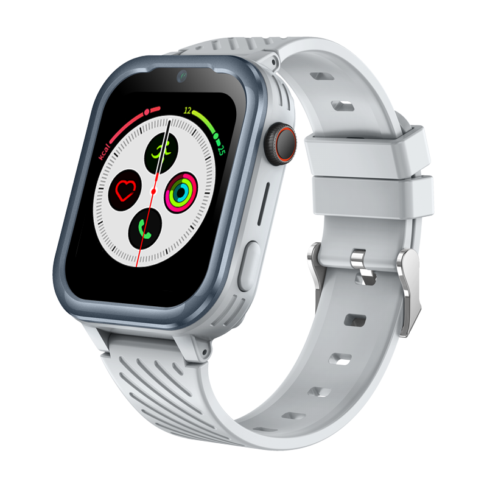

# Sentar - D39

El Sentar D39 es un reloj inteligente GPS compacto con Android y conectividad 4G diseñado para niños. Integra reportes de ubicación continuos con comunicación de voz bidireccional, un botón de emergencia SOS y posicionamiento multimodal que combina GPS, AGPS, LBS y WiFi. Con una pantalla IPS de 1.85 pulgadas y una carcasa resistente al agua con certificación IPX7, el D39 está pensado para el uso diario y la actividad, manteniendo a los cuidadores informados a través de una aplicación complementaria.

Como dispositivo compatible con Plaspy, el D39 transmite su información de posición y estado al entorno de seguimiento de Plaspy para que padres y administradores puedan monitorear ubicaciones, recibir alertas y revisar historiales junto con otros activos. Su formato portátil complementa a los rastreadores vehiculares y fijos en despliegues mixtos, y ofrece una opción enfocada en la seguridad infantil para organizaciones y familias que requieren visibilidad en tiempo real y comunicación directa.

## Características principales

- Reloj inteligente para niños compatible con Plaspy que ofrece seguimiento y reportes en tiempo real.
- Posicionamiento multimodal con GPS, AGPS, LBS y WiFi para mejorar la precisión en exteriores e interiores.
- Conectividad 4G para voz y datos que permite llamadas bidireccionales y actualizaciones rápidas de posición.
- Botón de emergencia SOS dedicado para alertas inmediatas y respuesta rápida de los cuidadores.
- Carcasa resistente al agua con certificación IPX7 y pantalla IPS de 1.85 pulgadas diseñada para el uso diario.
- Diseño portátil y compacto con batería integrada y carga magnética para recargas cómodas.

## Cómo funciona con Plaspy

Al integrarse con Plaspy, el D39 envía fijaciones de ubicación y estados de dispositivo a los paneles de Plaspy, ofreciendo visibilidad consolidada para cuidadores y administradores. Plaspy normaliza las entradas de posicionamiento asistido para la visualización en mapas y la generación de alertas, y presenta eventos y el historial del dispositivo junto con otros activos rastreados para una supervisión más sencilla.

- Actualizaciones de ubicación en tiempo real mostradas en los mapas de Plaspy para monitoreo en vivo.
- Informes de SOS y alertas de pánico que se enrutan a las notificaciones de Plaspy para una respuesta rápida.
- Asistencia en interiores mediante indicios derivados de WiFi y LBS cuando están disponibles, para mejorar la conciencia situacional.
- Reportes de estado de batería y carga para facilitar la gestión del tiempo de actividad y el mantenimiento del dispositivo.
- Controles parentales, historial de ubicaciones y permisos visibles a través de la aplicación complementaria e integrados en la monitorización de Plaspy.

## Casos de uso típicos

- Seguridad infantil y supervisión parental con comprobaciones de ubicación en vivo y alertas de emergencia.
- Supervisión escolar y de guarderías, incluyendo registros programados y soporte de posicionamiento en interiores.
- Monitoreo de actividades al aire libre y recreativas con un wearable resistente pensado para el uso diario.
- Cuidado residencial y comunitario para comprobaciones rápidas de estado y comunicación entre tutores.
- Telemetría complementaria en despliegues mixtos donde el seguimiento personal completa el monitoreo de vehículos o activos fijos.

## Por qué elegir este rastreador con Plaspy

El D39 es una opción dirigida a familias, programas y organizaciones que requieren un wearable enfocado en niños y compatible con Plaspy. Su posicionamiento multimodal y la conectividad celular permiten actualizaciones oportunas, mientras que el SOS y las llamadas bidireccionales ofrecen canales de comunicación directa con los cuidadores. Integrar el D39 en Plaspy incorpora los eventos del dispositivo a un panel administrado para alertas, historial de ubicaciones y supervisión operativa sin añadir complejidad innecesaria.

Dado que el D39 está optimizado para la seguridad personal y la comunicación, se complementa bien con rastreadores de grado vehicular u otros dispositivos de telemetría en Plaspy cuando se requieren capacidades de flota más amplias. Si su despliegue necesita telemetría orientada a vehículos o redes de sensores especializadas, combine el D39 con rastreadores diseñados para cubrir tanto casos de uso wearables como vehiculares.

Para más información sobre cómo funciona el D39 con Plaspy y otros dispositivos compatibles visite https://www.plaspy.com. Las especificaciones del producto, la disponibilidad y los datos del fabricante pueden cambiar con el tiempo, por lo que le recomendamos verificar las especificaciones vigentes en el sitio oficial de Sentar http://www.sentarsmart.com/ antes de tomar decisiones de compra o despliegue.
