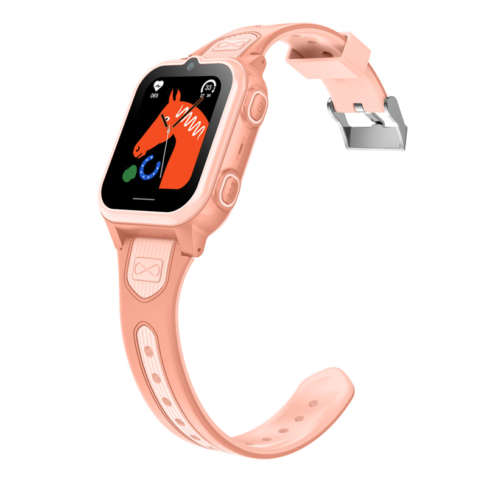

# Sentar - D50

El Sentar D50 es un reloj inteligente 4G compacto para niños, diseñado pensando en la seguridad infantil y la comunicación familiar. Como rastreador GPS wearable, combina posicionamiento por GPS con LBS y WiFi, dispone de una cámara frontal para llamadas y fotos, y cuenta con un botón físico de SOS integrado en una pantalla a color de pequeño tamaño. El dispositivo está pensado para ofrecer visibilidad continua de ubicación y un reporte de emergencias sencillo para padres y responsables.

Este modelo D50 es compatible con Plaspy, lo que significa que las actualizaciones de ubicación, las alertas SOS y la telemetría de estado del reloj pueden integrarse en la plataforma Plaspy para su monitoreo y notificaciones. Para organizaciones y familias que usan Plaspy, el D50 ofrece una opción wearable enfocada que incorpora el rastreo en tiempo real y el reporte de eventos en los mapas, líneas de tiempo y canales de notificación de Plaspy.

## Aspectos destacados

- Factor de forma wearable y compacto con una pantalla a color de 1.38 pulgadas adecuada para niños.
- Posicionamiento multi fuente que combina GPS con LBS y WiFi para mejorar la cobertura.
- Conectividad celular 4G y amplio soporte de bandas LTE/GSM para reportes confiables.
- Botón SOS dedicado y cámara frontal que añaden contexto a los eventos de emergencia.
- Batería de polímero de 630 mAh y un RTOS eficiente para telemetría diaria consistente.
- Protección IPX7 contra el agua y un sistema de carga práctico para el uso cotidiano.

## Cómo funciona con Plaspy

Al registrar el D50 en Plaspy, el dispositivo envía actualizaciones periódicas de posición y alertas por eventos a través de la red celular, de modo que cuidadores y administradores pueden ver la ubicación y el estado casi en tiempo real. Plaspy muestra esas actualizaciones en mapas y líneas de tiempo, enruta las alertas a los canales de notificación configurados y conserva el contexto de los eventos, como registros de llamadas o fotos, para apoyar la toma de decisiones.

- Actualizaciones de ubicación en tiempo real en Plaspy usando GPS con fallback a LBS y WiFi para continuidad.
- Alertas de emergencia SOS transmitidas a Plaspy para activar notificaciones inmediatas y mostrar la ubicación.
- Telemetría de nivel de batería y estado en línea visible en Plaspy para ayudar a gestionar el tiempo de actividad del dispositivo.
- Eventos de llamadas de voz y video bidireccionales e imágenes capturadas registrados como eventos contextuales.
- La integración admite operación flexible según el operador mediante nano SIM y cobertura de bandas amplia.

## Casos de uso típicos

- Seguridad infantil y supervisión parental con ubicación en vivo y alertas de emergencia rápidas.
- Supervisión escolar para llegadas, salidas y verificaciones de ubicación programadas.
- Comunicación familiar a corta distancia mediante llamadas de voz y video para confirmar el bienestar.
- Monitoreo de juegos al aire libre donde la resistencia al agua y un diseño duradero son beneficiosos.
- Revisiones rutinarias de estado del dispositivo y reportes de salud para reducir tiempos de inactividad inesperados.

## Por qué elegir este rastreador con Plaspy

El D50 es un rastreador wearable diseñado específicamente para encajar con los objetivos de seguridad infantil, comunicación familiar y supervisión simple de dispositivos cuando se usa junto a Plaspy. Su combinación de posicionamiento multi fuente, botón SOS y cámara aporta contexto práctico a los eventos, complementando las capacidades de visibilidad, alerta y reporte de Plaspy. El diseño del dispositivo y su capacidad de batería están pensados para un uso diario confiable, lo que lo convierte en una opción directa para cuidadores y despliegues pequeños gestionados a través de Plaspy.

Si desea saber más sobre cómo Plaspy puede trabajar con el Sentar D50, visite https://www.plaspy.com para información sobre la plataforma y opciones de despliegue. Las especificaciones del producto, la disponibilidad y los detalles del fabricante pueden cambiar con el tiempo, así que verifique las especificaciones y la documentación actuales con el fabricante en http://www.sentarsmart.com/ antes de comprar.
