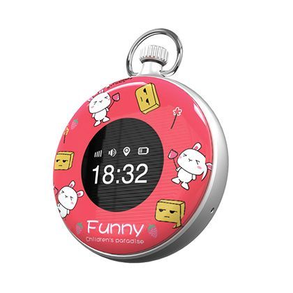

# Sentar - L70S

El Sentar L70S es un reloj rastreador GPS diseñado específicamente para niños. Con su diseño compacto y elegante, no solo es un dispositivo funcional, sino también un accesorio de moda. El L70S está equipado con un chipset MTK2503, que garantiza un seguimiento preciso y confiable de la ubicación.

Una de las características destacadas del L70S es sus múltiples modos de ubicación. Admite posicionamiento GPS, AGPS, LBS y WiFi, lo que permite un seguimiento preciso y en tiempo real de la ubicación de su hijo. Ya sea que estén en la escuela, en el parque o en casa de un amigo, puede vigilarlos fácilmente utilizando el L70S.

El L70S está disponible en cuatro colores vibrantes: azul, rosa, negro y blanco, lo que permite que su hijo elija su favorito. El reloj no solo es funcional, sino también cómodo de llevar, con una correa suave y ajustable que se ajusta de forma segura a la muñeca.

### Características destacadas:

- Chipset MTK2503 para un seguimiento preciso y confiable
- Posicionamiento GPS, AGPS, LBS y WiFi para un seguimiento preciso de la ubicación
- Diseño compacto y elegante
- Disponible en azul, rosa, negro y blanco
- Correa cómoda y ajustable

