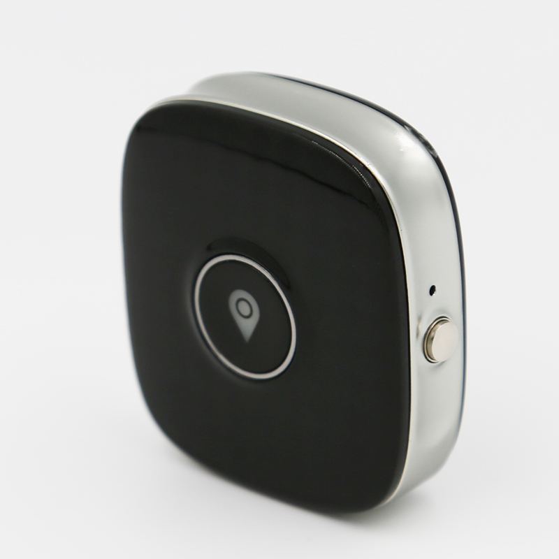

# Sentar - ROTS

El Sentar ROTS es un rastreador GPS portátil y compacto diseñado para la seguridad de las mascotas y la cobertura de localización a larga distancia. Diseñado para colocarse en el collar, el ROTS ofrece actualizaciones continuas de posición a través de redes celulares y está pensado para perros y mascotas de exterior que requieren supervisión permanente. El equipo incorpora un chipset principal ASR y una memoria a bordo moderada para garantizar un funcionamiento estable durante periodos prolongados de monitoreo.

El ROTS es compatible con Plaspy desde el primer momento, por lo que propietarios y gestores pueden ver la telemetría de ubicación a través de los paneles de Plaspy en dispositivos móviles y web. La integración con Plaspy permite acceso centralizado al seguimiento en vivo, reproducción histórica y alertas, lo que convierte al ROTS en una opción práctica para quienes desean visibilidad de la ubicación de su mascota junto con las funciones de monitoreo e informes de Plaspy.

## Aspectos clave

- Rastreador GPS para mascotas compatible con Plaspy para seguimiento en tiempo real y alertas centralizadas
- Conectividad celular multinetwork con soporte 4G, 3G y 2G para mayor cobertura
- Chipset principal ASR con 128MB de RAM y 128MB de ROM para operación estable durante monitoreo continuo
- Ranura Nano SIM para aprovisionamiento flexible con distintos operadores y configuración sencilla
- Diseño amigable para colocarse en el collar, apto para uso prolongado en exteriores
- Soporte de bandas de frecuencia amplias para mejorar el roaming y la conectividad entre regiones
- Optimizado para telemetría de ubicación con datos frecuentes de posición y registro temporal para el procesamiento en Plaspy

## Cómo funciona con Plaspy

Al emparejarse con Plaspy, el ROTS envía actualizaciones de ubicación por redes celulares a la plataforma Plaspy, donde los datos de posición se procesan y visualizan para seguimiento en tiempo real y revisión histórica. Plaspy convierte la telemetría entrante en mapas, alertas e informes para que usted pueda monitorear el movimiento de su mascota y recibir notificaciones cuando ocurran eventos definidos.

- Seguimiento de ubicación en vivo y reproducción de movimientos recientes desde los paneles de Plaspy
- Configuración de alertas geográficas y notificaciones para zonas protegidas y salidas de perímetro
- Informes de rutas históricas para revisar patrones de actividad y registros temporales
- Visibilidad centralizada de dispositivos para supervisar múltiples rastreadores desde una cuenta Plaspy
- Aprovisionamiento de SIM simplificado y selección de operador al gestionar despliegues mediante Plaspy

## Casos de uso típicos

- Seguridad y recuperación de mascotas perdidas o extraviadas mediante mapas en vivo y reproducción histórica
- Monitoreo de actividad al aire libre para perros de senderismo y mascotas que recorren grandes propiedades
- Supervisión remota con alertas por geovalla cuando una mascota sale de una zona segura
- Control en residencias o guarderías para mascotas para rastrear movimiento durante periodos de cuidado
- Monitoreo multiusuario para que distintos miembros de la familia compartan acceso a los datos de ubicación

## Por qué elegir este rastreador con Plaspy

El rastreador ROTS es una solución enfocada en el seguimiento de mascotas que combina un factor de forma liviano y portátil con amplia conectividad celular y recursos a bordo suficientes para soportar el reporte continuo de ubicación. En conjunto con Plaspy, ofrece visibilidad de telemetría sencilla y herramientas prácticas para propietarios que necesitan actualizaciones de posición confiables sin la complejidad de dispositivos específicos para vehículos.

Para organizaciones y propietarios de mascotas que usan Plaspy, el ROTS brinda una opción simple y orientada a la compatibilidad para la monitorización de la ubicación. Su diseño y características de conectividad lo hacen adecuado cuando la prioridad es el monitoreo continuo, la configuración fácil de SIM y reportes claros de ubicación.

Para conocer más sobre cómo Plaspy puede gestionar rastreadores como el Sentar ROTS visite https://www.plaspy.com. Las especificaciones y la disponibilidad del producto pueden cambiar con el tiempo, así que verifique los detalles más recientes con el fabricante en http://www.sentarsmart.com/.
