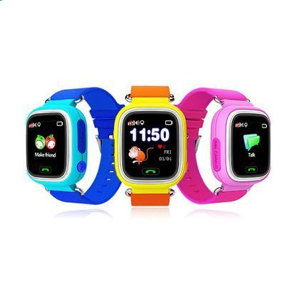

# Sentar - V80

El Sentar V80 es un reloj GPS compacto pensado para niños. Comercializado también como V80-1.22 Niños Reloj GPS, el equipo combina un diseño atractivo para menores —disponible en azul, rosa y naranja— con tecnologías de posicionamiento destinadas a ofrecer actualizaciones regulares de ubicación a los cuidadores. La ficha técnica destaca un chipset MTK2503 y varios modos de localización (GPS, AGPS, LBS y WiFi), además de funciones de seguridad como botón SOS, comunicación bidireccional y alertas por geocerca.

Como dispositivo compatible con Plaspy, el V80 puede integrarse con la plataforma para centralizar la visibilidad de ubicaciones y las notificaciones de seguridad de familias o administradores responsables del transporte o actividades grupales. Plaspy puede recopilar y mostrar la ubicación y los eventos del dispositivo, proporcionando una vista unificada de movimientos, eventos de geocerca y alertas de emergencia en un mismo entorno de monitoreo.

## Características principales

- Diseñado específicamente como reloj GPS infantil, con dimensiones compactas y colores que atraen a los niños.
- Varios modos de posicionamiento indicados en la descripción del producto para mejorar la fiabilidad de la ubicación en distintos entornos.
- Botón SOS integrado para enviar una alerta de emergencia a contactos predefinidos.
- Capacidad de comunicación bidireccional que permite comunicación de voz entre el cuidador y la persona que usa el reloj.
- Soporte para geocercas que notifica cuando el dispositivo entra o sale de áreas definidas.
- Basado en el chipset MTK2503, lo que indica el uso de hardware de posicionamiento probado.

## Cómo funciona con Plaspy

El V80 puede enviar actualizaciones de posición e información de eventos a Plaspy, de modo que una única plataforma muestre la ubicación actual, los desplazamientos recientes y los sucesos de seguridad. Los usuarios de Plaspy pueden monitorear niños o pequeños grupos junto con otros activos rastreados y configurar notificaciones e informes.

- Monitoreo de ubicación en tiempo real e historial de ubicaciones accesible desde los paneles de Plaspy.
- Notificaciones de eventos de geocerca reenviadas a Plaspy para alertas de límites y supervisión operativa.
- Alertas SOS canalizadas hacia Plaspy para que supervisores o familiares reciban avisos oportunos.
- Eventos de comunicación bidireccional que pueden registrarse o consultarse desde Plaspy para aportar contexto situacional.
- Informes y registros de eventos exportables para apoyar controles rutinarios y mantenimiento de registros.

## Casos de uso típicos

- Vigilancia parental para traslados escolares diarios y actividades después de clases.
- Supervisión en guarderías o campamentos para mantener control de varios niños durante salidas.
- Escenarios de tutela y cuidado de personas mayores donde un dispositivo pequeño y portátil resulta útil.
- Supervisión temporal en excursiones o transporte de grupos pequeños donde se requiere visibilidad centralizada.

## Por qué elegir este rastreador con Plaspy

El Sentar V80 es una opción sensata cuando la necesidad principal es un wearable enfocado en niños que ofrezca funciones básicas de ubicación y seguridad. Su combinación de múltiples modos de posicionamiento, función SOS y comunicación bidireccional lo hace práctico para cuidadores que buscan un rastreo sencillo y fiable junto con capacidad de contacto directo.

Al integrarlo con Plaspy, el V80 forma parte de una solución más amplia de visibilidad y alertas. Plaspy ayuda a centralizar los datos del dispositivo, enviar notificaciones y mantener registros de ubicaciones, facilitando la gestión de flujos de trabajo de seguridad para familias, colegios y pequeñas organizaciones. Según la descripción del modelo, el V80 es especialmente adecuado cuando se prefiere un wearable compacto y un monitoreo directo y sencillo.

Aprenda más sobre cómo Plaspy puede gestionar rastreadores compatibles y explore las funciones de la plataforma en https://www.plaspy.com. Las especificaciones y la disponibilidad del producto pueden cambiar con el tiempo, por lo que le recomendamos verificar los detalles técnicos actuales y la documentación oficial con el fabricante en http://www.sentarsmart.com/.
