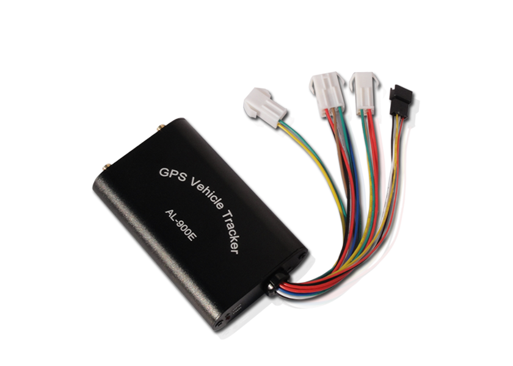

# SinoTrack - AL-900E

El SinoTrack AL-900E es un rastreador GPS vehicular compacto diseñado para una amplia variedad de vehículos, incluidos automóviles, camiones y motocicletas. Combina una construcción robusta con resistencia a condiciones ambientales, funcionando en un amplio rango de temperaturas y ofreciendo protección IP53 frente al polvo y salpicaduras. La unidad emplea un módulo GPS Sirf IV con recepción multicanal para ofrecer fijaciones de posición y reportar ubicaciones con una precisión indicada adecuada para el rastreo rutinario y la supervisión de flotas.

Como dispositivo compatible con Plaspy, el AL-900E puede enviar su ubicación y datos de eventos a la plataforma Plaspy para su monitoreo y gestión centralizados. Su soporte para reporte por SMS y a través de la plataforma, alarmas configurables, monitoreo de entradas y salidas y ajuste remoto de parámetros permite integrar el rastreador en flujos de trabajo de Plaspy para obtener visibilidad en tiempo real, alertas y análisis histórico de rutas, conservando la flexibilidad necesaria para diferentes requisitos operativos.

## Características principales

- Diseño compacto y resistente, apto para automóviles, camiones y motocicletas
- Amplio rango de operación de -15°C a 80°C para entornos variados
- Carcasa con certificación IP53 que protege contra polvo y salpicaduras
- Módulo GPS Sirf IV con recepción multicanal y precisión típica de posición de alrededor de 10 m CEP
- Múltiples tipos de alarma, incluyendo exceso de velocidad, SOS y encendido/apagado de la alimentación principal para monitoreo de seguridad
- Entradas y salidas para sensores externos y control remoto de funciones relacionadas con combustible y alimentación
- Soporta ubicación por SMS, reportes en tiempo real y subida de datos a la plataforma con almacenamiento de puntos para cobertura intermitente

## Cómo funciona con Plaspy

Al conectarse a Plaspy, el AL-900E envía mensajes de posición y eventos que Plaspy procesa para mostrar mapas, alertas y seguimiento histórico. Plaspy presenta esos datos en paneles y herramientas de reporte para que los gestores de flota y operadores puedan monitorear activos desde una sola interfaz.

- Visualización de la ubicación en tiempo real en los mapas de Plaspy usando los reportes de posición del rastreador
- Notificaciones automáticas de eventos y alarmas, como exceso de velocidad y SOS, enviadas al sistema de alertas de Plaspy
- Reproducción de rutas históricas e informes de viajes aprovechando puntos de ubicación almacenados y el almacenamiento por puntos para cobertura intermitente
- Configuración remota y actualizaciones de parámetros vía mensajería basada en la plataforma cuando el dispositivo lo soporta
- Visibilidad de eventos de entradas y salidas, por ejemplo cambios en puertas o en sensores de combustible, presentados en los paneles de Plaspy
- Reportes consolidados y registros exportables para revisión operativa y cumplimiento

## Casos de uso típicos

- Seguimiento de flotas pequeñas y medianas para autos, camionetas de reparto y camiones ligeros
- Monitoreo de seguridad y recuperación de vehículos con alarmas y reportes SOS
- Operaciones con flotas mixtas que incluyen motocicletas y vehículos utilitarios
- Visibilidad para logística y reparto con análisis histórico de rutas
- Operaciones remotas o regionales que requieren tolerancia térmica robusta y captura de datos en puntos durante cobertura intermitente

## Por qué elegir este rastreador con Plaspy

El AL-900E ofrece un conjunto equilibrado de funciones que encajan en muchos escenarios de rastreo vehicular. Su tolerancia ambiental y la clasificación de protección lo convierten en una opción práctica para flotas que operan en climas variados, mientras que las alarmas configurables y las opciones de entradas y salidas permiten una integración sencilla en procesos operativos. Para organizaciones que usan Plaspy, este rastreador aporta los datos de ubicación y eventos necesarios para el monitoreo rutinario y la respuesta ante incidentes.

Si desea explorar cómo se puede usar el SinoTrack AL-900E con Plaspy para la supervisión de flotas y el seguimiento de activos, conozca más sobre Plaspy en nuestro sitio principal https://www.plaspy.com. Las especificaciones del producto y la disponibilidad pueden cambiar con el tiempo, por lo que le recomendamos verificar los detalles técnicos y la documentación actuales con el fabricante en https://www.sinotrackgps.com/ antes del despliegue final.
