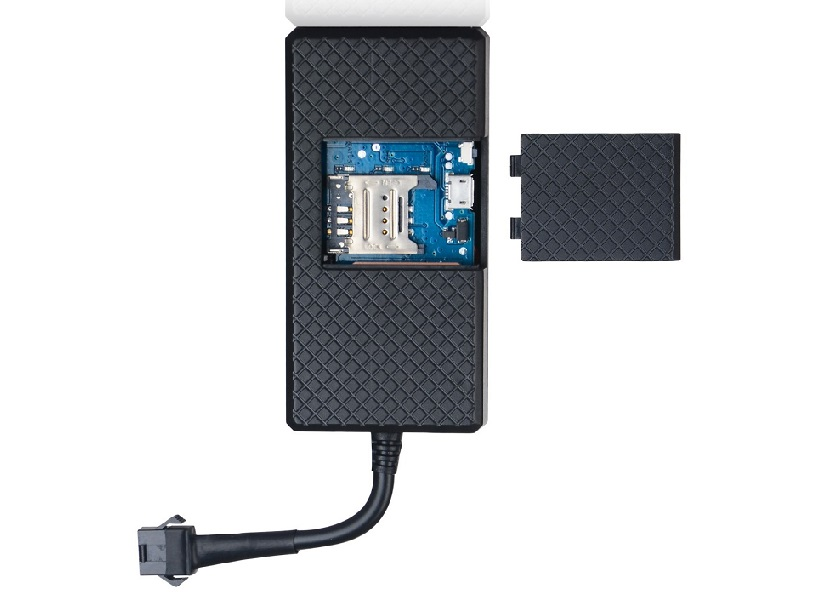

# SinoTrack - ST-901A

El SinoTrack ST-901A es un rastreador GPS compacto pensado para el seguimiento de vehículos y la supervisión de flotas. Combina un tamaño reducido con funciones esenciales de rastreo, aptas tanto para automóviles particulares como para activos comerciales. Emplea un módulo GPS Ubox 7020 y ofrece precisión de posición anunciada de alrededor de 10 metros, además de sensibilidades de rastreo pensadas para asegurar la recepción satelital en condiciones variadas.

Como dispositivo compatible con Plaspy, el ST-901A puede enviar ubicaciones y alertas básicas a una plataforma centralizada de gestión de flotas. Plaspy recibe las actualizaciones de posición del rastreador y las presenta junto con otros activos para brindar visibilidad operativa, por lo que el ST-901A es una opción práctica cuando usted necesita incorporar rastreo GPS y notificaciones sencillas a su despliegue de Plaspy.

## Aspectos destacados

- Diseño compacto, adecuado para vehículos particulares y activos de flota
- Posicionamiento basado en el módulo Ubox 7020 con precisión anunciada de hasta 10 metros
- Varias opciones de rastreo, incluyendo consultas por SMS y reporte en tiempo real vía GPRS
- Alarmas para corte de alimentación principal, detección de impactos y notificaciones por exceso de velocidad
- Controles remotos para corte de combustible y alimentación que apoyan la seguridad del vehículo
- Sensibilidades de receptor pensadas para favorecer la adquisición satelital en distintas condiciones

## Cómo funciona con Plaspy

Al integrarse con Plaspy, el ST-901A transmite actualizaciones de ubicación y notificaciones de alarma que Plaspy muestra en una interfaz unificada de gestión de flotas. Plaspy ingiere los datos del rastreador y los convierte en información accionable para monitoreo, alertas y reportes básicos.

- Las actualizaciones de posición en tiempo real enviadas por GPRS aparecen en Plaspy para seguimiento en vivo y revisión de rutas
- Las consultas de ubicación por SMS pueden utilizarse junto con el registro de Plaspy para validar la posición actual bajo demanda
- Eventos de alarma como corte de energía, impacto o exceso de velocidad se reenvían a Plaspy para activar notificaciones y registros de incidentes
- Las acciones remotas sobre combustible y alimentación reportadas por el dispositivo pueden reflejarse en los paneles de estado de Plaspy
- El historial de ubicaciones agregado por el rastreador apoya la reconstrucción básica de viajes y la supervisión operativa

## Casos de uso típicos

- Seguimiento de vehículos de flota para operaciones de reparto y servicio
- Monitoreo de autos personales o de empresa para ubicación y alertas de seguridad
- Supervisión de vehículos de alquiler o compartidos con controles básicos de inmovilización
- Informes empresariales sobre movimientos de vehículos y notificaciones de incidentes
- Seguridad de activos donde se requieren rastreadores compactos y alertas integradas

## Por qué elegir este rastreador con Plaspy

El ST-901A es una opción razonable para organizaciones que buscan un rastreador compacto y funcional para integrar con Plaspy. Su combinación de precisión de posición, opciones de reporte flexibles y funciones de alarma incorporadas entrega los datos básicos que la mayoría de los operadores necesita para la visibilidad diaria de la flota y flujos de trabajo de seguridad sencillos. Utilizar el ST-901A con Plaspy permite centralizar el monitoreo y responder a alertas desde una única plataforma.

Si requiere telemetría avanzada o integraciones especializadas, evalúe sus necesidades frente al conjunto de funciones del ST-901A y confirme que los tipos de rastreo y alarma soportados cumplen con sus requisitos operativos. Plaspy puede ayudar a presentar los datos del rastreador en paneles, alertas y reportes que mejoren la conciencia situacional en toda su flota.

Para conocer más sobre Plaspy y las capacidades de la plataforma visite https://www.plaspy.com. Las especificaciones y la disponibilidad del producto pueden cambiar con el tiempo, por lo que le recomendamos verificar los detalles actuales del dispositivo directamente con el fabricante en https://www.sinotrackgps.com/.
