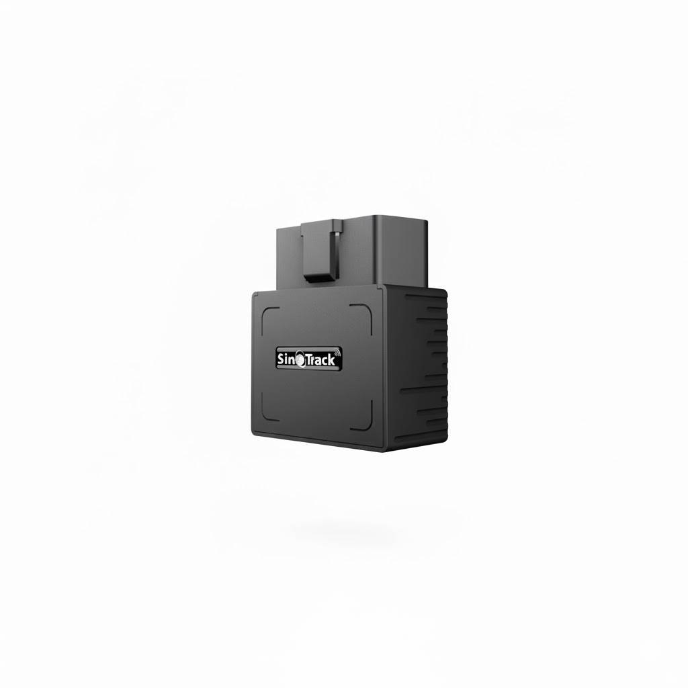

# SinoTrack - ST-902L

El SinoTrack ST-902L es un rastreador GPS OBD II compacto, plug and play, pensado para autos y vehículos livianos. Diseñado para conectarse en un puerto OBD estándar de 16 pines, el ST-902L ofrece actualizaciones continuas de posición y telemetría del vehículo a través de redes 4G LTE y GSM. El equipo integra un receptor GNSS UBLOX7020 para obtener localizaciones confiables, cuenta con una batería de respaldo interna para operación limitada y detección de manipulación, y permite la configuración por SMS para parámetros de APN y servidor.

Como modelo confirmado compatible con Plaspy, el ST-902L puede configurarse para enviar datos de ubicación en vivo y alarmas a Plaspy estableciendo la IP y el puerto del servidor del dispositivo y suministrando una SIM de datos local. Esa combinación de instalación sencilla y reporte configurable hace que el ST-902L sea una opción práctica para usuarios de Plaspy que buscan despliegue rápido de seguimiento en tiempo real, alertas de geocerca y notificaciones por eventos sin necesidad de modificar el cableado del vehículo.

## Aspectos principales

- Factor de forma OBD II plug and play para incorporación rápida de vehículos y tiempo mínimo de instalación.
- Compatible con Plaspy mediante configuración de IP y puerto del servidor y ajuste por SMS para APN y reportes.
- Receptor GNSS UBLOX7020 para fijaciones de posición precisas y rendimiento de seguimiento consistente.
- Conectividad 4G LTE y GSM GPRS para mantener seguimiento continuo a través de redes móviles.
- Batería de respaldo integrada para operación limitada y detección de manipulación cuando se corta la alimentación OBD.
- Soporte de eventos y alarmas incluyendo geocerca, exceso de velocidad, impacto y notificaciones de batería baja.
- Acceso al portal del fabricante y gestión de cuentas multi dispositivo para control centralizado de unidades.

## Cómo funciona con Plaspy

La integración del ST-902L con Plaspy se realiza apuntando el dispositivo al endpoint de ingestión de Plaspy mediante la configuración de la dirección del servidor y asegurando que la SIM de datos local y el APN estén correctamente configurados. Una vez dirigido a Plaspy, el ST-902L reenvía actualizaciones de posición y paquetes de eventos para que los vehículos aparezcan en tiempo real en los paneles y reportes de Plaspy.

- Actualizaciones de ubicación en tiempo real enviadas por redes celulares a Plaspy para monitoreo en vivo.
- Entrega inmediata de alarmas de geocerca, exceso de velocidad, impacto y manipulación a las notificaciones de Plaspy.
- Reproducción histórica de ubicaciones y archivos de viajes en Plaspy para análisis de rutas e informes.
- Provisionamiento por SMS para la configuración de APN e IP del servidor durante la puesta en marcha antes del registro en Plaspy.
- Aproveche las funciones de flota de Plaspy para agrupar dispositivos, supervisar múltiples vehículos y mantener supervisión operativa.

## Casos de uso típicos

- Gestión de flotas de vehículos livianos y taxis donde la instalación rápida en OBD II acelera el despliegue.
- Monitoreo antirrobo con detección de manipulación y alertas de batería de respaldo derivadas a Plaspy.
- Programas de supervisión y seguridad de conductores que usan eventos de exceso de velocidad e impacto para retroalimentación y coaching.
- Rastreo de vehículos de renta y leasing para activación rápida y registro de historial de ubicaciones durante el periodo de servicio.
- Cumplimiento y registro de trayectos donde los reportes centralizados de Plaspy archivan el movimiento de vehículos.

## Por qué elegir este rastreador con Plaspy

El ST-902L ofrece un equilibrio entre simplicidad y seguimiento confiable, ideal para organizaciones que requieren despliegues rápidos por OBD II. Su diseño plug and play reduce la carga de instalación, mientras que el GNSS UBLOX7020 y la conectividad celular brindan lo esencial para mantener la visibilidad continua de la flota. Para usuarios de Plaspy, la capacidad de configurar parámetros de servidor y APN por SMS o según las indicaciones del fabricante facilita la integración y optimiza la operación.

Si necesita un rastreador vehicular compacto que pueda apuntarse rápidamente a Plaspy para monitoreo en vivo, el SinoTrack ST-902L es una opción práctica para autos y vehículos livianos. Obtenga más información sobre Plaspy y cómo se usan los dispositivos compatibles en la plataforma en https://www.plaspy.com. Las especificaciones del producto y la disponibilidad pueden cambiar con el tiempo, por lo que le recomendamos verificar los detalles técnicos actuales y la compatibilidad regional en el sitio del fabricante https://www.sinotrackgps.com/ antes de la compra o el despliegue.
