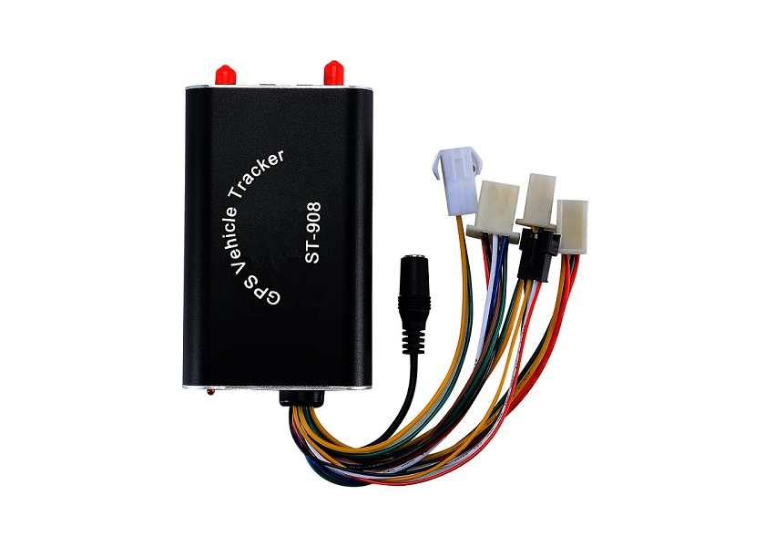

# SinoTrack - ST-908

El SinoTrack ST-908 es un rastreador GPS compacto para montaje en vehículos, pensado para autos, camiones, motocicletas y activos móviles similares. Ofrece una carcasa resistente, un amplio rango de temperatura de operación y grado de protección IP53, lo que lo hace apto para distintas condiciones ambientales. Incorpora un módulo Sirf IV GPS que proporciona precisión de posición típicamente alrededor de 10 m CEP y soporta posicionamiento satelital continuo con opciones de reporte por SMS y GPRS.

Como dispositivo compatible con Plaspy, el ST-908 puede enviar datos de ubicación y eventos a la plataforma Plaspy para su monitoreo y gestión. Su soporte para reportes en tiempo real, alarmas configurables como exceso de velocidad y SOS, así como entradas para ACC, puerta, choque y sensores de combustible, lo convierten en una opción práctica para organizaciones que desean centralizar la visibilidad de sus vehículos y las alertas en Plaspy. El almacenamiento de puntos de ruptura y el soporte de comandos desde la plataforma ayudan a garantizar que las posiciones históricas y los controles remotos se gestionen de forma centralizada.

## Características principales

- Diseño compacto y robusto, adecuado para autos, camiones, motocicletas y vehículos ligeros
- Amplio rango de operación de -15°C a 80°C para distintos climas
- Protección IP53 contra polvo y salpicaduras de agua
- Módulo Sirf IV GPS con precisión de posición alrededor de 10 m CEP sin SA
- Posicionamiento satelital continuo con reportes por SMS y GPRS
- Alarmas integradas, incluyendo exceso de velocidad, SOS y alertas de encendido/apagado de la alimentación principal
- Varias entradas para ACC, puerta, choque y sensores de combustible, además de control remoto de combustible y electricidad

## Cómo funciona con Plaspy

Al integrarse con Plaspy, el ST-908 puede transmitir actualizaciones de posición y eventos de alarma a un entorno centralizado de monitoreo para que los operadores visualicen el estado del vehículo, respondan incidentes y generen informes. Plaspy procesa los datos del dispositivo y los muestra junto con otros activos para una supervisión unificada de la flota.

- Seguimiento de ubicación en vivo y visualización en mapas dentro de Plaspy
- Reenvío de alarmas por eventos como exceso de velocidad, SOS y cambios en la alimentación principal
- Visibilidad de estados de entradas como ACC, puertas, choques y activaciones del sensor de combustible
- Soporte de comandos remotos desde la plataforma cuando el dispositivo acepta comandos de plataforma
- Sincronización de posiciones almacenadas después de brechas GSM mediante el almacenamiento de puntos de ruptura para reconstrucción completa de viajes

## Casos de uso típicos

- Monitoreo de vehículos de flota para operaciones diarias y supervisión de rutas
- Rastreo de vehículos particulares para seguridad y recuperación
- Seguimiento de motocicletas y vehículos ligeros en flotas mixtas
- Disuasión de robos y respuesta a emergencias mediante SOS y notificaciones de alarma
- Monitoreo del estado de motor o alimentación y eventos de sensores para control operativo

## Por qué elegir este rastreador con Plaspy

El ST-908 combina un conjunto de funciones práctico con resistencia ambiental, lo que lo hace una opción sensata para organizaciones que requieren reportes de ubicación confiables y alertas de eventos. Sus alarmas integradas y múltiples opciones de entrada permiten vigilar tanto la posición como señales clave del vehículo, mientras que el almacenamiento de puntos de ruptura ayuda a conservar el historial de ubicaciones cuando la conectividad es intermitente.

En conjunto con Plaspy, el ST-908 puede gestionarse como parte de una estrategia más amplia de rastreo de flotas o activos, permitiendo monitoreo consolidado, alertas y reportes históricos. Dado que el dispositivo soporta comandos de plataforma y parámetros configurables, Plaspy puede usarse para ajustar reportes y respuestas a las necesidades operativas sin perder la supervisión central.

Para obtener más información sobre Plaspy y cómo se integran los rastreadores compatibles, visite https://www.plaspy.com. Las especificaciones de producto y la disponibilidad pueden cambiar con el tiempo, por lo que le recomendamos verificar los detalles y la documentación técnica actual con el fabricante en https://www.sinotrackgps.com/.
