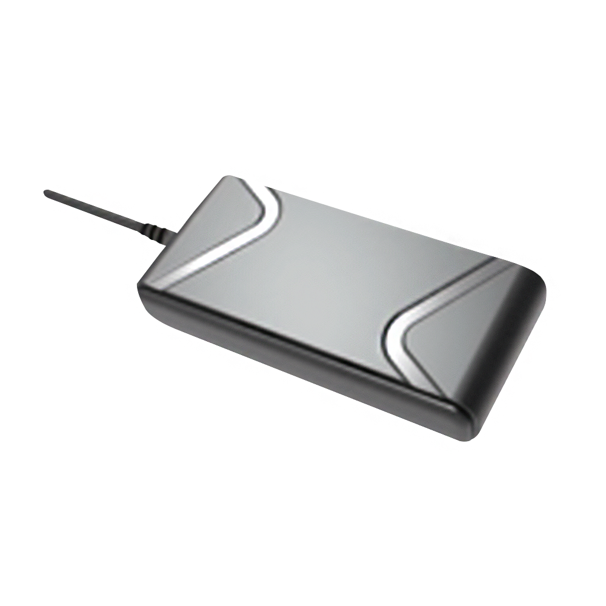

# SkyPatrol - SP1824

El SP1824 es un rastreador GPS económico diseñado para gerentes de flota y propietarios de vehículos que requieren seguimiento en tiempo real confiable sin complejidad innecesaria. Combina conectividad celular con antenas internas de GPS y celular para una instalación más compacta y actualizaciones de ubicación constantes. El dispositivo ofrece una conexión OBD II opcional y un acelerómetro integrado, además de una batería de respaldo compacta que mantiene el reporte durante interrupciones breves de energía.

Como dispositivo compatible con Plaspy, el SP1824 puede enviar ubicación, eventos de movimiento y telemetría vehicular opcional a la plataforma de seguimiento y reportes de Plaspy. Su enfoque en conectividad estable y telemetría esencial lo convierte en una opción práctica para organizaciones que desean hardware rentable integrado con Plaspy para monitoreo en vivo, alertas y análisis históricos.

## Aspectos clave

- Rastreador GPS compatible con Plaspy que ofrece seguimiento en tiempo real confiable con un perfil de bajo costo
- Conectividad 4G LTE Cat 1 con retroceso a 2G para mejorar la cobertura y la vida útil del dispositivo
- Antenas internas de GPS y celular para una instalación compacta y menos componentes externos
- Conexión OBD II opcional para exponer telemetría vehicular y obtener insights de flota más completos cuando esté disponible
- Acelerómetro integrado para detección de movimiento y reporte de eventos de comportamiento de conducción
- Pequeña batería de respaldo para mantener el reporte durante pérdidas temporales de energía o manipulación

## Cómo funciona con Plaspy

Cuando usted lo conecta a Plaspy, el SP1824 transmite datos de ubicación y eventos a través de la red celular para que los operadores de flota puedan ver posiciones en vivo, activar alertas y generar reportes. Plaspy ingiere la información del dispositivo y pone la telemetría a disposición en mapas, paneles y registros históricos para apoyar la supervisión operativa.

- Actualizaciones de ubicación en tiempo real y historial de rutas visibles en los mapas y la reproducción de Plaspy
- Eventos impulsados por el acelerómetro para detección de movimiento, maniobras bruscas y monitoreo de inactividad
- Telemetría OBD II opcional enviada a Plaspy para diagnósticos del vehículo y reportes relacionados con combustible cuando el vehículo lo expone
- Reportes de pérdida de energía y batería de respaldo para mantener visibilidad durante intentos de manipulación o desconexiones
- Reglas de alertas y geocercas en Plaspy para notificar a los equipos sobre movimientos no autorizados o desviaciones de rutas

## Casos de uso típicos

- Gestión de flotas para seguimiento de rutas, análisis de utilización y reportes operativos
- Flotas de alquiler y vehículos compartidos que necesitan hardware de rastreo económico a gran escala
- Monitoreo anti‑robo con ubicación en vivo y alertas por pérdida de energía para ayudar en la recuperación
- Programas de comportamiento del conductor que usan eventos del acelerómetro para capacitación en seguridad
- Monitoreo de combustible y motor mediante telemetría OBD II opcional cuando el vehículo lo soporte

## Por qué elegir este rastreador con Plaspy

El SP1824 ofrece un equilibrio directo entre asequibilidad y las funciones esenciales que muchas flotas requieren. Su enfoque en doble red y antenas internas reduce la complejidad, mientras que la telemetría OBD II opcional y los eventos del acelerómetro proporcionan información accionable más allá de la simple ubicación. Para organizaciones que priorizan despliegues rentables, el SP1824 puede aportar entradas confiables a Plaspy sin extras innecesarios.

Si usted está evaluando hardware para integrar con Plaspy, el SP1824 es una opción práctica para despliegues que requieren seguimiento en tiempo real confiable y telemetría vehicular esencial. Para conocer más sobre Plaspy y cómo dispositivos compatibles como el SP1824 se usan dentro de la plataforma visite https://www.plaspy.com. Las especificaciones y la disponibilidad del producto pueden cambiar con el tiempo, así que por favor verifique los detalles actuales en el sitio del fabricante https://www.skypatrol.com/ antes de tomar decisiones de compra o despliegue.
