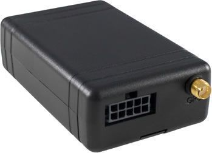

# SkyPatrol - SP3600

La serie SkyPatrol SP3600 es un dispositivo de rastreo GPS orientado a vehículos, diseñado para ofrecer monitoreo de ubicación confiable y visibilidad operativa. Desarrollado para entornos de transporte y gestión de flotas, el SP3600 integra conectividad GSM/GPRS cuatribanda, seguimiento en tiempo real, geocercas y un conjunto de sensores a bordo, incluyendo acelerómetro y sensor de temperatura. Su construcción resistente está pensada para cubrir necesidades habituales como la gestión de flotas, telemática para seguros, coordinación de despacho y recuperación de vehículos.

Como dispositivo compatible con Plaspy, el SP3600 puede integrarse en una plataforma de seguimiento centralizada para mejorar la visibilidad y los informes de una flota mixta. Plaspy puede recibir actualizaciones de ubicación, eventos de geocerca y alertas relacionadas con los sensores del SP3600 para ofrecer paneles consolidados, notificaciones e informes históricos que apoyen las operaciones diarias y el análisis a largo plazo.

## Aspectos clave

- Diseño orientado a vehículos con funciones enfocadas en gestión de flotas y recuperación
- Conectividad GSM/GPRS cuatribanda para comunicaciones en amplias zonas
- Seguimiento en tiempo real para monitorizar la ubicación del vehículo de forma continua
- Capacidad de geocercas para definir perímetros virtuales y recibir alertas de entrada y salida
- Acelerómetro y sensor de temperatura integrados para datos básicos de movimiento y ambiente
- Construcción duradera apta para entornos exigentes de vehículos

## Cómo funciona con Plaspy

Al integrarse con Plaspy, el SP3600 forma parte de una solución unificada de monitoreo de flotas que consolida datos de seguimiento y operativos. Plaspy ingiere las actualizaciones del dispositivo y las presenta en una interfaz accesible para que su equipo pueda supervisar vehículos, reaccionar ante eventos y generar informes.

- Visualización de ubicación en vivo para conciencia operativa inmediata
- Gestión de eventos de geocerca para activar alertas y notificaciones dentro de Plaspy
- Historial de seguimiento agregado para revisar viajes y analizar rutas
- Alertas basadas en sensores para destacar cambios de movimiento o condiciones de temperatura
- Informes a nivel de flota para rastrear uso y apoyar la toma de decisiones

## Casos de uso típicos

- Gestión diaria de flotas y seguimiento de rutas para proveedores de transporte
- Coordinación de despachos para asignar activos y supervisar su progreso
- Localización y recuperación de vehículos tras pérdida o robo
- Casos de telemática para seguros que requieren ubicación y datos básicos de movimiento
- Monitoreo de carga sensible a la temperatura en aplicaciones de transporte general

## Por qué elegir este rastreador con Plaspy

El SP3600 es una opción práctica para organizaciones que necesitan un rastreador vehicular sencillo con conectividad probada y un conjunto compacto de funciones. Su combinación de seguimiento en tiempo real, geocercas y sensores básicos se alinea con los requisitos operativos más comunes, mientras que Plaspy aporta visualización centralizada, alertas e informes para convertir las actualizaciones del dispositivo en información accionable.

Si usted busca un rastreador costoefectivo que pueda integrarse en un flujo de trabajo de gestión de flotas más amplio, combinar el SP3600 con Plaspy ofrece una vía clara hacia un monitoreo y supervisión consolidados. Conozca más sobre Plaspy en el sitio principal https://www.plaspy.com. Las especificaciones y disponibilidad del producto pueden cambiar con el tiempo, por favor verifique los detalles actuales con el fabricante en https://www.skypatrol.com/ para obtener la información más reciente.
