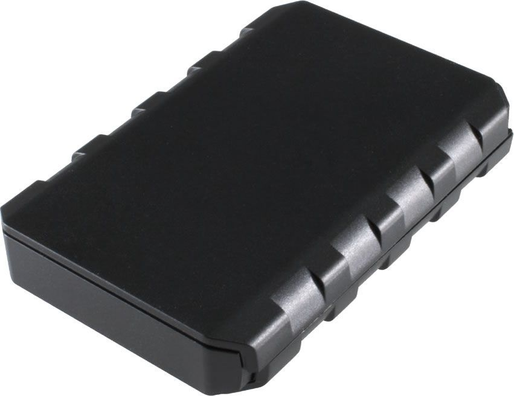

# SkyPatrol - SP3801

El SkyPatrol SP3801 es un rastreador GPS ultra compacto diseñado para ofrecer seguimiento vehicular fiable en condiciones exigentes. Construido para soportar entornos difíciles dentro de vehículos, el SP3801 es ideal tanto para la gestión de flotas como para el monitoreo de vehículos particulares. Su reducido tamaño facilita su colocación discreta en el vehículo, al tiempo que entrega actualizaciones de ubicación consistentes para supervisión operativa.

Como dispositivo compatible con Plaspy, el SP3801 puede integrarse en la plataforma de seguimiento de Plaspy para ofrecer visibilidad de ubicación y monitoreo de flotas junto con otros equipos. La combinación del diseño compacto del SP3801 y la opción de conexión rápida OBDII lo convierten en una alternativa práctica para organizaciones que requieren posicionamiento vehicular confiable con mínima intervención. Los usuarios de Plaspy pueden agregar el SP3801 a su inventario de dispositivos para centralizar seguimiento, alertas e informes.

## Características principales

- Diseño ultra compacto, fácil de ubicar y ocultar en vehículos
- Construido para funcionar con fiabilidad en entornos vehiculares exigentes
- Adecuado tanto para gestión de flotas como para seguimiento de vehículos particulares
- Cable de conexión rápida OBDII opcional para instalaciones más sencillas cuando está disponible
- Diseñado para proporcionar posicionamiento vehicular rápido y confiable
- Opción práctica para organizaciones que requieren seguimiento discreto y fiable

## Cómo funciona con Plaspy

Al usarse con Plaspy, el SP3801 envía datos de ubicación a la plataforma Plaspy, donde los vehículos pueden ser monitoreados junto con otros activos. Plaspy agrega las actualizaciones de posición, ofrece visualización en el mapa y habilita informes para apoyar las operaciones diarias y la supervisión.

- Vista centralizada en el mapa para ver en tiempo real la ubicación de vehículos equipados con SP3801
- Paneles de monitoreo de flota para rastrear movimiento y estado de los vehículos
- Alertas y notificaciones configurables en Plaspy para eventos como entrada y salida de zonas definidas
- Informes históricos y reproducción de rutas para revisión y análisis operativo
- Herramientas de supervisión operativa para ayudar en despacho, utilización y responsabilidad

## Casos de uso típicos

- Gestión de flotas pequeñas y medianas
- Seguimiento de vehículos particulares para disuasión de robos y apoyo en recuperación
- Supervisión de vehículos de alquiler y uso compartido para visibilidad de ubicación y uso
- Monitoreo de vehículos de servicio o reparto para verificar rutas y tareas
- Seguimiento discreto de activos cuando se requiere huella compacta

## Por qué elegir este rastreador con Plaspy

El SP3801 es una opción práctica para organizaciones que usan Plaspy y valoran un factor de forma compacto y rendimiento vehicular fiable. Su resistencia en entornos vehiculares y la opción de conexión rápida reducen la fricción de instalación, mientras que la compatibilidad con Plaspy ayuda a consolidar los datos de seguimiento en una vista operativa única.

Si necesita un rastreador pequeño y confiable para añadir a una flota gestionada por Plaspy, el SP3801 merece consideración. Para más información sobre Plaspy y cómo funciona con dispositivos como el SP3801 visite https://www.plaspy.com. Tenga en cuenta que las especificaciones del producto y la disponibilidad pueden cambiar con el tiempo; verifique los detalles actuales y las opciones de accesorios en el sitio del fabricante https://www.skypatrol.com/ antes de comprar.
