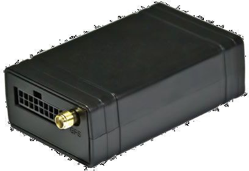

# SkyPatrol - SP4600

La serie SkyPatrol SP4600 es un dispositivo de rastreo GPS con muchas funciones, diseñado para aplicaciones exigentes como el seguimiento de flotas y la gestión de despachos en campo. Esta familia de productos está orientada tanto a implementaciones empresariales como a proyectos telemáticos convencionales, ofreciendo versiones en 2G y 3G y capacidades que cubren localización de vehículos, recuperación y escenarios de telemática para seguros. Entre las características destacadas por el fabricante figuran comunicación GSM/GPRS cuatribanda, gestión y mantenimiento remotos por aire, actualización de firmware por aire (FOTA), detección de interferencia GSM y 28 geocercas implementadas por hardware para supervisión de ubicación personalizada.

Por su combinación de opciones de comunicación flexibles, gestión remota de dispositivos y características robustas de geocercas y seguridad, la serie SP4600 encaja de forma natural como rastreador compatible con Plaspy. Plaspy puede recibir las actualizaciones de ubicación y estado del dispositivo y mostrarlas junto con otros datos de la flota, facilitando una visibilidad centralizada y el control operativo. Esta página explica las principales fortalezas del SP4600, cómo suele integrarse con Plaspy y los escenarios en los que aporta mayor valor.

## Aspectos clave

- Diseñado para entornos exigentes de seguimiento de flotas y despachos en campo, apto para despliegues empresariales.
- Disponible en versiones 2G y 3G para ajustarse a la conectividad y a las necesidades regionales.
- Comunicación GSM/GPRS cuatribanda para amplia cobertura celular.
- Gestión de dispositivos por aire y soporte FOTA para simplificar actualizaciones y mantenimiento remoto.
- Detección integrada de interferencia GSM para alertar sobre posibles manipulaciones o bloqueos de señal.
- 28 geocercas por hardware para supervisión de ubicación precisa y alertas de perímetro configurables.

## Cómo funciona con Plaspy

El SP4600 se integra con Plaspy proporcionando información de ubicación y del estado del dispositivo que Plaspy puede mostrar, alertar y reportar. Plaspy actúa como la capa de visualización y operación, permitiendo que los equipos utilicen los datos del SP4600 junto con otros dispositivos y flujos de trabajo para la gestión diaria de la flota.

- Visibilidad en tiempo real e histórica de ubicaciones en los paneles de Plaspy para monitoreo de flota y revisión de rutas.
- Manejo de eventos de geocerca usando las geocercas por hardware del dispositivo para disparar alertas e informes de zonas.
- Alertas por eventos de seguridad como la detección de interferencia GSM, visibles en notificaciones y registros de Plaspy.
- Indicadores de estado y gestión del dispositivo mostrados junto a los datos de ubicación, ayudando a los operadores a seguir el estado del firmware y la conectividad.
- Informes y exportación de la actividad rastreada para apoyar operaciones, cumplimiento y análisis telemáticos.
- Supervisión operativa centralizada que combina los flujos del SP4600 con otros datos de activos gestionados en Plaspy.

## Casos de uso típicos

- Flotas empresariales de vehículos que requieren monitoreo continuo de ubicación y coordinación de despachos.
- Flotas de servicio en campo donde el seguimiento de rutas y las actualizaciones de ubicación oportunas mejoran la eficiencia operativa.
- Escenarios de telemática para seguros que necesitan datos de ubicación confiables y actualizaciones de dispositivo gestionadas.
- Localización y recuperación de activos donde las geocercas y las alertas de perímetro aumentan la seguridad y facilitan la recuperación.
- Organizaciones que buscan mantenimiento remoto de dispositivos y gestión del ciclo de vida de los rastreadores desplegados.

## Por qué elegir este rastreador con Plaspy

La serie SP4600 es adecuada para organizaciones que necesitan un rastreador de nivel empresarial con opciones de conectividad regional y gestión remota del ciclo de vida. Su combinación de geocercas por hardware, mantenimiento por aire y funciones de seguridad como la detección de interferencias lo convierte en una opción práctica para flotas, operaciones de servicio y proyectos telemáticos donde la fiabilidad operativa y la facilidad de mantenimiento son prioritarias.

Al usarse con Plaspy, las capacidades del SP4600 contribuyen a un entorno consolidado de monitoreo e informes. Plaspy proporciona los paneles, las alertas y los informes necesarios para convertir las actualizaciones de ubicación y estado del SP4600 en información operativa, mientras que las funciones OTA del dispositivo ayudan a reducir la carga de mantenimiento presencial.

Aprenda más sobre Plaspy en el sitio principal https://www.plaspy.com. Las especificaciones del producto, la disponibilidad y los detalles del fabricante pueden cambiar con el tiempo; verifique las especificaciones actuales del SP4600 en el sitio oficial del fabricante https://www.skypatrol.com/ antes de tomar decisiones de compra o despliegue.
