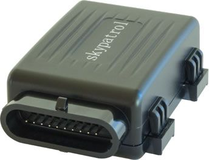

# SkyPatrol - SP5600

La serie SkyPatrol SP5600 es una familia de dispositivos GPS compactos diseñados para motocicletas y otros vehículos powersport, incluidos ATV, motos de agua, motonieves y embarcaciones pequeñas. Con un diseño resistente al agua, bajo consumo energético y una batería interna de respaldo, el SP5600 está pensado para ofrecer seguimiento continuo de ubicación y detección básica de manipulación en entornos exteriores exigentes donde el espacio y la energía son limitados.

Como dispositivo compatible con Plaspy, el SP5600 puede transmitir actualizaciones de ubicación y estado a la plataforma de monitoreo de flotas y activos de Plaspy, permitiendo una visibilidad centralizada de los activos powersport. La combinación del hardware del rastreador con las herramientas de mapeo, alertas e informes de Plaspy ofrece a propietarios y operadores una forma práctica de supervisar la ubicación de los vehículos, responder a posibles manipulaciones y mantener el control de equipos dispersos.

## Características principales

- Factor de forma compacto y discreto, ideal para instalar en motocicletas y vehículos powersport pequeños
- Diseño resistente al agua para soportar las condiciones propias del uso exterior y marino
- Bajo consumo de energía para minimizar el impacto en la batería del vehículo cuando está detenido
- Batería interna de respaldo que permite seguir reportando si la alimentación principal se interrumpe
- Detección integrada de interferencia GSM para ayudar a identificar intentos de bloquear la conectividad
- Instalación y operación sencillas, pensadas para un despliegue rápido en múltiples activos

## Cómo funciona con Plaspy

Cuando se integra con Plaspy, el SP5600 ofrece información de ubicación en tiempo real e histórica que Plaspy presenta junto con otros datos de la flota para la gestión operativa. Plaspy procesa las actualizaciones del dispositivo y las muestra mediante funciones de mapeo, alertas e informes, de modo que usted pueda supervisar los activos desde una interfaz única.

- Visibilidad en el mapa en tiempo real de cada vehículo con SP5600 en la plataforma de Plaspy
- Alertas y notificaciones por eventos informados por el dispositivo, como pérdida de alimentación o indicios de manipulación
- Historial de ubicaciones e informes de viajes para revisar movimientos pasados y apoyar investigaciones de pérdida o recuperación
- Agrupación y filtrado para gestionar múltiples activos powersport en distintas ubicaciones o instalaciones
- Paneles operativos para rastrear el estado de los activos y priorizar las acciones de seguimiento

## Casos de uso típicos

- Prevención y recuperación de robos para motocicletas y scooters de uso particular o en flotas
- Monitoreo de flotas de alquiler para operadores de powersport y marinas
- Rastreo de juguetes marinos y embarcaciones pequeñas almacenadas en marinas o en temporadas
- Supervisión de vehículos off road empleados por equipos de mantenimiento, centros turísticos u operadores de tours
- Visibilidad de activos para organizaciones que almacenan o transportan equipos powersport compactos

## Por qué elegir este rastreador con Plaspy

El SP5600 es especialmente adecuado para organizaciones que requieren un rastreador pequeño y robusto para activos powersport en los que el espacio y el consumo de batería son determinantes. Su construcción resistente al agua y la batería de respaldo lo convierten en una opción práctica para entornos exteriores y marinos, mientras que funciones como la detección de interferencias aportan una capa adicional de conciencia ante manipulaciones, útil en flujos de trabajo de seguridad.

Al combinarse con Plaspy, el SP5600 forma parte de una solución más amplia de monitoreo y gestión. Plaspy facilita la visualización de datos de ubicación, alertas e historial de actividad procedentes de dispositivos compatibles, de modo que su equipo pueda supervisar vehículos dispersos, responder a incidentes y generar informes operativos sin manejar múltiples herramientas.

Para obtener más información sobre cómo Plaspy da soporte a rastreadores como el SkyPatrol SP5600 visite https://www.plaspy.com. Las especificaciones y la disponibilidad del producto pueden cambiar con el tiempo, por lo que verifique los detalles técnicos actuales y las indicaciones del fabricante en el sitio oficial de SkyPatrol https://www.skypatrol.com/.
