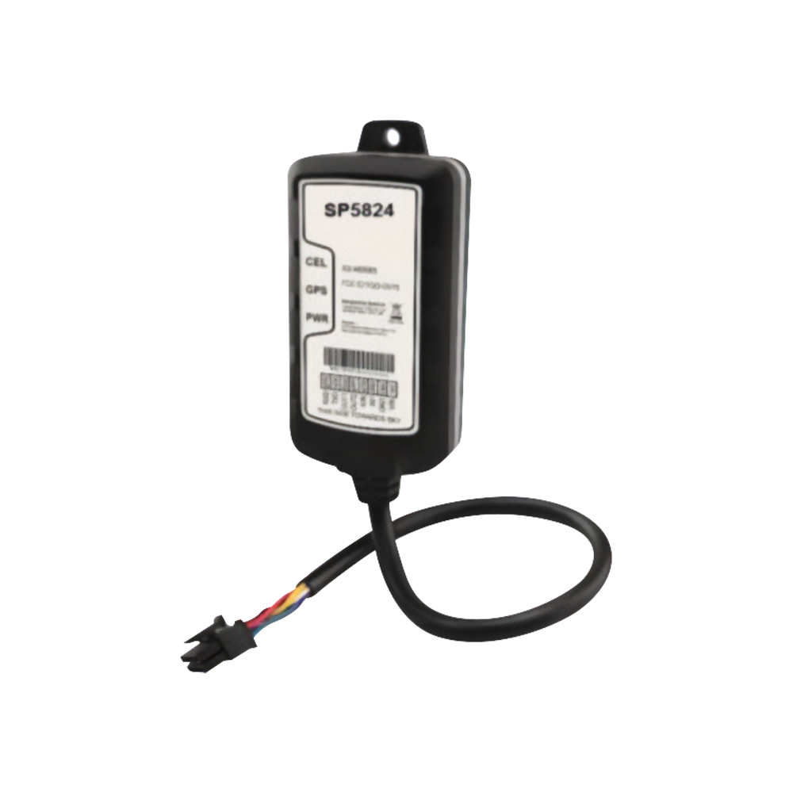

# SkyPatrol - SP5824

El SP5824 es un rastreador GPS compacto y resistente, diseñado para motocicletas y diversos vehículos powersport como ATV, motos acuáticas, motos de nieve y embarcaciones pequeñas. Pensado para uso exterior, ofrece protección IP67 y un tamaño de instalación reducido, por lo que propietarios y operadores de flotas pueden incorporar seguimiento de ubicación fiable a vehículos de dos y tres ruedas y pequeñas embarcaciones sin grandes requerimientos de espacio o energía. El equipo incluye detección de choques y conectividad orientada a reportes oportunos de ubicación y alertas de incidentes.

Al ser un modelo compatible con Plaspy, el SP5824 puede enviar ubicación, alertas de incidentes y telemetría externa a Plaspy para su monitoreo y generación de informes centralizados. Su interfaz serie admite módulos de telemetría de terceros para canalizar información adicional del vehículo hacia los paneles de Plaspy, mientras que su comportamiento de bajo consumo y su carcasa robusta lo hacen ideal para vehículos que pasan largos periodos estacionados o que operan en ambientes húmedos.

## Características destacadas

- Diseño específico para motocicletas y vehículos powersport con carcasa compacta y resistente
- Protección IP67 para soportar condiciones húmedas y marinas
- Detección de choques para alertas automáticas de incidentes
- Conectividad LTE Cat M1 para actualizaciones persistentes de ubicación y telemetría
- Modo de consumo cero para evitar descarga de la batería del vehículo cuando está estacionado
- Interfaz serial RS232 para añadir módulos y accesorios de telemetría de terceros

## Cómo funciona con Plaspy

Integrado con Plaspy, el SP5824 transmite datos de ubicación y eventos a una plataforma centralizada donde administradores de flota y propietarios pueden ver la actividad, recibir alertas y generar reportes. Plaspy ingiere eventos de choque y telemetría externa para que los operadores puedan configurar flujos de alertas y escalamiento basados en esas señales.

- Las actualizaciones de ubicación en tiempo real se muestran en los mapas de Plaspy para monitoreo en vivo y reproducción histórica
- Los eventos de detección de choques se reenvían a Plaspy para generar notificaciones de incidente y acciones de seguimiento
- Módulos conectados por RS232 pueden enviar estado de ignición, nivel de combustible u otra telemetría a los paneles de Plaspy
- El diseño de bajo consumo reduce notificaciones de baja tensión falsas mientras mantiene el dispositivo listo para reportar
- La protección IP67 ayuda a mantener un flujo de datos fiable desde entornos húmedos o exteriores

## Casos de uso típicos

- Seguimiento de flotas para empresas de alquiler de vehículos powersport para controlar uso e historial de ubicación
- Monitoreo antirrobo para motocicletas y ATV con alertas en tiempo real y asistencia en recuperación
- Rastreo de activos marinos como motos acuáticas y botes pequeños donde se requiere impermeabilidad
- Monitoreo de seguridad que utiliza detección de choques para activar flujos de respuesta rápida
- Proyectos de expansión de telemetría que añaden información de ignición o combustible mediante módulos RS232

## Por qué elegir este rastreador con Plaspy

El SP5824 es adecuado para organizaciones y propietarios que necesitan un rastreador pequeño y duradero, listo para condiciones exteriores y marinas, capaz de entregar información de incidentes a una plataforma de flotas centralizada. Su detección de choques y comportamiento de bajo consumo responden a preocupaciones operativas comunes en flotas powersport, mientras que la interfaz RS232 permite ampliar la telemetría sin reemplazar el rastreador base.

En conjunto con Plaspy, el SP5824 forma parte de una caja de herramientas operativa para visibilidad, alertas e informes en flotas mixtas de vehículos pequeños y embarcaciones. Plaspy consolida la ubicación y la telemetría del rastreador para que los equipos puedan monitorear activos, automatizar notificaciones y generar reportes accionables desde un único sistema. Para conocer más sobre Plaspy y las capacidades de la plataforma visite https://www.plaspy.com. Las especificaciones y la disponibilidad del producto pueden cambiar con el tiempo, por lo que verifique los detalles técnicos actuales y las variantes regionales en el sitio del fabricante https://www.skypatrol.com/ antes de la compra.
