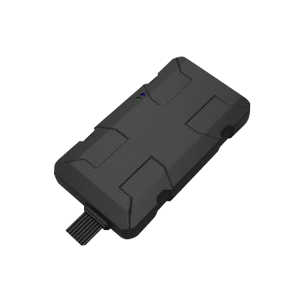

# SkyPatrol - SP6824

El SP6824 es un rastreador GPS ultradelgado y de alto rendimiento diseñado para el seguimiento de vehículos y activos en gestión de flotas, financiamiento vehicular, control de lotes y aplicaciones de recuperación ante robo. Combina un módulo GPS super sensitivo con conectividad 4G LTE Cat M1 y antenas internas para ofrecer un dispositivo de perfil bajo pensado para proporcionar información de ubicación fiable y telemetría básica de vehículos y activos almacenados.

Como dispositivo compatible con Plaspy, el SP6824 puede entregar actualizaciones continuas de ubicación y la telemetría disponible a la plataforma Plaspy, facilitando visibilidad consolidada y automatización de flujos de trabajo. Su variante opcional OBDII plug and play y sus múltiples interfaces I/O permiten a los usuarios de Plaspy incorporar datos de diagnóstico y eventos cuando corresponda, apoyando procesos antirobo, monitoreo de lotes y la supervisión rutinaria de la flota.

## Características principales

- Rastreador GPS compatible con Plaspy y conectividad 4G LTE Cat M1 para seguimiento en tiempo real resistente y de bajo consumo
- Factor de forma ultradelgado con antenas internas para instalaciones discretas en vehículos y lotes
- Variante opcional OBDII plug and play para exponer diagnósticos del vehículo y telemetría proveniente del OBD cuando esté disponible
- Módulo GPS super sensitivo para fijaciones de posición más rápidas y mejor rendimiento en entornos difíciles
- Múltiples interfaces I/O para capturar alarmas de puerta y entradas externas, habilitando alertas basadas en eventos
- Diseño compacto adecuado para flotas mixtas, lotes de concesionarios y flotas de renta

## Cómo funciona con Plaspy

Al conectarse, el SP6824 envía posición y telemetría del dispositivo a través de LTE M a Plaspy, donde esos datos se incorporan a un panel unificado para monitoreo, alertas y generación de informes. Plaspy consolida los flujos entrantes del dispositivo y aplica reglas y flujos de trabajo para respaldar operaciones en tiempo real y análisis posteriores a eventos.

- Actualizaciones continuas de ubicación con marcas de tiempo entregadas a Plaspy para seguimiento en vivo e historial de rutas
- Diagnósticos y estado del vehículo extraídos vía OBDII reenviados a Plaspy cuando se utiliza la variante OBDII
- Eventos de alarma por manipulación de puertas y entradas externas dirigidos a Plaspy para disparar alertas y flujos operativos
- Alertas por geocercas, velocidad y ruta configurables en Plaspy usando la transmisión en vivo del SP6824
- Los datos del rastreador están disponibles para informes y supervisión operativa dentro de los paneles de Plaspy

## Casos de uso típicos

- Gestión de flotas y supervisión de rutas en despliegues con vehículos diversos
- Financiamiento vehicular y recuperación de activos donde la visibilidad de la ubicación apoya procesos de reposición
- Monitoreo de lotes de concesionarios y patios de almacenamiento para rastrear movimientos de vehículos y el estado del inventario
- Recuperación ante robo y monitoreo antirobo mediante alertas por manipulación y movimiento
- Diagnóstico remoto e informes relacionados con combustible al usar la variante OBDII

## Por qué elegir este rastreador con Plaspy

El SP6824 es una opción práctica para organizaciones que requieren un rastreador discreto y confiable que se integre con una plataforma en la nube como Plaspy. Su perfil delgado y las antenas internas facilitan la instalación en una amplia variedad de vehículos y escenarios de lote, mientras que la conectividad LTE M amplía el alcance para actualizaciones continuas de ubicación en despliegues modernos. La variante opcional OBDII y las múltiples interfaces I/O permiten a los equipos ampliar la telemetría y la cobertura de eventos cuando se necesita una visión más profunda del vehículo.

Combinado con Plaspy, el SP6824 ofrece una ruta clara desde los datos del dispositivo hasta la acción operativa: las fuentes de ubicación y eventos ingresan a Plaspy donde pueden visualizarse, generar alertas e incluirse en informes que respalden las operaciones diarias de la flota y los flujos de seguridad. Si usted necesita una instalación discreta, actualizaciones de seguimiento constantes y la capacidad de integrar señales básicas de diagnóstico o eventos en una plataforma de gestión de flotas, el SP6824 es una opción compatible a considerar.

Para obtener más información sobre Plaspy y cómo se usan los dispositivos compatibles dentro de la plataforma visite https://www.plaspy.com. Product specifications availability and manufacturer details can change over time, so please verify current specifications and options on the SkyPatrol website https://www.skypatrol.com/.
