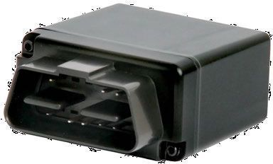

# SkyPatrol - SP7600

El SkyPatrol SP7600 es una serie de rastreadores GPS en formato OBD compactos, pensados para implementaciones rápidas de tipo plug and play y uso flexible entre diferentes vehículos. La familia SP7600 destaca por su portabilidad y su gestión inteligente de energía, lo que la hace adecuada para escenarios que requieren reasignación frecuente de dispositivos o una interferencia mínima en el vehículo. Las funcionalidades de localización y seguridad comunes en esta línea respaldan la supervisión de flotas y las necesidades de recuperación de vehículos.

Como dispositivo compatible con Plaspy, el SP7600 aporta la visibilidad de ubicación y los datos operativos que los equipos de flotas esperan ver en la plataforma de seguimiento y gestión de Plaspy. Su factor de forma OBD compacto y su diseño portátil facilitan la incorporación de dispositivos a Plaspy para monitoreo vehicular, generación de informes y alertas sin cambios de hardware extensos. Esta compatibilidad ayuda a centralizar el seguimiento, la seguridad y el monitoreo tipo UBI dentro del entorno Plaspy.

## Aspectos destacados

- Diseño OBD compacto que encaja directamente en una amplia variedad de vehículos
- Gestión inteligente de energía para minimizar el impacto en el vehículo durante su uso
- Instalación plug and play para despliegues rápidos y reasignación sencilla de dispositivos
- Portátil y fácil de mover entre automóviles para un uso flexible de activos
- Proporciona seguimiento de ubicación instantáneo para apoyar la seguridad y la recuperación
- Adecuado para visibilidad de flotas, gestión de lotes de concesionarios y programas UBI

## Cómo funciona con Plaspy

Al integrarlo con Plaspy, el SP7600 envía información de ubicación y estado del vehículo que Plaspy procesa y presenta para uso operativo. Esta compatibilidad permite a los gestores de flota y administradores utilizar las herramientas de Plaspy para monitorear vehículos, configurar alertas y revisar datos históricos de movimiento desde los dispositivos SP7600.

- Visibilidad en mapas en tiempo real de los vehículos equipados con SP7600 dentro de la interfaz de Plaspy
- Alertas configurables para movimiento, entradas y salidas de zonas, y eventos de seguridad
- Informes históricos de viajes y tiempos para apoyar reportes de flota y análisis para seguros basados en uso
- Reasignación y gestión de dispositivos simple para aprovechar la portabilidad de la serie SP7600
- Supervisión centralizada que combina datos del SP7600 con otra información de la flota en Plaspy

## Casos de uso típicos

- Gestión de lotes y visibilidad de inventario en concesionarios de autos nuevos
- Administración de pequeñas y medianas flotas que requieren rastreadores móviles
- Programas de seguros basados en uso que recopilan datos de operación vehicular
- Programas de alquiler y uso temporal de vehículos que necesitan seguimiento portátil
- Operaciones de seguridad y recuperación para respuesta ante robos de vehículos

## Por qué elegir este rastreador con Plaspy

El SkyPatrol SP7600 es una opción práctica para organizaciones que necesitan un dispositivo de rastreo compacto y trasladable que se integre dentro de un sistema de gestión de flotas más amplio. Su factor de forma OBD y su enfoque plug and play reducen los tiempos de despliegue y facilitan la reasignación entre vehículos, mientras que sus consideraciones de energía inteligente ayudan a mantener bajo el coste de mantenimiento.

En combinación con Plaspy, el SP7600 puede formar parte de un flujo de trabajo centralizado de monitoreo y generación de informes que apoye la visibilidad operativa, la seguridad y el análisis de uso. Para equipos que evalúan rastreadores para la gestión de concesionarios, supervisión de flotas o recolección de datos UBI, el SP7600 ofrece una opción equilibrada que se integra con Plaspy para el seguimiento diario y reportes a largo plazo.

Para obtener más información sobre Plaspy y cómo dispositivos compatibles como el SP7600 pueden usarse con la plataforma visite https://www.plaspy.com. Las especificaciones del producto, sus características y su disponibilidad pueden cambiar con el tiempo, por lo que le recomendamos verificar los detalles actuales en el sitio del fabricante https://www.skypatrol.com/.
