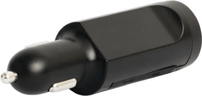

# SkyPatrol - SP8600

El SkyPatrol SP8600 es una serie de rastreadores GPS portátiles plug and play pensada para un despliegue rápido y un uso flexible entre vehículos. Las unidades se alimentan desde la toma de accesorios o un cargador del vehículo, lo que permite moverlas de un coche a otro en segundos. La serie SP8600 prioriza la facilidad de uso y la portabilidad práctica, ofreciendo conectividad global mediante un módem quad band GSM y detección de movimiento con acelerómetro de 3 ejes y sensor de fuerza G.

Como dispositivo compatible con Plaspy, el SP8600 es ideal para organizaciones y usuarios que necesitan rastreo ágil y sin complicaciones integrado en sus flujos de trabajo de gestión de flotas. Al combinarse con Plaspy, el SP8600 aporta visibilidad de ubicación, datos de viaje y reportes de eventos de movimiento que pueden incorporarse en la supervisión, las alertas y los informes básicos sin requerir una instalación permanente.

## Puntos clave

- Diseño portátil plug and play que facilita la transferencia rápida entre vehículos
- Alimentación desde la toma de accesorios o un cargador para minimizar el tiempo de instalación
- Módem quad band GSM para cobertura amplia e uso internacional
- Acelerómetro de 3 ejes y sensor G-Force que permiten detectar movimiento e impactos
- Opción rentable para necesidades de rastreo a corto plazo o temporales
- Útil para capturar datos de viaje y validar el uso del vehículo entre múltiples conductores

## Cómo funciona con Plaspy

El SP8600 envía datos de ubicación y movimiento a Plaspy para que los equipos puedan monitorear la posición de los vehículos, revisar trayectos y recibir notificaciones de eventos. Plaspy recopila la información del dispositivo y la presenta en mapas, líneas de tiempo e informes para la supervisión operativa.

- Visibilidad de ubicación en tiempo real e histórica en los mapas y paneles de Plaspy
- Eventos de movimiento e impacto registrados por el acelerómetro y el sensor G-Force mostrados como alertas o marcadores en la línea de tiempo
- Resúmenes de viajes y registros de kilometraje disponibles para reembolsos o verificación de uso
- Monitoreo de flota y estado del dispositivo que ayuda a los responsables a gestionar asignaciones temporales y alquileres
- Notificaciones configurables en Plaspy para movimientos, llegadas o actividad inusual

## Casos de uso típicos

- Empresas de alquiler de vehículos que necesitan rastrear asignaciones temporales y garantizar un uso responsable
- Padres que desean monitorear a conductores adolescentes para revisar comportamiento en viajes y fomentar la conducción segura
- Negocios que registran kilometraje para reembolsos y validan el uso de tarjetas de combustible
- Equipos de campo y contratistas que emplean unidades portátiles en vehículos ocasionales o estacionales
- Organizaciones que requieren la rápida redistribución de rastreadores entre vehículos

## Por qué elegir este rastreador con Plaspy

El SP8600 es una alternativa práctica cuando necesita un rastreador accesible y fácil de mover que se integre con una plataforma de gestión de flotas como Plaspy. Su naturaleza plug and play reduce la fricción en el despliegue, lo que lo hace adecuado para flotas de alquiler, monitoreo temporal de vehículos y situaciones en las que los dispositivos deben reubicarse con frecuencia. Los sensores de movimiento integrados brindan contexto para eventos que Plaspy puede utilizar en alertas y análisis de trayectos sin requerir cambios complejos de hardware.

Combinado con Plaspy, el SP8600 ofrece visibilidad operativa rápida y reportes sencillos, ayudando a los equipos a gestionar el uso de los vehículos y a responder a incidentes de forma más eficaz. Para organizaciones que priorizan la portabilidad y la configuración rápida, esta combinación proporciona una vía de bajo costo para el seguimiento de flotas y la recopilación de datos de viaje.

Learn more about Plaspy and how compatible devices like the SkyPatrol SP8600 can fit into your fleet management workflow at https://www.plaspy.com. Product specifications and availability can change over time, so please verify current details and technical documentation on the manufacturer website https://www.skypatrol.com/.
