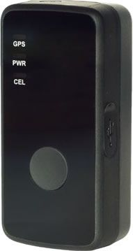

# SkyPatrol - SP8801

El SkyPatrol SP8801 es un rastreador GPS personal compacto diseñado para ofrecer localización rápida y precisa de personas. Está pensado para usuarios que necesitan supervisar a niños, personas mayores o familiares con discapacidad, y también resulta adecuado para empresas que deben monitorear a personal de campo como policías, guardias de seguridad, representantes de ventas y mensajeros. El dispositivo prioriza la colocación discreta y un uso sencillo, pudiendo llevarse en un bolso, mochila o bolsillo mientras proporciona visibilidad de ubicación en tiempo real y alertas de geocerca.

Como dispositivo compatible con Plaspy, el SP8801 puede enviar información de ubicación y eventos de alerta a Plaspy para centralizar la monitorización y supervisión. Plaspy puede agregar los datos del rastreador junto con otros dispositivos y ofrecer una única interfaz para seguimiento en vivo, gestión de alertas e informes. La compatibilidad con Plaspy convierte al SP8801 en una opción práctica para organizaciones y cuidadores que desean combinar un rastreador portátil con una plataforma integral de gestión de flotas y personal.

## Características principales

- Seguimiento de ubicación en tiempo real para mantener visibilidad continua de la persona rastreada
- Botón de emergencia configurable que notifica a contactos designados
- Alertas de geocerca para avisar cuando el dispositivo sale de zonas predefinidas
- Diseño discreto y portátil, apto para llevar en bolsillos o bolsas
- Acceso a la ubicación desde interfaces móviles y de escritorio
- Aplicable tanto para monitoreo de seguridad personal como para seguimiento de personal de campo

## Cómo funciona con Plaspy

Cuando se integra con Plaspy, el SP8801 envía actualizaciones de ubicación en vivo y eventos de alerta a la plataforma, lo que permite a equipos y cuidadores supervisar la actividad desde un panel centralizado. Plaspy utiliza esos datos entrantes para mostrar posiciones en mapas, activar notificaciones y generar vistas históricas para análisis e informes.

- Visualice la ubicación en vivo y los movimientos recientes de los SP8801 en los mapas de Plaspy
- Configure zonas de geocerca en Plaspy y reciba alertas si el rastreador cruza un límite
- Reciba y gestione alertas de emergencia del dispositivo dentro de Plaspy para una respuesta rápida
- Consolide múltiples dispositivos SP8801 junto con otros activos para monitorear personas y pequeñas flotas de forma conjunta
- Utilice los informes y las vistas de historial de Plaspy para revisar rutas y actividad pasadas y obtener información operativa

## Casos de uso comunes

- Supervisión de niños durante salidas o traslados escolares
- Monitoreo de personas mayores o con movilidad reducida para mayor seguridad
- Provisión de un dispositivo de seguridad personal discreto para trabajadores en solitario y cuidadores
- Seguimiento de personal de campo como seguridad, mensajería o representantes de ventas
- Integración de rastreadores individuales en una vista unificada para supervisión de equipos pequeños

## Por qué elegir este rastreador con Plaspy

El SP8801 es una opción sensata cuando necesita un rastreador pequeño y fácil de llevar que se enfoque en la visibilidad confiable de la ubicación y en alertas sencillas. Emparejado con Plaspy, forma parte de un flujo de trabajo más amplio de monitoreo y gestión, permitiendo a organizaciones y cuidadores centralizar el seguimiento, recibir notificaciones y mantener un registro de movimiento y eventos. Su portabilidad y funciones orientadas al usuario lo hacen adecuado tanto para la seguridad personal como para el seguimiento ligero de personal de campo sin requerir una configuración compleja.

Si desea evaluar cómo encaja el SkyPatrol SP8801 en su estrategia de monitoreo, Plaspy puede ayudar a integrar la ubicación y las alertas del dispositivo en las operaciones diarias. Learn more about Plaspy on the main site https://www.plaspy.com. Product specifications, availability, and manufacturer features can change over time, so please verify current details on the official SkyPatrol website https://www.skypatrol.com/.
