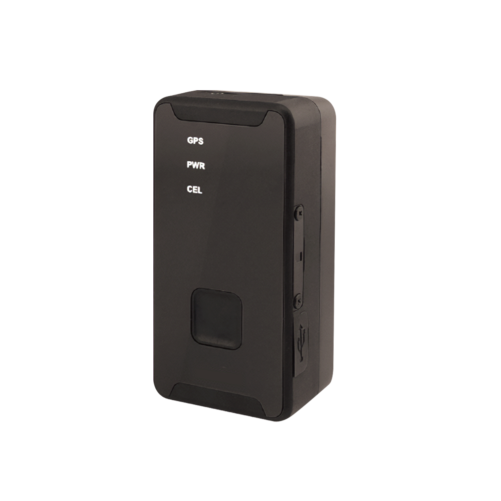

# SkyPatrol - SP8824

El SP8824 es un rastreador GPS personal compacto de nueva generación, diseñado para el monitoreo diario de activos y la supervisión de movilidad. Con conectividad celular LTE Cat M1 y antena GPS integrada, el SP8824 ofrece actualizaciones de ubicación confiables, priorizando el bajo consumo y largos tiempos de espera gracias a su batería interna recargable. Su formato discreto lo hace apto para niños, adultos mayores y profesionales que requieren monitoreo continuo sin ser invasivos.

Como dispositivo totalmente compatible con Plaspy, el SP8824 se integra en la plataforma para permitir seguimiento en tiempo real, alertas de eventos y una incorporación sencilla para vigilar activos personales. La combinación de uplink celular eficiente, detección de movimiento y una batería de larga duración se alinea con los flujos de trabajo de visibilidad y notificaciones comunes en Plaspy, por lo que el SP8824 es una opción práctica para escenarios de seguimiento personal y de pequeños activos.

## Aspectos destacados

- Rastreador GPS personal compatible con Plaspy, optimizado para uso discreto diario
- Conectividad LTE Cat M1 para un enlace celular eficiente y mayor autonomía de batería
- Antena GPS integrada para posiciones precisas y seguimiento de movilidad
- Acelerómetro de 3 ejes que permite detección de movimiento y reportes basados en actividad
- Batería interna recargable con largos tiempos de espera para despliegues prolongados
- Diseño compacto y discreto apropiado para niños, adultos mayores y profesionales móviles

## Cómo funciona con Plaspy

Al emparejarse con Plaspy, el SP8824 transmite información de ubicación y movimiento a la plataforma, de modo que usted puede ver posiciones, recibir alertas y revisar la actividad reciente desde un único panel. Plaspy normaliza los datos entrantes y los muestra junto con otros dispositivos para soportar flujos de trabajo de monitoreo personal y de flotas.

- Actualizaciones de ubicación en tiempo real mostradas en los mapas de Plaspy para mayor conciencia situacional
- Eventos de detección de movimiento enviados a Plaspy para alertas por actividad o inactividad
- Estado de batería y del dispositivo visible en Plaspy para ayudar a gestionar ciclos de carga y conectividad
- Creación de geocercas y notificaciones de entrada o salida mediante el sistema de alertas de Plaspy
- Incorporación y agrupamiento sencillo de dispositivos para vistas familiares, de proveedores de cuidado u operativas

## Casos de uso típicos

- Seguridad infantil y compartición de ubicación con cuidadores mediante alertas basadas en movimiento
- Monitoreo de adultos mayores para supervisar movilidad y actividad de forma pasiva
- Seguimiento de trabajadores de campo y móviles para registros básicos y visibilidad de ubicación
- Protección de pequeños activos como equipaje, bolsos o equipos portátiles
- Despliegues temporales o a corto plazo donde una batería con larga autonomía resulta beneficiosa

## Por qué elegir este rastreador con Plaspy

El SP8824 es un rastreador personal enfocado que funciona bien con Plaspy cuando la prioridad es un monitoreo discreto y de bajo mantenimiento. Su diseño equilibra posicionamiento confiable y detección de movimiento con eficiencia energética, lo que permite a organizaciones y familias mantener visibilidad continua sin intervenciones frecuentes. Para usuarios que buscan seguimiento en tiempo real sencillo, alertas básicas y un dispositivo de tamaño reducido, el SP8824 junto con Plaspy ofrecen una solución práctica.

Para obtener más información sobre cómo Plaspy soporta dispositivos como el SP8824 visite https://www.plaspy.com. Las especificaciones del producto, disponibilidad y detalles del fabricante pueden cambiar con el tiempo; para la información técnica más actual consulte la documentación oficial de SkyPatrol en https://www.skypatrol.com/.
