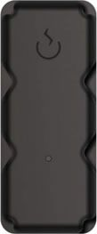

# SkyPatrol - SP9501

El rastreador de activos Skypatrol SP9501 CDMA es una solución confiable y duradera diseñada para rastrear y gestionar activos en movimiento. Con su carga inalámbrica y rendimiento GPS superior, este rastreador es ideal para aplicaciones como empresas de préstamo de títulos y transporte de mercancías.

El SP9501 CDMA Asset Tracker de Skypatrol ofrece una amplia gama de características y funcionalidades que lo convierten en una opción confiable para el monitoreo de activos. Su diseño robusto y resistente al agua garantiza su durabilidad en diversas condiciones ambientales. Además, su batería de larga duración permite un seguimiento continuo durante varios años sin necesidad de recargar.

Este rastreador GPS ofrece una precisión excepcional en la ubicación de activos, lo que permite a las empresas tener un control total sobre sus operaciones. Con la capacidad de rastrear en tiempo real, recibir alertas y generar informes detallados, el SP9501 CDMA Asset Tracker proporciona una visibilidad completa de los activos en movimiento.

Características destacadas:

- Diseño robusto y resistente al agua
- Batería de larga duración
- Precisión excepcional en la ubicación de activos
- Rastreo en tiempo real
- Alertas y notificaciones personalizables
- Generación de informes detallados

