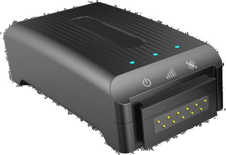

# SkyPatrol - SP9600

La serie SkyPatrol SP9600 es un rastreador GPS portátil diseñado para el monitoreo prolongado de activos móviles y de alto valor. Está pensado para rastrear elementos como contenedores de envío, suministros médicos críticos, maquinaria pesada, equipo militar y vehículos durante transporte o almacenamiento. La SP9600 prioriza informes de ubicación fiables durante largos periodos y cuenta con una construcción resistente para entornos operativos exigentes.

Este modelo es compatible con Plaspy, lo que lo convierte en una opción práctica para organizaciones que desean supervisar activos desde una plataforma unificada de rastreo de flotas. Plaspy puede integrar los reportes de ubicación y los estados procedentes de dispositivos SP9600 para ofrecer visibilidad, seguimiento histórico y supervisión operativa de activos distribuidos. Las opciones flexibles de alimentación y la vida útil extendida de reporte del SP9600 encajan bien con los flujos de trabajo de Plaspy orientados a un seguimiento a largo plazo y de bajo mantenimiento.

## Aspectos destacados

- Rastreador GPS portátil diseñado para el seguimiento prolongado de activos móviles
- Adecuado para una variedad de activos: contenedores, envíos médicos, maquinaria pesada y vehículos
- Opción de baterías CR123 reemplazables con capacidad combinada de 6000 mAh que permiten un informe semanal durante hasta tres años
- Soporta baterías recargables y carga mediante un conector de alimentación externo para mayor flexibilidad
- Construcción robusta apta para uso prolongado en campo y condiciones de transporte
- Ideal para flujos de trabajo con intervalos de reporte largos donde el acceso para mantenimiento es limitado

## Cómo funciona con Plaspy

Al integrarse con Plaspy, la SP9600 envía actualizaciones de ubicación y estado que se incorporan a las vistas de gestión de flotas y activos. Plaspy captura los reportes programados del dispositivo y los presenta junto con la telemetría de la flota para apoyar decisiones operativas e informes.

- Centralice los reportes de ubicación de la SP9600 en los paneles de Plaspy para obtener visibilidad de activos
- Revise el historial de movimientos y el progreso del tránsito de envíos y equipos rastreados
- Configure alertas en Plaspy basadas en la cadencia de reportes o cambios de ubicación para detectar excepciones
- Emplee las herramientas de informes de Plaspy para generar resúmenes operativos y registros de auditoría de activos rastreados
- Monitoree activos distribuidos con larga duración de batería sin necesidad de intervenciones frecuentes en sitio

## Casos de uso típicos

- Seguimiento de contenedores y carga en tránsito a lo largo de rutas prolongadas
- Monitoreo de suministros médicos críticos durante distribución y entrega
- Gestión de la ubicación de equipos de construcción e industriales pesados
- Registro de movimientos y responsabilidad de equipo militar y logística
- Comprobaciones periódicas de ubicación para vehículos y activos almacenados o poco móviles

## Por qué elegir este rastreador con Plaspy

La SP9600 es una opción práctica para organizaciones que requieren un rastreo de activos fiable y de bajo mantenimiento integrado en una plataforma de gestión de flotas. Su enfoque en una vida útil de batería prolongada y en opciones de alimentación flexibles reduce la frecuencia de intervenciones en campo, lo que complementa los entornos Plaspy diseñados para monitoreo centralizado y supervisión operativa.

Al enfocarse en el rastreo portátil y resistente para una amplia variedad de activos, la SP9600 se integra bien con Plaspy cuando los objetivos principales son visibilidad, horarios de reporte sencillos y menor carga de mantenimiento. Cuando no se requieren actualizaciones frecuentes, la combinación SP9600 + Plaspy ofrece registros de seguimiento claros y gestión consolidada de activos distribuidos.

Para obtener más información sobre cómo Plaspy puede funcionar con la SkyPatrol SP9600, visite https://www.plaspy.com. Las especificaciones del producto, la disponibilidad y los detalles del fabricante pueden cambiar con el tiempo, por lo que conviene verificar la información técnica y comercial actual en el sitio del fabricante https://www.skypatrol.com/ antes de tomar decisiones de adquisición o despliegue.
