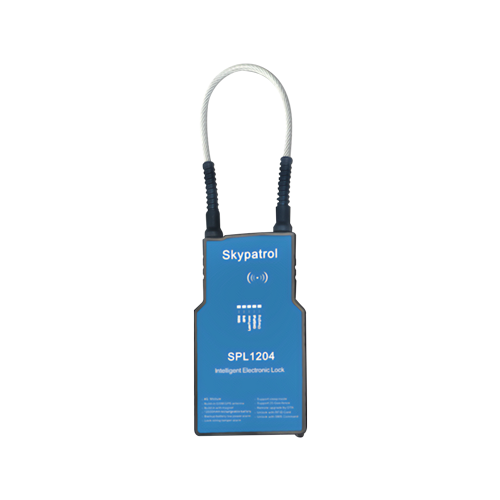

# SkyPatrol - SPL1204

El SPL1204, comercializado como SkyOne Lock Tracker, es un rastreador GPS robusto integrado en un candado de seguridad diseñado para la logística y la protección de carga de alto valor. Combina posicionamiento a bordo con una forma de candado pensada para entornos de transporte y exteriores, e incluye funciones como rastreo GPS 4G, desbloqueo por RFID, alertas por manipulación, batería recargable y construcción resistente a la intemperie para reducir fraudes y mejorar la seguridad de los activos.

Como dispositivo compatible con Plaspy, el SPL1204 aporta información de ubicación y telemetría de eventos a los flujos de gestión de flota y activos. Al integrarse con Plaspy, el rastreador en candado puede enviar posición, eventos de acceso y notificaciones de manipulación a paneles centralizados y reportes, lo que ayuda a los equipos operativos a supervisar contenedores sellados, remolques y envíos de alto valor donde se requiere tanto un cierre físico como posicionamiento persistente.

## Puntos clave

- Rastreo GPS integrado con conectividad celular para visibilidad continua de los activos.
- Diseñado como un candado de seguridad que combina disuasión física y telemetría en un solo dispositivo.
- Desbloqueo por RFID para registrar accesos autorizados y facilitar la entrega y recepción.
- Alertas por manipulación que notifican al personal sobre interferencias no autorizadas con el candado.
- Batería recargable para despliegues repetidos sin depender de fuentes de energía de un solo uso.
- Construcción robusta y a prueba de clima, adecuada para remolques, contenedores y cargas expuestas.

## Integración con Plaspy

El SPL1204 envía datos de ubicación y eventos a Plaspy para que usted pueda monitorear activos y recibir alertas desde una única plataforma de gestión. Plaspy consolida la telemetría generada por el candado junto con otras señales de la flota para ofrecer una vista operativa unificada y facilitar los flujos de respuesta e informes.

- Actualizaciones de ubicación en tiempo real y reportes de estado para mantener visibilidad continua de activos asegurados.
- Registro de eventos de manipulación y accesos para que actividades sospechosas y desbloqueos queden documentados y puedan activar alertas.
- Información del estado de la batería que ayuda a programar ciclos de recarga y evitar pérdida de alimentación inesperada.
- Seguimiento de la cadena de custodia mediante eventos de desbloqueo RFID registrados, útiles en entregas y recepciones.
- Correlación con otras telemetrías en implementaciones Plaspy para ver eventos del candado en contexto con datos más amplios de la flota.

## Casos de uso habituales

- Protección antirobo para remolques y contenedores en tránsito.
- Monitoreo de envíos sellados con eventos de desbloqueo registrados para la cadena de custodia.
- Rastreo continuo de carga de alto valor para apoyar a los equipos de seguridad y logística.
- Vigilancia en patios y depósitos para detectar manipulación de activos estacionados.
- Despliegues complementarios que correlacionan eventos del candado con otras fuentes de telemetría compatibles con Plaspy.

## Por qué elegir este rastreador con Plaspy

El SPL1204 es adecuado para organizaciones que requieren un dispositivo de seguridad física que también proporcione rastreo GPS persistente y telemetría de eventos. Su forma de candado y la detección de manipulación lo convierten en una opción práctica cuando se necesitan tanto disuasión como registros trazables de acceso, mientras que la batería recargable y el diseño resistente permiten un uso repetible en campo.

Si su operación necesita combinar cierre físico y monitoreo remoto, el SPL1204 puede ampliar los flujos de trabajo impulsados por Plaspy con información de ubicación, acceso y manipulación desde contenedores sellados y envíos de alto valor. Para obtener más información sobre Plaspy y cómo rastreadores compatibles como el SPL1204 pueden encajar en su estrategia de gestión de flotas y activos visite https://www.plaspy.com. Las especificaciones y la disponibilidad del producto pueden cambiar con el tiempo, por lo que le recomendamos verificar los detalles actuales en el sitio del fabricante https://www.skypatrol.com/.
