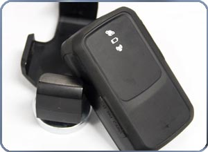

# SkyPatrol - TT8850

El SkyPatrol TT8850 es un dispositivo de localización GPS en tiempo real, compacto y pensado para aplicaciones discretas y encubiertas. Su diseño delgado y de bajo perfil lo hace adecuado para situaciones donde la visibilidad debe minimizarse sin renunciar a la supervisión continua de la ubicación. El TT8850 ofrece una autonomía prolongada con una sola carga, certificación de resistencia al agua IPX5, sensor de movimiento 3D integrado y un botón de emergencia SOS, por lo que resulta una opción práctica para rastreos prolongados y poco intrusivos.

Como dispositivo compatible con Plaspy, el TT8850 puede integrarse en la plataforma de seguimiento de Plaspy para ofrecer visibilidad centralizada y supervisión operativa. Su portabilidad, la opción de montaje magnético y la capacidad de recibir actualizaciones inalámbricas facilitan el despliegue y mantenimiento sin acceso físico frecuente. Para equipos que usan Plaspy en el seguimiento de personal o activos, el TT8850 aporta un equilibrio entre discreción, autonomía y alertas básicas de seguridad que encajan con flujos de trabajo habituales de monitoreo.

## Aspectos destacados

- Diseñado para implementaciones discretas y compactas donde la baja visibilidad es importante
- Tiempo de rastreo continuo de aproximadamente 10 a 12 días con una sola carga
- Autonomía en espera de hasta alrededor de 25 días para periodos de inactividad
- Resistencia al agua IPX5 para uso en diversas condiciones climáticas
- Sensor de movimiento 3D integrado para detectar actividad y mejorar la conciencia situacional
- Botón SOS incorporado para enviar una alerta inmediata a contactos designados
- Admite conectividad GSM GPRS quad band y actualizaciones inalámbricas para mantenimiento remoto

## Cómo funciona con Plaspy

Al emparejarse con Plaspy, el TT8850 envía información de ubicación y actividad a un entorno de monitoreo único, donde los equipos pueden ver posiciones en tiempo real y gestionar alertas. Plaspy puede procesar las señales del dispositivo para facilitar el seguimiento centralizado, la generación de informes y la toma de decisiones operativas mientras mantiene la visibilidad del equipo de forma discreta.

- Actualizaciones de ubicación en tiempo real mostradas en los mapas de Plaspy para conciencia situacional
- Alertas SOS reenviadas a través de Plaspy para notificar a los respondedores designados
- Cambios de estado basados en movimiento disponibles en Plaspy para monitoreo de actividad
- Trazas históricas de ubicación conservadas para revisión e informes en Plaspy
- Gestión remota de dispositivos y actualizaciones soportadas mediante las capacidades OTA del TT8850 y los procesos operativos de Plaspy

## Casos de uso típicos

- Seguimiento encubierto de personal cuando se requiere monitoreo discreto
- Viviendas cortas de vigilancia o tareas investigativas con acceso limitado
- Monitoreo de activos portátiles que requieren fijación y retirada fáciles
- Escenarios de seguridad y trabajadores aislados aprovechando la función SOS
- Despliegues temporales que se benefician de la larga autonomía y las actualizaciones OTA

## Por qué elegir este rastreador con Plaspy

El TT8850 es apropiado para organizaciones que requieren dispositivos de rastreo compactos y de bajo perfil junto con la supervisión operativa que ofrece Plaspy. Su mayor duración de batería y tiempo en espera reducen los ciclos de mantenimiento, mientras que el sensor de movimiento y el botón SOS aportan señales útiles de estado y seguridad para los equipos de monitoreo. La resistencia al agua y las opciones de montaje portátil hacen que el dispositivo sea adaptable a diversas condiciones de campo.

Debido a su compatibilidad con Plaspy, los equipos pueden incorporar unidades de rastreo discretas en un flujo de trabajo Plaspy ya establecido para visibilidad, alertas e informes sin introducir cambios complejos en el hardware. Si necesita más detalles sobre las capacidades del dispositivo o consideraciones de despliegue, verifique la documentación más reciente del fabricante y consulte las opciones de integración con Plaspy.

Aprenda más sobre Plaspy en el sitio principal https://www.plaspy.com. Las especificaciones del producto, la disponibilidad y los datos del fabricante pueden cambiar con el tiempo; por favor verifique las especificaciones y la compatibilidad actuales en el sitio oficial de SkyPatrol https://www.skypatrol.com/ antes de la adquisición.
