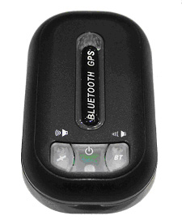

# Stars Nav - BTS-100

El BTS-100 es un receptor GPS compacto para vehículo, pensado para conductores e integradores que necesitan una fuente confiable de posición y alertas de POI. Combina recepción GNSS de alta sensibilidad con un recordatorio integrado de cámaras de velocidad y transmite telemetría básica —longitud, latitud, velocidad y UTC— a través del perfil serial Bluetooth (SPP). El equipo está optimizado para largas jornadas en carretera y permite gestionar bases de POI configurables por el usuario mediante una utilidad de PC y su interfaz mini USB.

Como dispositivo compatible con Plaspy, el BTS-100 puede funcionar como fuente externa de GPS para rastreo en tiempo real y flotas. Su salida Bluetooth SPP y las alertas de POI locales lo convierten en una opción práctica cuando se requieren avisos dentro de cabina, mientras que Plaspy se encarga de la visualización en mapas, el historial de telemetría y los análisis a nivel de flota.

## Características principales

- Transmisión por Bluetooth SPP de posición y velocidad para seguimiento en tiempo real e ingestión de telemetría por Plaspy
- Recordatorio integrado de cámaras de velocidad con alerta sonora y LED para mayor atención del conductor
- Gran autonomía con batería recargable interna de 1100 mAh y gestión de energía por detección de movimiento
- Receptor GNSS de alta sensibilidad con antena de alta ganancia integrada y seguimiento multicanal para fijaciones fiables
- Almacenamiento y actualización de POI configurable vía mini USB y utilidad de PC para mantener las bases de cámaras actualizadas
- Opciones flexibles de intervalo de reporte, desde frecuencias altas hasta informados periódicos según la operación
- Factor de forma compacto plug-and-play, apto para instalación en cabina y despliegue rápido

## Cómo funciona con Plaspy

El BTS-100 ofrece a Plaspy un flujo constante de datos similar a NMEA a través de Bluetooth SPP una vez emparejado con un dispositivo o gateway habilitado para Plaspy. Plaspy puede ingerir las actualizaciones de posición y velocidad para vistas en vivo, alertas e informes, mientras que el rastreador mantiene la funcionalidad local de POI para advertencias al conductor.

- Actualizaciones en tiempo real de longitud, latitud, velocidad y UTC por Bluetooth SPP para ingestión en Plaspy
- Alertas locales audibles y por LED que complementan las notificaciones de Plaspy para mejorar la seguridad del conductor
- Subida y descarga de POI vía mini USB y utilidad de PC para gestionar las bases de datos de cámaras a nivel de dispositivo
- Intervalos de rastreo configurables que equilibran la necesidad de telemetría de alta frecuencia con el consumo de datos y energía
- Gestión de energía activada por movimiento que facilita largos periodos operativos y reduce la carga de mantenimiento

## Casos de uso típicos

- Suministrar una entrada GPS externa a unidades de navegación antiguas y dispositivos móviles que aceptan entradas externas
- Operaciones de flota que desean alertas locales de radares junto con reportes centralizados en Plaspy
- Seguimiento portátil para vehículos compartidos o despliegues temporales en campo que requieren emparejado rápido
- Asistencia al conductor e informes de ubicación para que los gestores de flota supervisen movimientos en tiempo real
- Integradores de sistemas que requieren una fuente GPS clásica por Bluetooth SPP para compatibilidad con hardware legado

## Por qué elegir este rastreador con Plaspy

El BTS-100 es una opción práctica para organizaciones que usan Plaspy cuando la necesidad principal es la transmisión fiable de posición y las alertas orientadas al conductor. Su combinación de receptor GNSS de alta sensibilidad, larga autonomía y salida sencilla por Bluetooth SPP facilita añadir capacidad de GPS externa a flotas, sistemas de navegación posventa o dispositivos móviles que se integran con Plaspy.

Aunque el BTS-100 prioriza la localización y las funciones de POI frente a telemetría específica del vehículo, encaja bien en configuraciones telemáticas más amplias donde Plaspy agrega datos de múltiples fuentes. Para equipos que buscan un receptor GPS compacto y configurable por el usuario que ofrezca recordatorios locales de radares y datos posicionales estables, el BTS-100 es una opción sólida compatible con Plaspy.

Obtenga más información sobre Plaspy en el sitio principal https://www.plaspy.com. Las especificaciones del producto, la disponibilidad y los datos del fabricante pueden cambiar con el tiempo, por favor confirme las especificaciones actuales y la información de firmware con el fabricante oficial en http://www.starsnav.com/.
