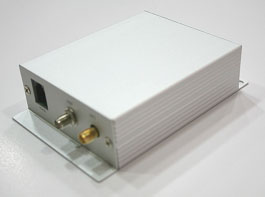

# Stars Nav - Rover 9

El rastreador de vehículos Rover 9 es un rastreador GPS compacto de grado profesional, diseñado para flotas, proveedores de seguridad y empresas que requieren un seguimiento en tiempo real confiable compatible con Plaspy. Equipado con un módulo GPS SiRFstarIII y comunicación GPRS, el Rover 9 ofrece una posición satelital y telemetría consistentes, al mismo tiempo que admite programación y actualizaciones por aire para configuración y mantenimiento remotos.

El dispositivo está diseñado para aplicaciones de vehículos y activos donde la durabilidad y la continuidad de los reportes son importantes: un rango amplio de voltaje de entrada \(6–37 V\) es adecuado para coches, camiones, vehículos comerciales y motocicletas, y una batería interna de respaldo proporciona entre 4 y 8 horas de operación portátil cuando se pierde la alimentación del vehículo. Con múltiples entradas de alarma, control de inmovilizador, monitorización analógica de combustible y temperatura, y salida Bluetooth, el Rover 9 se integra sin problemas con Plaspy para la gestión de flotas, protección antirrobo y flujos de trabajo impulsados por telemetría.

## Aspectos clave

- Rastreador GPS compatible con Plaspy con GNSS SiRFstarIII para un seguimiento en tiempo real fiable y fijaciones de posición consistentes.
- Ampio rango de entrada 6–37 V, más batería de respaldo integrada \(4–8 horas\) para mantener la transmisión de datos durante la pérdida de energía o manipulación.
- Comunicación GPRS con modo de reposo para ahorro de energía y datos.
- Funciones de seguridad integrales: múltiples entradas de alarma, entrada de pánico con marcación automática de emergencia, control del inmovilizador y salida de liberación de puerta.
- Entradas analógicas para monitorización de combustible, detección de temperatura o telemetría de presión de aire para telemática de seguros y despachos de cadena de frío.
- Verificación de identificación del conductor y comunicación de voz manos libres para mejorar la responsabilidad del conductor y la coordinación en campo.
- Programación y actualizaciones por aire para configuración remota, asegurando una gestión de flotas escalable sin tiempo muerto.

## Cómo funciona con Plaspy

Cuando se integra con Plaspy, el Rover 9 transmite datos esenciales de ubicación y del vehículo para su uso inmediato en paneles, alertas e informes. Plaspy recibe posiciones GPS, velocidad y rumbo, activaciones de alarmas y telemetría analógica para que los gestores de flotas y los equipos de seguridad puedan monitorizar los vehículos en tiempo real, automatizar reglas y responder con rapidez a incidentes.

- Actualizaciones de ubicación y telemetría en tiempo real: las fijaciones GPS del módulo SiRFstarIII se envían a Plaspy para seguimiento en vivo y registro histórico.
- Estado de puerta, alarma e inmovilizador: múltiples entradas de alarma, control del inmovilizador y salidas de liberación de puerta reportan eventos de seguridad y soportan flujos de trabajo de inmovilización remota.
- Monitoreo de combustible y telemetría de temperatura: entradas analógicas permiten a Plaspy recibir cambios en el nivel de combustible y lecturas de temperatura para control de costos y cumplimiento de la cadena de frío.
- Informe de pánico y emergencias: entrada de pánico con marcación automática de emergencia genera alertas inmediatas dentro de Plaspy para coordinar una respuesta rápida.
- Identificación del conductor y comunicaciones: eventos de ID de conductor y llamadas de voz manos libres pueden registrarse y gestionarse a través de Plaspy para evaluar el comportamiento del conductor y contextualizar incidentes.

## Resumen técnico

| Conectividad | Comunicación GPRS con modo de reposo para ahorro de energía y datos |
| --- | --- |
| Bandas | No especificado en la descripción del dispositivo |
| Alimentación y batería | Ampio rango de voltaje de entrada 6–37 V; batería de respaldo integrada que proporciona aproximadamente 4–8 horas de operación portátil |
| Interfaces | Múltiples entradas de alarma, entrada de pánico \(marcación automática de emergencia\), control del inmovilizador, salida de liberación de puerta, entradas analógicas para temperatura/combustible/presión de aire, interfaz de ID de conductor, y comunicación de voz manos libres |
| GNSS | Módulo GPS SiRFstarIII |
| Bluetooth | Salida Bluetooth para datos GPS a dispositivos de navegación; puede conectarse con accesorios Bluetooth compatibles cuando sea soportado |
| Gestión remota | Programación y actualizaciones por aire para configuración y mantenimiento remotos |
| Forma | Rastreador compacto para vehículos, adecuado para coches, camiones, motocicletas y vehículos comerciales |

## Casos de uso

- Gestión de flotas y monitorización de rutas: seguimiento en tiempo real, informes de velocidad y verificación de la ID del conductor para mejorar la eficiencia y el cumplimiento.
- Protección antirrobo y recuperación: control del inmovilizador, monitorización de puerta/alarma y reporte de la batería de respaldo favorecen una recuperación rápida y flujos de trabajo de seguridad.
- Telemática de seguros y programas de comportamiento del conductor: telemetría y registros de eventos permiten puntuación de riesgos y modelos de seguro basados en el uso.
- Logística sensible a la temperatura: entradas analógicas de temperatura admiten el despacho de alimentos congelados y el monitoreo de la cadena de frío.
- Respuesta a emergencias y coordinación de asistencia en carretera: entradas de pánico y comunicación de voz manos libres simplifican la gestión de incidentes para flotas municipales y comerciales.

## Por qué elegir este rastreador con Plaspy

Rover 9 es un rastreador GPS compatible con Plaspy diseñado para la fiabilidad y la eficiencia operativa. Su GNSS SiRFstarIII, conectividad GPRS con modo de reposo y la capacidad de actualizaciones por aire reducen el tiempo de inactividad y el esfuerzo de mantenimiento en las flotas. El amplio rango de voltaje y la batería de respaldo de varias horas aseguran telemetría continua incluso durante la pérdida de energía o manipulación, proporcionando la visibilidad sostenida que los gestores de flotas y los equipos de seguridad requieren para la anti-robo, la telemática de seguros y la protección de activos.

Con soporte para telemetría analógica \(monitoreo de combustible, temperatura\), múltiples entradas de alarma, control del inmovilizador y ID del conductor, el Rover 9 suministra los datos ricos en eventos que Plaspy necesita para generar alertas accionables, informes automatizados y flujos de gestión de flotas escalables. La salida Bluetooth facilita además la conexión a dispositivos de navegación y accesorios compatibles cuando las integraciones lo permiten. Elija Rover 9 con Plaspy para una solución práctica y centrada en funciones que aporta seguimiento en tiempo real, capacidades antirrobo y conocimientos basados en telemetría a sus vehículos y operaciones.

