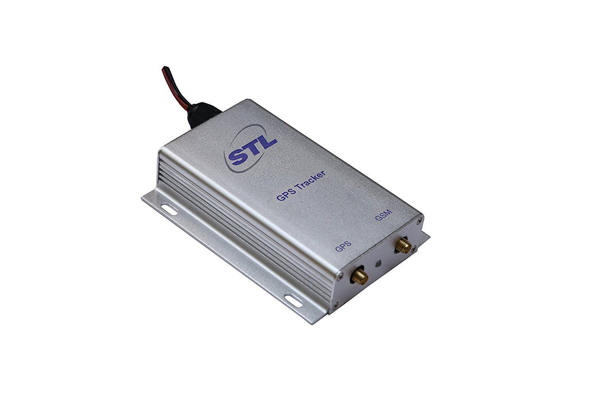

# STL - STL060

El STL STL060 es un dispositivo GPS compacto pensado para el seguimiento de vehículos, personas y activos portátiles. Utiliza señales satelitales para obtener coordenadas precisas y registra la posición a intervalos regulares. El equipo destaca por su sencillez de uso y ofrece exportación de datos y configuración vía SMS, lo que lo hace adecuado para quienes necesitan seguimiento práctico sin configuraciones complejas.

Como dispositivo compatible con Plaspy, el STL060 puede enviar datos de ubicación a Plaspy para brindar visibilidad centralizada y supervisión operativa. Su memoria interna y la posibilidad de recuperar posiciones por SMS resultan útiles en entornos con conectividad intermitente, permitiendo que Plaspy muestre el historial reciente de ubicaciones y respalde informes aun cuando los datos en tiempo real no estén disponibles temporalmente.

## Características principales

- Interfaz amigable pensada para una configuración y operación sencillas
- Reportes de posición precisos mediante datos satelitales GPS
- Almacena registros de posición en memoria interna cuando no hay GPRS
- Responde con información de ubicación por petición SMS para comprobaciones rápidas
- Soporta exportación de datos y ajustes vía SMS para una gestión flexible
- Ideal para el seguimiento de vehículos, personas y pequeños activos en entornos con conectividad mixta

## Cómo funciona con Plaspy

Al integrarse con Plaspy, el STL060 suministra registros de posición que Plaspy procesa, normaliza y presenta en paneles y reportes. Plaspy puede combinar actualizaciones en vivo con las posiciones almacenadas en el dispositivo para mantener continuidad en el seguimiento y permitir la reproducción histórica para revisiones operativas.

- Mostrar ubicaciones en vivo o recientes en los mapas de Plaspy para supervisión sencilla
- Acceder a registros históricos capturados en la memoria del dispositivo para revisar rutas
- Activar alertas y notificaciones en Plaspy según cambios de ubicación y reglas operativas
- Generar reportes y exportar datos desde Plaspy usando el historial de ubicación recopilado por el dispositivo
- Usar la recuperación por SMS como alternativa para verificar ubicaciones cuando la conectividad remota es limitada

## Casos de uso típicos

- Rastreo de vehículos de flotas pequeñas y medianas
- Monitoreo de seguridad personal y ubicación de trabajadores en solitario
- Seguimiento de equipos de renta y activos portátiles con conexiones intermitentes
- Verificación de rutas e historial de ubicaciones para auditorías operativas
- Supervisión de sitios remotos o activos temporales donde las consultas SMS resultan prácticas

## Por qué elegir este rastreador con Plaspy

El STL060 es una opción práctica cuando necesita un rastreador GPS fiable y fácil de usar que combine simplicidad con las funciones esenciales de seguimiento. Su capacidad para almacenar posiciones sin conectividad de red y responder a solicitudes por SMS aporta mayor resiliencia a operaciones que enfrentan cobertura irregular.

Emparejado con Plaspy, el STL060 contribuye a una vista centralizada de activos y personal sin requerir instalaciones complejas ni conocimientos especializados. Esta combinación es adecuada para organizaciones que priorizan despliegues sencillos, reportes de ubicación consistentes y herramientas accesibles de generación de informes.

Si desea obtener más información sobre cómo funciona el STL060 dentro de Plaspy, visite el sitio de Plaspy en https://www.plaspy.com para detalles de la plataforma y opciones. Tenga en cuenta que las especificaciones del producto la disponibilidad y los datos del fabricante pueden cambiar con el tiempo por lo que verifique las especificaciones actuales con la documentación del fabricante en http://siliconwireless.in.
