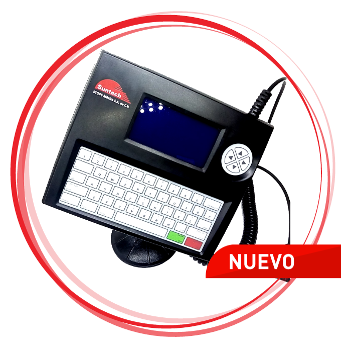

# Suntech - SNT 100

El Suntech SNT 100 es un terminal de datos diseñado para facilitar el monitoreo de vehículos y la comunicación con el conductor. Funciona como interfaz a bordo entre el conductor y una central de control, pensado para usarse junto a equipos de rastreo Suntech como el ST300R y el ST300H. El SNT 100 integra funciones prácticas —mensajería bidireccional, monitoreo de geocercas, bloqueo y desbloqueo remoto del motor y análisis de comportamiento del conductor— en un único dispositivo para ayudar a gestionar activos móviles.

Como dispositivo compatible con Plaspy, el SNT 100 puede enviar sus eventos y estados a la plataforma Plaspy para permitir visibilidad y control operativos centralizados. Plaspy puede mostrar las funciones de mensajería y alertas del equipo junto con los datos de ubicación e informes, lo que convierte al SNT 100 en una opción útil para flotas y operaciones que requieren comunicación con el conductor, alertas por geocerca e información sobre comportamiento integrado en el flujo de trabajo de gestión de flotas.

## Principales características

- Mensajería bidireccional para comunicación en tiempo real entre el conductor y la central
- Función de bloqueo y desbloqueo remoto del motor para reforzar la seguridad y el control
- Monitoreo de geocercas que genera alertas cuando los vehículos entran o salen de áreas predefinidas
- Análisis de comportamiento del conductor para identificar oportunidades de seguridad y eficiencia
- Diseñado para integrarse con equipos de rastreo Suntech como ST300R y ST300H
- Herramienta práctica para mejorar la supervisión de la flota y la coordinación operativa

## Cómo funciona con Plaspy

Al conectarse a Plaspy, los eventos y mensajes del SNT 100 se incorporan al entorno de monitoreo e informes de la plataforma, lo que permite a los operadores actuar sobre la información en vivo proveniente de los vehículos. Plaspy puede presentar los datos del SNT 100 junto con la ubicación e historial del vehículo para mejorar la conciencia situacional.

- Mostrar mensajes bidireccionales y comunicaciones del conductor en la línea de tiempo del vehículo en Plaspy
- Generar alertas de geocerca en Plaspy para notificar al despacho o al personal operativo sobre eventos de límites
- Usar eventos de bloqueo y desbloqueo remoto del motor como parte de flujos de trabajo de seguridad y respuesta a incidentes
- Incluir resúmenes de comportamiento del conductor en los informes de Plaspy para capacitación y revisiones de cumplimiento
- Consolidar el estado y los eventos del SNT 100 con otra telemetría de la flota para supervisión operativa

## Casos de uso habituales

- Despacho de flotas y coordinación con conductores cuando se requiere comunicación directa
- Cumplimiento de rutas y aplicación de geocercas en operaciones reguladas o sensibles al tiempo
- Flujos de seguridad vehicular que emplean el control remoto del motor como medida antirrobo
- Programas de monitoreo de desempeño del conductor centrados en seguridad y eficiencia de combustible
- Flotas mixtas que necesitan un terminal a bordo para complementar el hardware de rastreo del vehículo

## Por qué elegir este equipo con Plaspy

El SNT 100 es apropiado para organizaciones que requieren un terminal a bordo que combine comunicación con el conductor y funciones básicas de control y monitoreo. Su mezcla de mensajería, alertas por geocerca y análisis de comportamiento se complementa de forma natural con las herramientas de Plaspy para visibilidad e informes de flota, lo que permite centralizar eventos, alertas e interacciones con conductores en una sola plataforma.

Dado que el SNT 100 está diseñado para funcionar con equipos Suntech, puede ser una opción práctica cuando un operador ya utiliza o planea usar hardware Suntech compatible. En contextos donde la comunicación con el conductor y las alertas basadas en geocercas son importantes, integrar el SNT 100 con Plaspy ayuda a transformar los eventos del terminal en información operativa accionable.

Para obtener más información sobre cómo Plaspy puede funcionar con el Suntech SNT 100 visite https://www.plaspy.com. Las especificaciones y la disponibilidad de productos pueden cambiar con el tiempo, por lo que le recomendamos verificar los detalles actuales con el fabricante en http://www.suntechint.com/.
