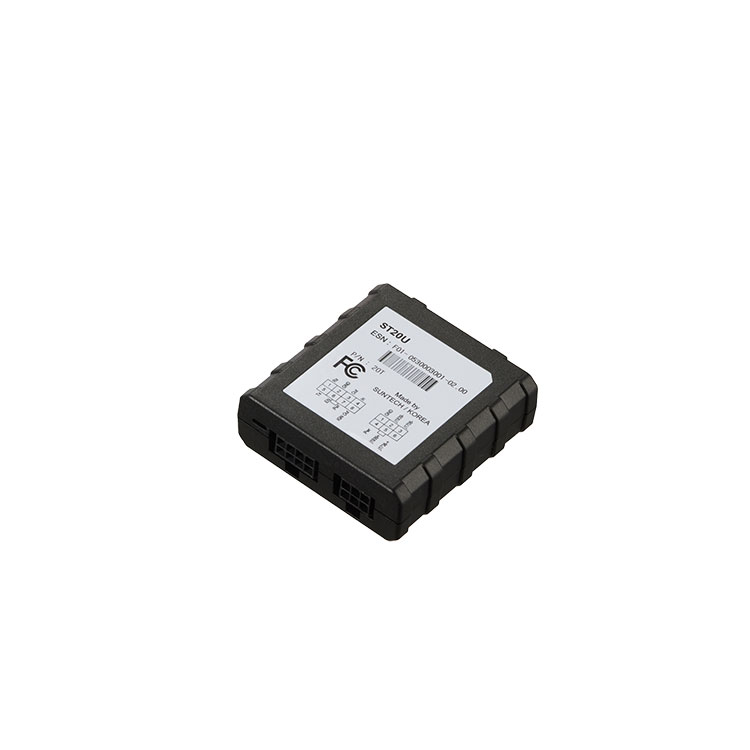

# Suntech - ST20U

El ST20U de ST SUNLAB es un módulo compacto de interfaz telemática diseñado para capturar datos a nivel de vehículo en entornos de flotas comerciales y de trabajo pesado. Su función es actuar como un puente ligero entre las redes a bordo del vehículo y un host o gateway con GNSS, recopilando telemetría clave como VIN, velocidad en carretera, odómetro, horas de motor, RPM y consumo de combustible para su envío a un dispositivo host.

Como dispositivo compatible con Plaspy cuando se empareja con hosts GNSS o gateways con capacidad Plaspy, el ST20U complementa el hardware de localización aportando telemetría detallada del vehículo que Plaspy puede procesar para monitoreo, reportes y alertas. Esa combinación transforma el seguimiento de posición básico en inteligencia de flota accionable para la gestión de rutas, la planificación de mantenimiento y la supervisión operativa dentro de la plataforma Plaspy.

## Puntos clave

- Flujo de datos compatible con Plaspy al integrarse con hosts y gateways GNSS para combinar localización y telemetría vehicular.
- Captura identidad y parámetros del vehículo, incluyendo VIN, velocidad, odómetro, horas de motor, RPM y consumo de combustible para obtener información más completa de la flota.
- Diseñado para flotas comerciales y de trabajo pesado con un formato compacto, resistente y amplio rango de temperatura de operación.
- Bajo consumo eléctrico para minimizar el impacto en los sistemas de alimentación del host mientras opera de forma continua en el vehículo.
- Opciones de conectores flexibles y un LED de estado sencillo para facilitar la integración y la verificación en campo con dispositivos host.
- Funciona como puente de telemetría y no como un dispositivo GNSS independiente, emparejándose con hosts o trackers GNSS para proporcionar ubicación más datos del vehículo.
- Pensado para funcionar de forma fiable con interfaces de bus vehicular establecidas y conexiones RS232 al host para el reenvío de telemetría.

## Cómo funciona con Plaspy

El ST20U lee la telemetría del bus del vehículo y reenvía esos datos a un host con GNSS o a un gateway compatible con Plaspy. Cuando el host combina la localización de su receptor GNSS con la telemetría del ST20U, ese flujo combinado puede subirse a Plaspy para monitoreo en tiempo real y análisis histórico. Plaspy utiliza luego esa telemetría para enriquecer paneles, reportes y alertas operativas.

- Proporciona actualizaciones sincronizadas de posición y parámetros del vehículo a Plaspy cuando se usa con un host GNSS compatible.
- Mantiene registros de activos en Plaspy usando el VIN y los datos de identidad suministrados por el ST20U.
- Alimenta a Plaspy con odómetro, horas de motor, RPM y velocidad para programación de mantenimiento y evaluación del desempeño del conductor.
- Suministra datos de consumo de combustible a los paneles de Plaspy para monitoreo de combustible y análisis de costos.
- Reenvía eventos y estados a través del host para activar alertas, flujos de trabajo y reportes en Plaspy, apoyando la supervisión operativa.

## Casos de uso típicos

- Gestión de flotas de camiones y vehículos comerciales pesados donde se requiere telemetría combinada de ubicación y parámetros del vehículo.
- Programas de monitoreo y eficiencia de combustible que dependen de datos de consumo integrados en los reportes de Plaspy.
- Planificación de mantenimiento mediante telemetría de odómetro y horas de motor para programar servicios y reducir paradas no planificadas.
- Identificación y registro de activos usando VIN y datos del bus para mantener inventarios de flota precisos.
- Flujos de trabajo de seguridad y anti-robo cuando se empareja con hosts que soportan inmovilizadores o funciones de control remoto.

## Por qué elegir este rastreador con Plaspy

El ST20U es apropiado para organizaciones que necesitan una adquisición fiable de parámetros vehiculares que complemente el seguimiento GNSS. Su papel como puente de telemetría le permite ampliar el valor de hosts GNSS existentes o nuevos al aportar datos a nivel de vehículo que Plaspy puede aprovechar en análisis, alertas y toma de decisiones operativas. Para flotas que operan vehículos de trabajo pesado, el ST20U ofrece una vía práctica hacia una telemática más completa sin reemplazar el hardware GNSS.

Elegir el ST20U con Plaspy tiene sentido cuando desea convertir los datos de ubicación en información útil en áreas como gestión de combustible, comportamiento del conductor, mantenimiento y seguimiento de activos. Su diseño compacto y bajo consumo facilitan su integración en la arquitectura telemática del vehículo, permitiendo que Plaspy presente una vista unificada de la posición y el estado del vehículo.

Para saber más sobre cómo Plaspy puede usar la telemetría del ST20U en los flujos de trabajo de su flota, visite https://www.plaspy.com. Las especificaciones y la disponibilidad del producto pueden cambiar con el tiempo, por lo que le recomendamos verificar los detalles técnicos actuales y las instrucciones de instalación en el sitio del fabricante http://www.suntechint.com/.
