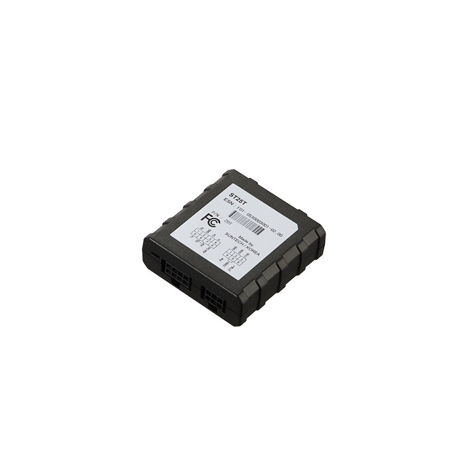

# Suntech - ST25T

El ST25T es un módulo interfaz telemático compacto diseñado para ampliar soluciones de seguimiento y telemetría compatibles con Plaspy. Reenvía datos del bus del vehículo y de sensores hacia dispositivos gateway como el ST4305 y el ST8300, permitiendo integrar equipos seriales heredados, sensores de combustible y redes vehiculares estándar como J1939 y J1708 en un flujo de trabajo unificado para flotas. Su formato pequeño, amplio rango de operación térmica y bajo consumo lo hacen adecuado para camiones pesados, autobuses y otros vehículos comerciales que operan en entornos exigentes.

Como interfaz compatible con Plaspy, el ST25T está pensado para enriquecer la telemetría de un gateway y no como un rastreador GPS independiente. Cuando se combina con un gateway habilitado para Plaspy, entrega las señales del vehículo y de los sensores necesarias para el seguimiento en tiempo real, el monitoreo de combustible y las alertas antirrobo dentro de los paneles de Plaspy. Este enfoque hace al ST25T relevante para flotas que requieren reenvío de telemetría robusto, integración de dispositivos heredados y entradas de sensores confiables en un despliegue gestionado por Plaspy.

## Características principales

- Interfaz telemática compatible con Plaspy que reenvía datos del bus vehicular y de sensores a gateways para la gestión de flotas en tiempo real.
- Múltiples interfaces seriales para conectar equipos heredados y subsistemas de terceros sin rediseñar el hardware del gateway.
- Entradas/salidas flexibles con ADC o entradas digitales para detección de ignición, eventos de puertas o alarmas y otras señales telemétricas.
- Soporte opcional Bluetooth 4.1 para configuración local y emparejamiento de accesorios durante la instalación y el mantenimiento.
- Funcionamiento de bajo consumo y empaquetado compacto adecuados para despliegues continuos en vehículos.
- Diseño resistente con amplio rango de temperatura de operación pensado para camiones pesados, autobuses y vehículos comerciales.
- Orientado a la agregación de telemetría en lugar de actuar como un rastreador GNSS independiente.

## Cómo funciona con Plaspy

El ST25T opera como un agregador de telemetría que suministra mensajes del bus vehicular, lecturas de combustible e entradas de sensores auxiliares a un gateway habilitado para Plaspy. Plaspy procesa la corriente combinada del gateway y del ST25T para ofrecer visibilidad unificada, alertas e informes de la flota en tiempo real.

- Reenvío de telemetría en tiempo real — los mensajes del bus y los datos seriales se retransmiten al gateway para monitoreo en vivo e informes históricos en Plaspy.
- Soporte para monitoreo de combustible — los datos del sensor de combustible pueden reenviarse vía ST25T a Plaspy para análisis de consumo y detección de anomalías.
- Entradas de eventos y estado — las entradas ADC o digitales capturan el estado de ignición, eventos de puertas y disparos de alarma que alimentan flujos de trabajo de viajes, inactividad y antirrobo en Plaspy.
- Configuración local y emparejamiento de accesorios — el Bluetooth opcional permite a los técnicos emparejar herramientas de configuración o sensores BLE locales durante el servicio.
- Integración de equipos heredados — múltiples canales seriales permiten a las flotas conservar dispositivos a bordo como impresoras de tickets u otros subsistemas mientras se envía su información a Plaspy.

## Casos de uso típicos

- Mejorar la telemetría de la flota reenviando datos del motor y del bus vehicular a Plaspy para informes operativos.
- Monitoreo del nivel de combustible y detección de discrepancias mediante interfaces dedicadas para sensores de combustible.
- Integración de dispositivos seriales heredados y accesorios a bordo sin reemplazar el hardware existente.
- Captura de eventos de ignición, puertas y alarmas para etiquetado de viajes, análisis de inactividad y alertas de seguridad.
- Configuración local y emparejamiento de sensores BLE durante la instalación o el mantenimiento rutinario.

## Por qué elegir este dispositivo con Plaspy

Elegir el ST25T como parte de una solución compatible con Plaspy es apropiado cuando la necesidad principal es la agregación de telemetría más que el rastreo GNSS independiente. El equipo está diseñado para reenviar las señales del bus y de los sensores hacia un gateway que provea GNSS y conectividad, lo que permite a Plaspy entregar una visibilidad completa, alertas e informes en flotas heterogéneas.

Para organizaciones que requieren monitoreo de combustible, reenvío de diagnósticos o soporte para múltiples dispositivos seriales, el ST25T facilita la integración y preserva la inversión en equipos heredados, encajando naturalmente en los flujos de trabajo gestionados por Plaspy. Su diseño robusto y sus características de bajo consumo favorecen el despliegue en vehículos de servicio pesado que operan en condiciones adversas.

Para saber más sobre cómo el ST25T puede trabajar con Plaspy visite https://www.plaspy.com. Las especificaciones del producto y su disponibilidad pueden cambiar con el tiempo, por lo que verifique los detalles técnicos actuales y la información de conectores con el fabricante en http://www.suntechint.com/ antes del despliegue.
