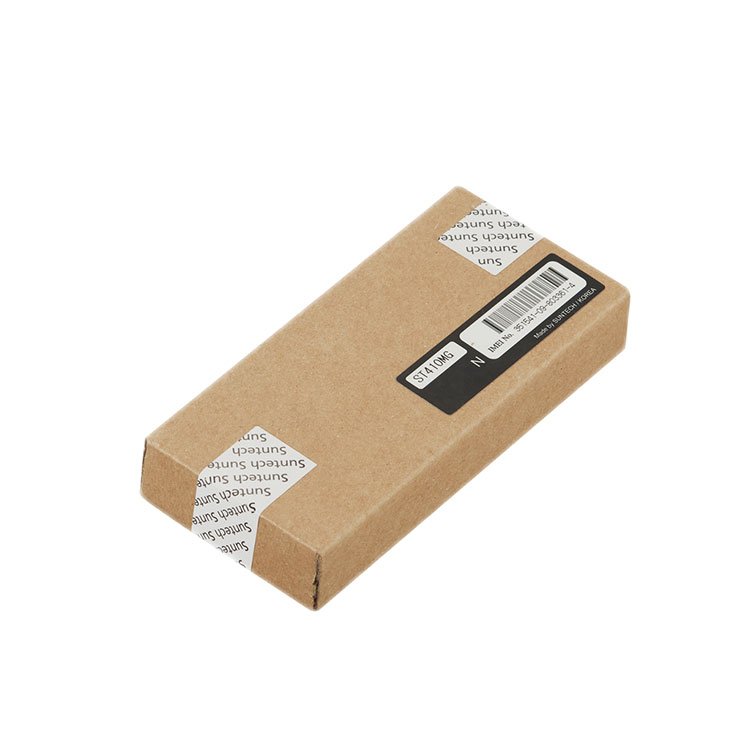

# Suntech - ST410MG

El ST410MG es un rastreador GPS compacto compatible con Plaspy, diseñado para el monitoreo discreto y de larga duración de activos y cargamentos. Integra posicionamiento GNSS con ayuda SBAS y una arquitectura de comunicaciones dual que incluye GSM GPRS y RF 433–435 MHz, soportando seguimiento continuo, telemetría y flujos de trabajo orientados a maximizar la vida útil de la batería y extender el alcance RF.

Como dispositivo compatible con Plaspy, el ST410MG provee a la plataforma actualizaciones de posición, eventos de movimiento y telemetría de energía que alimentan la visibilidad en tiempo real y los informes históricos. Su tamaño reducido, acelerómetro de 3 ejes integrado y detección de interferencias lo hacen idóneo para escenarios de antirrobo y recuperación de activos, mientras que Plaspy agrega y presenta los datos para la supervisión operativa.

## Aspectos destacados

- Rastreador GPS compatible con Plaspy, optimizado para monitoreo discreto de activos y cargamento y entrega continua de telemetría.
- Canales de comunicación duales: GSM GPRS para cobertura amplia y RF 433–435 MHz como complemento para flujos de recuperación de largo alcance.
- Posicionamiento GNSS con soporte GLONASS y asistencia SBAS para mejorar la fiabilidad de la ubicación en los mapas e informes de Plaspy.
- Acelerómetro de 3 ejes integrado y detección de interferencias para alertas de movimiento y conciencia de suposición de señales, reforzando los procesos de seguridad.
- Batería recargable de respaldo de 2,750 mAh con modos de operación configurables para permitir intervalos de despliegue prolongados entre cargas.
- Factor de forma compacto y liviano que facilita el montaje discreto en vehículos o en la carga sin añadir volumen significativo.

## Cómo funciona con Plaspy

Al integrarse con Plaspy, el ST410MG transmite ubicación, estado y telemetría para que los operadores puedan monitorear activos en tiempo real, revisar rutas históricas y recibir alertas basadas en eventos. Plaspy ingiere los datos del equipo y los pone a disposición para geocercas, generación de informes y notificaciones adaptadas a procesos de flota y recuperación de activos.

- Actualizaciones en tiempo real de ubicación y telemetría para mantener la conciencia situacional en los paneles de Plaspy.
- Alertas de movimiento del acelerómetro de 3 ejes para identificar desplazamientos no autorizados y activar notificaciones.
- Eventos de detección de interferencias presentados como alertas para ayudar a identificar posibles bloqueos de GPS e iniciar investigaciones.
- Reportes de nivel de batería y modos de energía para planificar mantenimiento y gestionar la autonomía de los despliegues.
- Uso de RF 433–435 MHz como canal complementario de recepción o recuperación en operaciones que requieren alcance extendido.

## Casos de uso típicos

- Monitoreo prolongado de carga y mercancías donde el montaje discreto y la larga duración de la batería reducen la necesidad de mantenimiento frecuente.
- Flujos de trabajo de recuperación de activos y antirrobo que se benefician de alertas de movimiento, detección de interferencias y rastreo RF complementario.
- Despliegues periódicos o estacionales que requieren reportes en bajo consumo configurables para maximizar la vida operativa.
- Seguimiento de pallets o equipos de alto valor que necesita actualizaciones precisas de posición y detección de manipulación sin hardware voluminoso.

## Por qué elegir este rastreador con Plaspy

El ST410MG ofrece una combinación práctica de autonomía, tamaño compacto y detección de eventos que encajan con los casos de uso de Plaspy para monitoreo de flotas y activos. Su enfoque de comunicaciones dual y las mejoras GNSS ayudan a mantener la visibilidad en escenarios típicos de rastreo, mientras que las alertas basadas en acelerómetro y la detección de interferencias añaden capas de seguridad que se integran directamente en los flujos de trabajo de Plaspy.

Para organizaciones que buscan un rastreo discreto de activos con larga autonomía y telemetría accionable, el ST410MG es una opción compatible con Plaspy que equilibra simplicidad de despliegue y datos útiles de eventos. Para saber más sobre Plaspy y cómo se integra con dispositivos como el ST410MG visite https://www.plaspy.com. Las especificaciones del producto, disponibilidad y detalles del fabricante pueden cambiar con el tiempo, por lo que es recomendable verificar la información técnica actual en el sitio oficial del fabricante http://www.suntechint.com/.
