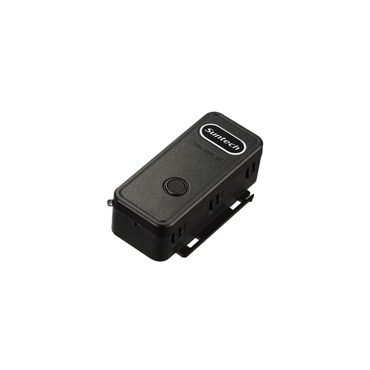

# Suntech - ST4290

El Suntech ST4290 es un rastreador GPS robusto y alimentado por batería, diseñado para el monitoreo y la recuperación de activos a largo plazo. Combina posicionamiento GNSS con conectividad celular y una carcasa IP67 para asegurar reportes de ubicación confiables en entornos exigentes. Compacto y eficiente en consumo, el ST4290 está disponible con dos variantes de batería primaria que permiten ajustar la autonomía según las necesidades de despliegue.

Este rastreador es compatible con Plaspy y está pensado para enviar posiciones y telemetría de eventos a plataformas de gestión de flotas y activos. Con entradas y salidas orientadas a vehículos, detección de movimiento por acelerómetro y opciones de batería de larga duración, el ST4290 es ideal para flujos de trabajo en Plaspy como seguimiento en tiempo real, alertas por geocerca y coordinación de respuesta ante robo.

## Puntos clave

- Compatibilidad nativa con Plaspy para seguimiento en tiempo real e integración con flotas.
- Carcasa resistente IP67 y un rango de temperatura adecuado para numerosas instalaciones al aire libre.
- GNSS integrado con soporte SBAS y precisión suficiente para localización de activos y flotas.
- Diseño de bajo consumo con dos variantes de batería primaria para operación prolongada sin supervisión.
- Conectividad celular en bandas de bajo consumo y con retroceso a 2G donde esté disponible para amplia cobertura.
- Entradas y salidas enfocadas en vehículo y acelerómetro de 3 ejes para alertas basadas en eventos.
- Soporte para actualizaciones remotas de firmware y gestión de dispositivos basada en red para reducir mantenimiento.

## Cómo funciona con Plaspy

Cuando se integra con Plaspy, el ST4290 entrega posiciones GNSS y eventos de dispositivo a la plataforma para que los equipos de operaciones puedan supervisar activos, recibir alertas y gestionar flujos de recuperación. Plaspy procesa los datos del rastreador y los muestra junto con herramientas de cartografía, reportes y alertas para apoyar la supervisión diaria de la flota y la respuesta ante incidentes.

- Actualizaciones de ubicación y telemetría en tiempo real visibles en los paneles y mapas de Plaspy.
- Eventos de ignición, puertas y pánico transmitidos a Plaspy para activar alertas y procesos de incidente.
- Salidas para inmovilizador o sirena que pueden coordinarse mediante procedimientos gestionados en Plaspy para mitigar robos.
- Eventos de movimiento y manipulación detectados por el acelerómetro que permiten alertas automáticas para activos sin supervisión.
- Informes de batería y estado del dispositivo en Plaspy que ayudan a programar mantenimiento y optimizar intervalos de reporte.

## Casos de uso habituales

- Seguimiento prolongado de carga y mercancía donde se requiere autonomía de varias semanas o meses.
- Flujos de recuperación de activos y anti robo en flotas utilizando detección de ignición y salidas de inmovilizador.
- Monitoreo remoto de equipos y detección de movimiento para activos de campo sin supervisión.
- Despliegues de larga duración en campo que requieren protección robusta y menos visitas de mantenimiento.

## Por qué elegir este rastreador con Plaspy

El ST4290 combina hardware resistente y diseño de bajo consumo con un conjunto de funciones que se alinean con las necesidades comunes de gestión de flotas y activos. Sus entradas orientadas a vehículos y la detección de movimiento lo hacen útil para organizaciones que requieren alertas basadas en eventos y flujos de recuperación, mientras que las opciones de batería permiten equilibrar tiempo de operación y tamaño del dispositivo según cada despliegue.

Usar el ST4290 con Plaspy aporta visibilidad a nivel de dispositivo en una plataforma centralizada para mapas, alertas y reportes. Si necesita un rastreador compacto y duradero que soporte larga vida en campo y supervisión operativa, el ST4290 es una opción práctica para evaluar junto con Plaspy.

Learn more about Plaspy on the main website https://www.plaspy.com. Product specifications, availability, and manufacturer details can change over time, so verify current information on the official Suntech site http://www.suntechint.com/ before making procurement or deployment decisions.
