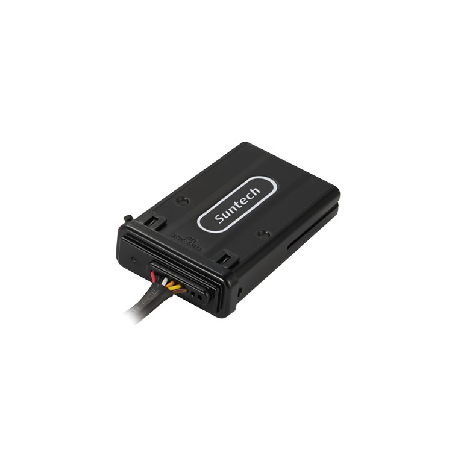

# Suntech - ST4315

La serie ST4315 es un rastreador GPS compacto para montaje en vehículos, diseñado para la gestión de flotas y activos compatible con Plaspy. Diseñado para funcionar con plataformas telemáticas modernas, el ST4315 ofrece un seguimiento en tiempo real confiable, telemetría robusta y hardware resistente que soporta condiciones exigentes en campo, lo que lo convierte en una excelente opción para operadores que requieren datos de posición precisos, reconstrucción de accidentes y análisis de patrones de conducción en Plaspy.

Disponible en múltiples variantes para adaptarse a diferentes necesidades de instalación e integración, el ST4315 soporta conectividad LTE Cat M1, NB‑IoT y 2G legado \(EGPRS\), registro en búfer de hasta 10,000 registros y interfaces dependientes del modelo como RS232 y 1‑Wire. Estas capacidades se combinan con modos de bajo consumo y protección IP67 para posibilitar despliegues de larga duración y de bajo mantenimiento para gestión de flotas, antifraude y rastreo general de activos en la plataforma Plaspy.

## Puntos destacados

- Compatible con Plaspy: ofrece datos continuos del rastreador GPS y telemetría para rastreo en tiempo real y flujos de trabajo de gestión de flotas.
- Conectividad celular multinetwork: LTE Cat M1 y NB‑IoT con respaldo EGPRS para una cobertura amplia y resiliencia del operador.
- GNSS de alta precisión: GPS + GLONASS con soporte SBAS \(WAAS/EGNOS/MSAS\) y una exactitud CEP típica de ~±3 m para servicios de ubicación confiables.
- Diseño robusto y de bajo consumo: carcasa IP67, rango de tensión de entrada \(DC 8–33 V\) y corrientes en modo deep sleep \< 2 mA para ampliar la operación respaldada por batería.
- Búfer local y datos listos para analítica: memoria a bordo para hasta 10,000 registros que preserva datos durante interrupciones y permite reconstrucción de accidentes y DPA \(cuando esté activado\).
- Soporte flexible de E/S y periféricos: hasta seis entradas/salidas cableadas \(dependiente del modelo\); antenas internas; 2 LEDs de estado \(Red, GPS\); puertos RS232 y/o 1‑Wire opcionales
- Opciones de variantes: múltiples configuraciones de pines y combinaciones de E/S/puertos \(ST4315, ST4315U, ST4315W, ST4315R, ST4315RW\) para adaptar la instalación y las necesidades de telemetría.

## Funcionamiento con Plaspy

Cuando se integra con Plaspy, el ST4315 transmite la ubicación y la telemetría mediante TCP/UDP sobre LTE Cat M1, NB‑IoT o EGPRS para ofrecer rastreo casi en tiempo real, alertas e informes históricos. Plaspy ingiere las posiciones GNSS del dispositivo, entradas de eventos y registros en búfer, de modo que las flotas mantienen la continuidad de los datos incluso si la cobertura celular se interrumpe.

- Actualizaciones de ubicación y telemetría en tiempo real entregadas a Plaspy para el rastreo en vivo y visualización en mapas.
- Geocercas \(circulares y poligonales\) y generación de eventos para alertas de entrada/salida y cumplimiento de rutas.
- E/S digital y estado de ignición \(dependiente del modelo\) para eventos de encendido/apagado del motor y entradas de alarma.
- Registro en búfer de hasta 10,000 registros para la subida a Plaspy tras la reconexión, posibilitando la reconstrucción de accidentes y DPA \(cuando esté activado\).
- Puertos listos para integración \(RS232, 1‑Wire\) y BLE opcional para conectar sensores externos, permitiendo ampliar la telemetría con sensores de temperatura o sensores de combustible de terceros cuando se despliegan con los periféricos adecuados.

## Resumen técnico

| Conectividad | LTE Cat M1, NB‑IoT y EGPRS \(según modelo\); transporte TCP/UDP |
| --- | --- |
| Bandas | EGPRS 850 / 900 / 1800 / 1900 MHz \(EGPRS de respaldo\); bandas LTE/NB‑IoT según modelo |
| Energía y Batería | Entrada DC 8–33 V con protección de inversión de energía; batería de respaldo Li‑ion recargable de 3.7 V, 220 mAh; consumo activo ~40–50 mA a 12 V, modo reposo \<4 mA, sueño profundo \<2 mA |
| Interfaces | Hasta seis E/S cableadas \(dependiente del modelo\); antenas internas; 2 LEDs de estado \(Red, GPS\); puertos RS232 y/o 1‑Wire opcionales |
| GNSS | GPS + GLONASS con SBAS \(WAAS/EGNOS/MSAS\); ~±3 m CEP típico; actualización 1 Hz; TTFF: arranque en frío \<35 s \(\<15 s con EASYTM\), arranque tibio \<30 s \(\<5 s con EASYTM\), arranque en caliente \<1 s |
| Bluetooth | BLE opcional disponible en modelos seleccionados \(dependiente del modelo\) para sensores y balizas |
| Memoria | Búfer en la placa para hasta 10,000 registros para conservar datos durante pérdidas de conectividad |
| Gestión remota | El fabricante proporciona firmware y descargas opcionales \(hoja de datos: ST4315.pdf\); soporte de integración para instaladores del sistema |
| Formato y Entorno | Diseño compacto montado en vehículo; protección IP67; rango de operación −30 °C a +80 °C; certificaciones: FCC, IC, PTCRB, CE |

## Casos de uso

- Gestión de flotas: seguimiento en vivo de vehículos, optimización de rutas y monitorización del comportamiento de conducción a través de paneles de Plaspy e informes.
- Recuperación de vehículos y antifraude: reporte continuo de posición y alertas disparadas por eventos; el control remoto del inmovilizador puede implementarse mediante salidas digitales cuando sea necesario.
- Monitorización de maquinaria de construcción: carcasa robusta IP67 y amplio rango de temperaturas hacen del ST4315 una opción adecuada para telemetría de maquinaria pesada y programación de mantenimiento.
- Cadena de frío o activos respaldados por sensores: conecte sensores externos vía RS232/1‑Wire o BLE \(según modelo\) para ampliar la telemetría de temperatura o monitoreo de movimiento.
- Reconstrucción de accidentes y analítica de seguridad: GNSS en búfer más reconstrucción de accidentes y análisis de patrones de conducción proporcionan insights basados en datos para programas de seguridad.

## Por qué elegir este rastreador con Plaspy

La serie ST4315 es un rastreador GPS práctico, compatible con Plaspy, que equilibra fiabilidad robusta con operación de bajo consumo y opciones de integración flexibles. Su soporte de conectividad celular multinetwork \(LTE Cat M1 / NB‑IoT con respaldo EGPRS\) y posicionamiento GNSS preciso proporcionan un seguimiento en tiempo real consistente para la gestión de flotas y flujos de antifraude. Puertos BLE, RS232 y 1‑Wire opcionales, junto con múltiples configuraciones de pines, permiten a los integradores telemáticos conectar sensores para ampliar la telemetría —monitoreo de combustible, detección de temperatura o control del inmovilizador— utilizando las interfaces que mejor se adapten a cada instalación.

Para operadores de flotas e integradores de sistemas que buscan desplegar soluciones de rastreo escalables y resilientes en Plaspy, la serie ST4315 ofrece los bloques de construcción clave: formato compacto para vehículos, registro en búfer para evitar lagunas de datos, durabilidad IP67 y recursos del fabricante \(hojas de datos y firmware\) para apoyar la instalación y el mantenimiento a largo plazo. Su combinación de telemetría, informes de eventos y funciones analíticas opcionales la convierten en una opción eficaz cuando el rastreo fiable en tiempo real y el análisis post-evento son relevantes.

