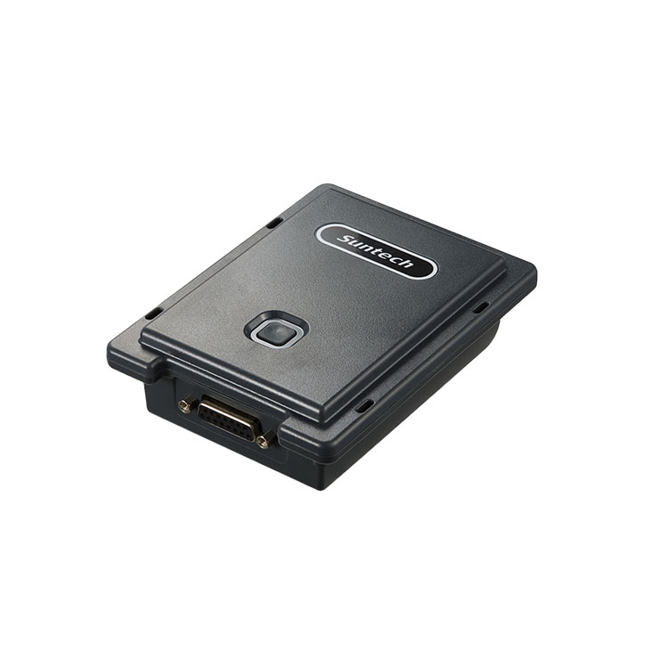

# Suntech - ST4335

El ST4335 es un rastreador GPS de alta resistencia y diseño híbrido, pensado para el seguimiento de vehículos y activos industriales. Diseñado para ambientes exigentes, combina una carcasa robusta y conectividad celular multinetwork con posicionamiento GNSS para entregar información fiable de ubicación, movimiento y estado. Su construcción y características lo hacen ideal para remolques, contenedores, maquinaria pesada y otras implementaciones a largo plazo donde la durabilidad y la telemetría continua son prioritarias.

Como dispositivo compatible con Plaspy, el ST4335 transmite en tiempo real datos de flota y telemetría a la plataforma Plaspy para mapeo, alertas e informes. Sus modos de reporte configurables, entradas/salidas flexibles y sensores locales opcionales permiten ajustar la frecuencia de actualización, monitorear el estado del activo e integrar entradas de sensores en los flujos de trabajo de Plaspy para anti robo, control de remolques y supervisión de flota más amplia.

## Puntos clave

- Carcasa robusta y resistente, adecuada para remolques, contenedores y vehículos industriales.
- Conectividad celular multinetwork con LTE Cat M1 y NB-IoT más retroceso a 2G para amplia cobertura.
- Posicionamiento GNSS con GPS y GLONASS y soporte SBAS para datos de ubicación confiables.
- Interfaz flexible de 15 pines I/O para integración de sensores externos y controles que extienden la telemetría.
- Enfoque en despliegues de larga duración con modos de bajo consumo y varias opciones de batería de respaldo para mayor autonomía.
- Funciones operativas como reporte condicional, detección de interferencias (jamming) y detección virtual de encendido.
- Soporte opcional de Bluetooth para incorporar sensores locales y balizas para monitoreo ambiental o de proximidad.

## Cómo funciona con Plaspy

Cuando se configura con Plaspy, el ST4335 envía posición GNSS, movimiento y el estado de las entradas/salidas a la plataforma Plaspy, de modo que usted puede utilizar las herramientas de Plaspy para mapas en vivo, alertas y análisis históricos. Los modos de reporte y los eventos condicionales permiten equilibrar la vida de la batería frente a la frecuencia de seguimiento según el tipo de despliegue. En Plaspy, los datos del dispositivo se integran en paneles de flota, lógica de geocercas y canales de informes.

- Ubicación y telemetría en tiempo real transmitidas a Plaspy para rastreo y mapeo en vivo.
- Alertas de geocerca e interferencias enviadas a Plaspy para activar notificaciones y flujos de incidentes.
- Eventos basados en encendido virtual y movimiento reportados a Plaspy para detección de viajes e información del estado del motor.
- Datos de sensores externos a través del I/O de 15 pines reenviados a Plaspy para telemetría integrada y paneles.
- Reporte condicional e intervalos configurables que ayudan a gestionar la duración de batería en activos de larga duración.

## Casos de uso típicos

- Gestión de flotas mixtas que requieren ubicación fiable e informes de viajes.
- Rastreo de remolques y contenedores donde la carcasa resistente y la larga vida de batería son prioridades.
- Flujos de trabajo anti robo que combinan detección de interferencias, alertas por movimiento y opciones de control remoto.
- Telemetría industrial para equipos remotos donde los datos de sensores se agregan en paneles de Plaspy.
- Monitoreo prolongado de activos sin supervisión con reporte condicional para preservar la autonomía de la batería.

## Por qué elegir este rastreador con Plaspy

El ST4335 es una opción práctica para organizaciones que necesitan un rastreador resistente y flexible integrado en una plataforma comercial de gestión de flotas como Plaspy. Su diseño celular multinetwork y el desempeño GNSS proporcionan conectividad resiliente y posicionamiento preciso en áreas de operación diversas. La combinación de I/O configurable, sensores locales opcionales y modos de bajo consumo hace que el dispositivo sea adaptable tanto para operaciones activas de flota como para despliegues prolongados sin supervisión.

Usar el ST4335 con Plaspy brinda a los equipos acceso inmediato a mapas en vivo, geovallas, alertas e informes históricos sin necesidad de middleware complejo. Esta combinación soporta una variedad de necesidades operativas, desde monitoreo de rutas y telemetría de combustible o sensores (con sensores externos compatibles) hasta flujos de trabajo de anti robo y recuperación, convirtiéndolo en un componente versátil para programas profesionales de flota y activos.

Para obtener más información sobre cómo gestionar dispositivos como el ST4335 con Plaspy visite https://www.plaspy.com. Product specifications, availability and manufacturer details can change over time, so please verify current technical details on the official Suntech site http://www.suntechint.com/.
