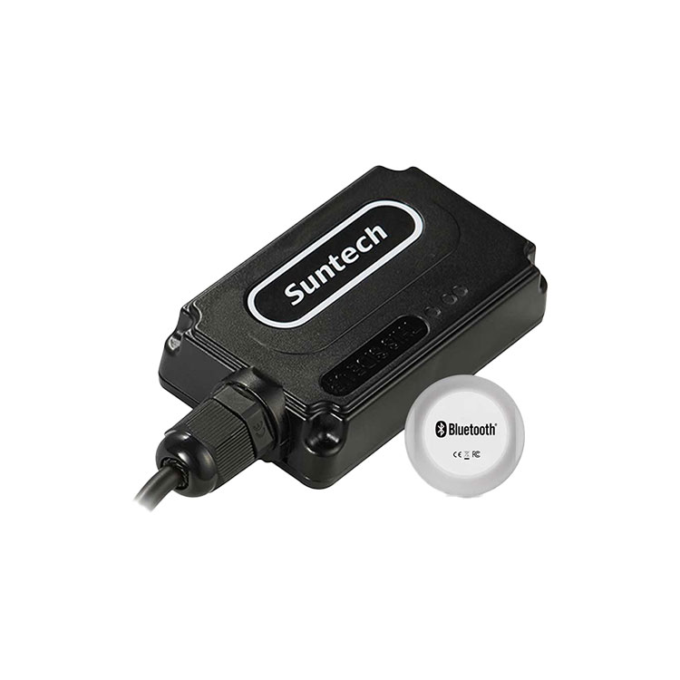

# Suntech - ST4345LB

El ST4345LB es un rastreador GPS compacto y resistente diseñado para telemática vehicular y monitoreo distribuido de activos. Con conectividad celular multimodo y posicionamiento GNSS integrado, está pensado para la supervisión de flotas, procesos de recuperación y despliegues a largo plazo donde se requiere rendimiento exterior duradero e informes de ubicación fiables. El equipo combina localización, detección de movimiento y analítica a bordo para generar eventos útiles para los equipos operativos.

Como dispositivo compatible con Plaspy, el ST4345LB puede enviar posiciones, eventos e información de sensores a la plataforma de gestión de flotas de Plaspy para ofrecer visibilidad y reportes en tiempo real. Sus salidas de telemetría y analítica lo convierten en una opción práctica para organizaciones que desean consolidar rastreo de vehículos, alertas por geocerca y datos de incidentes en los paneles y flujos de trabajo de Plaspy sin desarrollos de integración extensos.

## Puntos clave

- Rastreador compatible con Plaspy que ofrece amplia cobertura celular mediante LTE Cat M1, NB‑IoT y 2G para despliegues en zonas extensas.
- Soporte BLE para conectar sensores externos y enriquecer la telemetría con datos sobre el estado de los activos.
- Analítica vehicular a bordo como análisis de patrones de conducción y reconstrucción de choques para apoyar revisiones de incidentes y flujos de seguridad.
- Carcasa con protección IP67 y amplio rango de temperatura de operación para uso fiable en exteriores y en vehículos.
- Posicionamiento GNSS completo con precisión típica adecuada para aplicaciones de rastreo de flotas y activos.
- Detección virtual de encendido, opciones de geocercas y modos de bajo consumo para soportar activos diversos y seguimiento a largo plazo.

## Cómo funciona con Plaspy

Al integrarse con Plaspy, el ST4345LB transmite datos de ubicación, sensores y eventos a los paneles de la flota y a los motores de reglas, de modo que su equipo pueda monitorear activos, activar alertas y generar informes desde una interfaz unificada. Plaspy ingiere la telemetría del dispositivo y la mapea a las funciones de la plataforma para supervisión operativa.

- Rastreo en tiempo real y trazas históricas para visibilidad en vivo y reproducción de recorridos.
- Eventos de telemetría y analítica enviados a Plaspy para puntuación de comportamiento y reconstrucción de incidentes.
- Eventos virtuales de encendido y movimiento utilizados para cambiar estados, generar reportes de tiempo de operación y resúmenes de kilometraje.
- Monitoreo de geocercas con notificaciones instantáneas para cumplimiento de perímetros, rutas y sitios.
- Datos de sensores BLE encaminados a Plaspy para supervisión de temperatura, puertas o condición del activo.
- Compatibilidad con gestión remota para soportar configuración y flujos de ciclo de vida junto con el monitoreo en Plaspy.

## Casos de uso típicos

- Gestión de flotas de vehículos ligeros y pesados con énfasis en visibilidad de ubicación y análisis de comportamiento del conductor.
- Recuperación de vehículos y monitoreo antirrobo con reporte de ubicación continuo y alertas por geocerca.
- Rastreo de remolques, contenedores y activos remotos donde importa el bajo consumo y la amplia cobertura.
- Investigación de incidentes y revisiones de seguridad mediante reconstrucción de choques y analítica de patrones de conducción dentro de la plataforma.

## Por qué elegir este rastreador con Plaspy

El ST4345LB combina características de hardware prácticas con las capacidades de la plataforma Plaspy para ofrecer una solución equilibrada de telemetría, recuperación y visibilidad operativa. Su mezcla de conectividad celular multimodo, posicionamiento GNSS y analítica a bordo lo hace adecuado para organizaciones que necesitan rastreo confiable y conciencia de eventos en flotas mixtas y activos dispersos.

Para equipos que ya utilizan Plaspy, el ST4345LB puede simplificar la recolección de datos y habilitar flujos de trabajo estándar de flota como alertas por geocerca, monitoreo de rutas e informes de incidentes. Los detalles de producto y los conjuntos de funciones pueden cambiar con el tiempo, por lo que le recomendamos obtener más información sobre Plaspy en el sitio principal https://www.plaspy.com y verificar especificaciones y disponibilidad actuales en la web del fabricante http://www.suntechint.com/.
