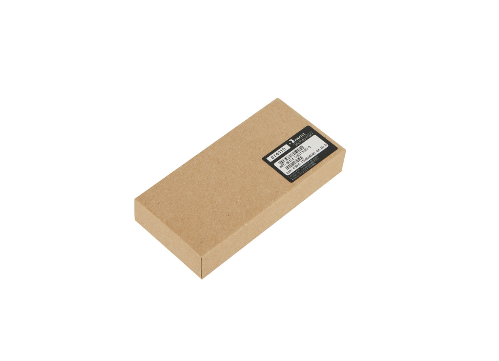

# Suntech - ST4410G

El ST4410G es un rastreador GPS compacto diseñado para el seguimiento a nivel de caja y activo en entornos logísticos y de cadena de suministro. Integra conectividad celular multimodo, un receptor GNSS multiconstelación y un receptor RF integrado para ofrecer reportes de posición, detección de eventos de etiquetas y telemetría basada en movimiento para activos portátiles y envíos embalados.

Como dispositivo compatible con Plaspy, el ST4410G está diseñado para una integración sencilla con plataformas de seguimiento en la nube. Su carcasa robusta con protección IP67, antena interna y perfiles de energía configurables lo convierten en una opción práctica para despliegues que requieren larga autonomía en modo espera, enlaces inalámbricos confiables y reportes basados en eventos para obtener visibilidad operativa dentro de los paneles y reportes de Plaspy.

## Características principales

- Compatible con Plaspy para integrar telemetría y reportes de posición directamente en flujos y paneles de Plaspy.
- Conectividad celular multimodo para amplia cobertura en redes modernas con opciones de reserva.
- Receptor RF integrado en 433–435 MHz para captar eventos de etiquetas y soportar correlación a nivel de caja.
- GNSS multiconstelación con soporte SBAS y precisión típica adecuada para seguimiento de activos.
- Larga autonomía de batería con batería interna recargable y perfiles de energía configurables para extender la operación.
- Carcasa resistente con clasificación IP67 y factor de forma compacto, apto para montaje en cajas y activos portátiles.
- Sensado de movimiento integrado para detección fiable de desplazamientos y actualizaciones basadas en eventos.

## Cómo funciona con Plaspy

Al conectarse a Plaspy, el ST4410G transmite posiciones GNSS, eventos de etiquetas RF y telemetría de movimiento, de modo que Plaspy puede mostrar la ubicación en tiempo real, alertas y actividad histórica. Plaspy ingiere y decodifica los mensajes del dispositivo y pone a disposición el estado, la batería y la información de eventos en mapas, reportes e integraciones para los equipos operativos.

- Ubicación y telemetría en tiempo real visibles en los mapas y vistas de seguimiento en vivo de Plaspy.
- Reportes de eventos RF para correlacionar lecturas de etiquetas con cajas o inventario dentro de la plataforma Plaspy.
- Alertas disparadas por movimiento y detección de actividad para generar notificaciones por desplazamiento o manipulación.
- Monitoreo del estado de batería y carga para respaldar procesos de mantenimiento y reemplazo en Plaspy.
- Intervalos de reporte y perfiles de energía configurables para balancear fidelidad de rastreo y duración de batería según las necesidades operativas.

## Casos de uso típicos

- Seguimiento a nivel de caja en envíos multimodales donde se requiere protección contra agua y larga autonomía.
- Monitoreo de activos portátiles o inventario que se benefician de la integración con etiquetas RF y la detección de movimiento.
- Operaciones de almacén y cadena de suministro que necesitan correlación de cajas a pallets y conciliación de inventario.
- Despliegues temporales o de equipos en alquiler que requieren montaje sencillo, antena interna y larga vida en espera.
- Visibilidad complementaria donde los datos a nivel de caja o activo enriquecen el seguimiento de vehículos y los reportes de flota.

## Por qué elegir este rastreador con Plaspy

El ST4410G es una opción práctica para equipos que buscan añadir visibilidad a nivel de caja y activos en una implementación con Plaspy. Su combinación de posicionamiento GNSS, detección RF y telemetría por movimiento reduce la necesidad de conteos manuales y facilita flujos de trabajo orientados a eventos sin añadir infraestructura compleja. Los modos de reporte configurables y la telemetría clara de batería permiten a los operadores ajustar el dispositivo para priorizar mayor autonomía o mayor frecuencia de reporte, según sus prioridades operativas.

Emparejado con Plaspy, los datos del dispositivo se vuelven accionables a través de mapas, alertas y reportes que apoyan a gerentes logísticos, equipos de almacén y propietarios de activos. Si su implementación necesita tipos de E/S adicionales o flujos de sensores alternativos, Plaspy puede combinar datos de múltiples tipos de dispositivos en una sola vista operativa para cubrir requisitos de proyecto más amplios.

Aprenda más sobre cómo Plaspy funciona con dispositivos de rastreo y las características de la plataforma en https://www.plaspy.com. Las especificaciones del producto, disponibilidad y detalles del fabricante pueden cambiar con el tiempo; verifique las especificaciones actuales del ST4410G en el sitio del fabricante http://www.suntechint.com/ antes de la adquisición o el despliegue.
